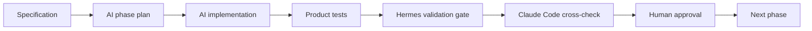

# AI-Led Law Firm OS Development Plan v0.1

This plan intentionally makes AI the primary development producer for Law Firm OS, while Hermes, Claude Code, tests, and human review act as control and verification layers.

## Operating Thesis

AI may drive implementation, scaffolding, refactoring, UI work, tests, and documentation.

AI may not be the final authority for:

- tenant isolation;
- permission and deny-rule behavior;
- DMS security trimming;
- billing, invoice, tax, payment, and settlement correctness;
- AI retrieval permission scope;
- production deployment;
- use of real client, matter, document, billing, settlement, or secret data.



## Repo Split

```text
/Users/jws/Documents/Codex/Law Firm OS
  AI builds the product here.
  Source, UI, API, domain models, tests, and product validation commands live here.

/Users/jws/Documents/Codex/Hermes
  Hermes validates the product from outside.
  It records gates, evidence, failures, blocked claims, and review packets.
```

## Agent Roles

| Role | Tool | Responsibility |
| --- | --- | --- |
| Primary builder | Codex | Implement small slices, write tests, fix failures, maintain repo contracts |
| Fast UI builder | Cursor | Jira-like UI, product screens, CRUD UX, responsive polish |
| Cross-validator | Claude Code | Architecture, security, domain correctness, missing test review |
| Harness | Hermes | Deterministic validation, evidence, no-write/no-secret gates |
| Final authority | Human | Approves sensitive behavior, phase transitions, merge/release |

## Goal 1 Claude Review Density

Goal 1 is the RP00-RP03 foundation slice. Claude Code review must be frequent in this slice because errors here become systemic product defects later.

The controlling plan is `docs/goal1-foundation-claude-review-plan.md`.

Minimum review counts:

- RP00 / C00: 8 checkpoints
- RP01 / C01: 10 checkpoints
- RP02 / C02: 12 checkpoints
- RP03 / C03: 12 checkpoints

Goal 1 cannot close with missing Claude packets or unresolved P0/P1 Claude findings.

## Phase Plan

### Phase 0: Product Constitution And AI Control Plane

Goal:

- Convert the specification into enforceable product contracts.
- Make the AI-led workflow explicit.
- Keep Hermes attached at the lightest possible level.

AI builds:

- product contract;
- implementation plan;
- initial Jira-like UI scaffold;
- local validation command;
- synthetic-only fixture policy.

Hermes gate:

- `H0 product_contract_validate`
- Run `npm run validate`.
- Confirm `project_type = product_codebase`.
- Confirm autonomous third-party agent production access is forbidden.

Claude Code cross-check:

- Required repeatedly for Goal 1, not only once at the end.
- Follow `docs/goal1-foundation-claude-review-plan.md`.
- Minimum C00 review count: 8 checkpoints across contract, authority boundary, Hermes attachment, interface, permission/audit baseline, and closeout.
- Check whether product contracts match the specification.
- Check whether AI-led workflow still blocks real data, secrets, and autonomous production writes.

Exit criteria:

- `npm run validate` passes.
- Phase 1 work items are concrete.

### Phase 1: Core Domain Contract

Goal:

- Establish the first real code foundation: Tenant, User, Client, Matter, Document, Permission reference, and AuditEvent.

AI builds in `packages/domain`:

- entity definitions;
- ownership map;
- Matter-first invariants;
- synthetic fixtures;
- domain tests.

Required tests:

- Matter requires `tenant_id`, `client_id`, `owner_user_id`, `status`, and `confidentiality`.
- Document and DocumentVersion are DMS-owned.
- Document must be traceable to `matter_id`.
- AuditEvent belongs to Core.
- Permission belongs to Core.
- Opportunity may exist before Matter conversion.

Hermes gate:

- `H1 domain_contract_gate`
- Run `npm run validate`.
- Run `npm test`.
- Record product contract result, domain test result, and changed files.

Claude Code cross-check:

- Required repeatedly for Goal 1.
- Follow `docs/goal1-foundation-claude-review-plan.md`.
- Minimum C01 review count: 10 checkpoints across contract, core models, relationship map, invariants, fixtures, permission/audit integration, and closeout.
- Review domain ownership, missing entities, naming drift, and whether tests actually enforce the spec.

Exit criteria:

- Domain tests pass.
- Claude cross-check has no unresolved P0/P1 findings.

### Phase 2: Permission And Audit Kernel

Goal:

- Implement the safety kernel before deep DMS or AI features.

AI builds in `packages/authz` and `packages/audit`:

- RBAC rule shape;
- ABAC rule shape;
- object ACL;
- deny rule;
- ethical wall decision;
- audit event append contract;
- security trimming decision object.

Required tests:

- deny overrides allow;
- ethical wall blocks partner/admin access;
- document view/download emits audit event;
- permission change emits audit event;
- search result can be trimmed before display.

Hermes gate:

- `H2 permission_audit_gate`
- Run `npm run validate`.
- Run `npm test`.
- Check no real data fixtures.
- Check no `.env` or credential samples.

Claude Code cross-check:

- Required repeatedly for Goal 1.
- Follow `docs/goal1-foundation-claude-review-plan.md`.
- Minimum C02 review count: 12 checkpoints across permission design, precedence, evaluator, deny-over-allow, ethical wall, API, bypass fixtures, audit matrix, fail-closed behavior, Hermes dependency, and closeout.
- At minimum:
  - before implementation, to review the permission model design;
  - after tests pass, to review bypass and edge cases.

Exit criteria:

- deny-over-allow behavior is tested.
- Audit events exist for core sensitive actions.

### Phase 3: Matter Core + DMS Core MVP

Goal:

- Build the first usable product loop: Matter workspace and document/version management.

AI builds:

- Matter list/detail UI;
- Matter workspace folder template;
- Document and DocumentVersion service;
- synthetic document metadata;
- upload/download placeholders or local-only abstraction;
- DMS UI screen;
- no-real-file policy for early tests.

Required tests:

- Matter workspace template is generated by matter type.
- DocumentVersion never overwrites previous version.
- DMS document cannot exist outside permission scope.
- unauthorized search result hides title and snippet.

Hermes gate:

- `H3 matter_dms_gate`
- Run `npm run validate`.
- Run `npm run build`.
- Run `npm test`.
- Record UI build, DMS contract, and permission trimming evidence.

Claude Code cross-check:

- Required at the end of DMS model design.
- Required before any real file storage integration.
- Focus: DMS ownership, version safety, retention/legal hold readiness, security trimming.

Exit criteria:

- Matter + DMS UI builds.
- Synthetic DMS tests pass.

### Phase 4: API And Persistence

Goal:

- Choose backend stack and add local persistence without corrupting domain boundaries.

AI builds:

- API framework scaffold;
- database schema draft;
- migrations for P0 entities;
- local test database setup;
- seed fixtures;
- API contract tests.

Hermes gate:

- `H4 api_persistence_gate`
- Run `npm run validate`.
- Run `npm run build`.
- Run `npm test`.
- Run migration dry-run command when available.
- Check migrations use synthetic data only.

Claude Code cross-check:

- Required before migration files are accepted.
- Required after API contract tests pass.
- Focus: schema ownership, tenant isolation, migration rollback, auditability.

Exit criteria:

- Local API starts.
- P0 schema exists.
- Migration dry-run passes.

### Phase 5: Time, Billing, Expense MVP

Goal:

- Add Matter-based time, expense, proforma, invoice, payment, AR, and basic P&L.

AI builds:

- TimeEntry;
- Expense;
- Disbursement;
- ProformaInvoice;
- Invoice;
- Payment;
- ARRecord;
- basic Matter P&L;
- billing UI.

Required tests:

- time and expense require Matter;
- proforma to invoice flow;
- invoice lock after approval;
- payment matching and partial payment;
- AR aging;
- monthly close blocks normal mutation.

Hermes gate:

- `H5 billing_gate`
- Run product validation and tests.
- Record billing workflow evidence.
- Block phase exit if no golden billing fixtures.

Claude Code cross-check:

- Required before implementation of formulas.
- Required after golden tests pass.
- Focus: invoice locking, write-down/write-off, payment matching, monthly closing, accounting-risk edge cases.

Exit criteria:

- Billing golden fixtures pass.
- Human review approves billing assumptions.

### Phase 6: CRM, Intake, Conflict, Engagement

Goal:

- Build pre-Matter business flow into Matter conversion.

AI builds:

- Contact;
- Lead;
- Opportunity;
- Proposal document link;
- ConflictCheck;
- ConflictHit;
- Engagement;
- FeeArrangement;
- Opportunity to Matter conversion;
- CRM pipeline UI.

Required tests:

- Opportunity can exist pre-Matter.
- Conflict clear is required before Matter opening.
- Proposal references DMS document ID.
- Engagement fee terms transfer into billing rule.
- Origination credit sum validates to 100%.

Hermes gate:

- `H6 intake_crm_gate`
- Record conversion evidence and conflict-check tests.
- Block if Matter identity is duplicated.

Claude Code cross-check:

- Required before conflict search design is accepted.
- Required before Opportunity to Matter conversion merges.
- Focus: conflict scope, party aliases, ethical wall creation, origination disputes.

Exit criteria:

- Opportunity to Matter conversion passes tests.
- Matter remains the single final work object.

### Phase 7: Email, Office, Search, OCR

Goal:

- Make DMS usable in real legal workflows, still using synthetic data in development.

AI builds:

- email metadata model;
- thread filing;
- attachment extraction contract;
- search index adapter;
- OCR adapter contract;
- Office integration scaffold;
- secure external sharing scaffold.

Hermes gate:

- `H7 integration_dms_gate`
- Check connector scopes.
- Check no real email/document fixtures.
- Check search trimming.

Claude Code cross-check:

- Required before Outlook/Gmail/Office connector implementation.
- Required after search/OCR adapter tests pass.
- Focus: OAuth scopes, email content minimization, duplicate filing, document confidentiality.

Exit criteria:

- DMS native workflow works against synthetic fixtures.

### Phase 8: Settlement, Analytics, Governance

Goal:

- Add partner settlement, analytics, retention/legal hold, DLP, and audit analytics.

AI builds:

- SettlementRule;
- SettlementRun;
- SettlementLine;
- PartnerAllocation;
- WorkingCredit;
- Matter P&L dashboard;
- retention/legal hold;
- DLP/audit anomaly rules.

Hermes gate:

- `H8 settlement_governance_gate`
- Require settlement golden tests.
- Require human approval packet.
- Record locked-run mutation tests.

Claude Code cross-check:

- Required before settlement rule engine implementation.
- Required after every settlement golden fixture batch.
- Required before any dashboard metric is treated as final.
- Focus: formula ambiguity, allocation disputes, close/month lock, audit defensibility.

Exit criteria:

- Settlement preview and lock behavior pass golden tests.
- Human approval accepts assumptions.

### Phase 9: AI Legal Knowledge Platform

Goal:

- Add AI only after DMS, permission, audit, and search are stable.

AI builds:

- AIJob;
- AIQuery;
- AIRetrievalSet;
- AIOutput;
- AICitation;
- AIModelPolicy;
- permission-aware retrieval;
- citation grounding;
- review workflow.

Required tests:

- AI can retrieve only permitted documents.
- AI output includes document/version/page or clause grounding.
- AI access creates audit event.
- tenant model policy blocks external model when disabled.
- human review required for final legal/client/billing/settlement output.

Hermes gate:

- `H9_ai_governance_gate`
- Check retrieval permission tests.
- Check citation grounding tests.
- Check model policy tests.
- Block final output authority by default.

Claude Code cross-check:

- Required before RAG architecture is accepted.
- Required before any AI output is saved as Document or Note.
- Required after prompt/evaluation test sets are created.
- Focus: prompt injection, permission leakage, citation hallucination, model policy, retention.

Exit criteria:

- AI is useful but never final authority.
- Grounding and audit are enforceable.

## Claude Code Cross-Validation Schedule

Claude Code should be used as a different reviewer, not as the same implementation loop.

| Moment | Required? | Purpose |
| --- | --- | --- |
| End of Phase 0 | Yes | Check spec-to-contract mapping |
| End of Phase 1 | Yes | Check domain model and tests |
| Before Phase 2 implementation | Yes | Review permission/audit model |
| End of Phase 2 | Yes | Find permission bypasses |
| Before real file storage | Yes | Review DMS risk |
| Before DB migrations | Yes | Review schema and rollback |
| Before billing formulas | Yes | Review accounting/domain ambiguity |
| After billing golden tests | Yes | Review edge cases |
| Before conflict search | Yes | Review party/alias/ethical-wall logic |
| Before external connectors | Yes | Review OAuth/data minimization |
| Before settlement engine | Yes | Review formula and dispute risks |
| Before AI/RAG | Yes | Review retrieval and model policy |
| Before release candidate | Yes | Full architecture/security review |

## Hermes Gate Schedule

| Hermes Level | Starts When | Product Commands |
| --- | --- | --- |
| H0 | Already | `npm run validate` |
| H1 | Domain tests exist | `npm run validate`, `npm test` |
| H2 | Permission/audit begins | `npm run validate`, `npm test` |
| H3 | Matter + DMS UI exists | `npm run validate`, `npm run build`, `npm test` |
| H4 | API/DB begins | add migration dry-run |
| H5 | Billing begins | add billing golden tests |
| H6 | CRM/Intake begins | add conversion/conflict tests |
| H7 | Email/Office/Search begins | add connector/search trimming tests |
| H8 | Settlement begins | add settlement golden tests |
| H9 | AI begins | add AI retrieval/citation/model-policy tests |

## Immediate Next AI-Led Slice

AI should now build Phase 1, not more planning:

```text
packages/domain
  src/entities.js
  src/invariants.js
  test/domain-contract.test.js
```

Then Hermes moves from H0 to H1.
