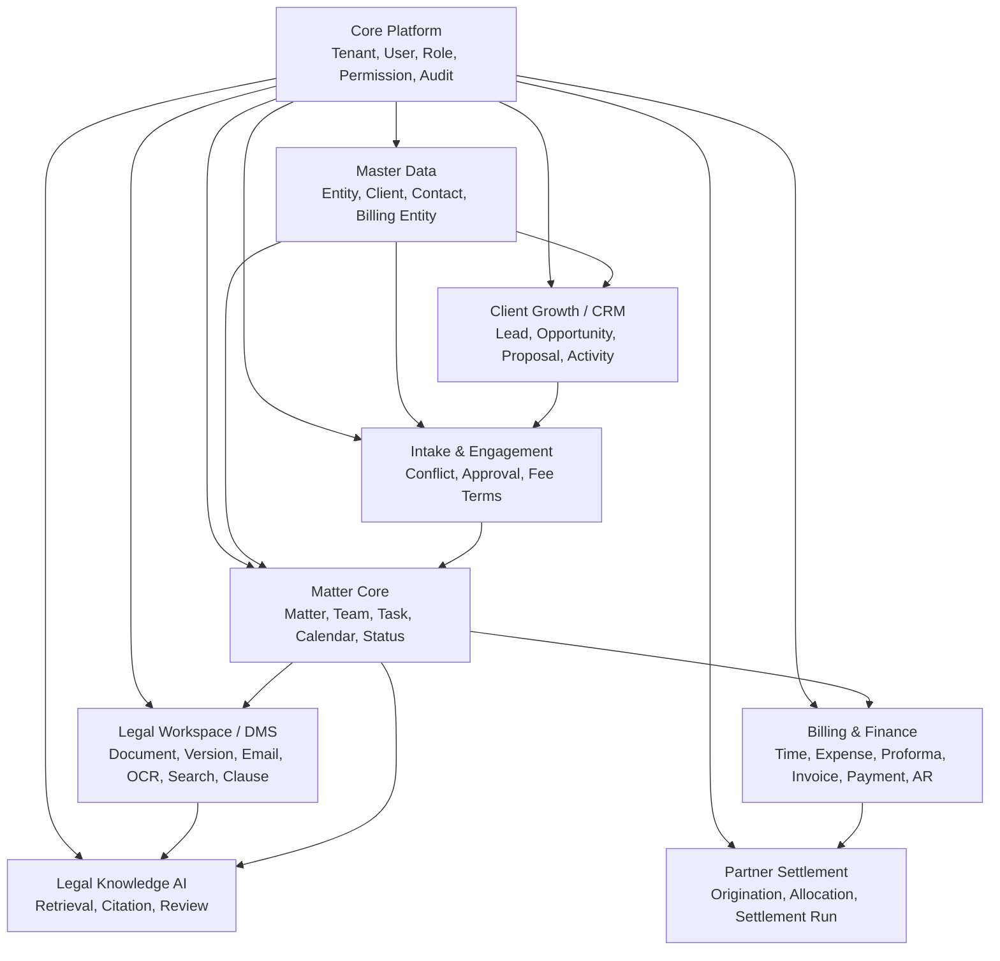

# Law Firm OS Architecture v0.1

## Product Shape

Law Firm OS is one integrated product, not three disconnected apps.



## First Codebase Structure

```text
Law Firm OS/
  apps/
    api/                 modular backend API
    web/                 product UI
  contracts/
    law-firm-os.product-contract.json
  docs/
    architecture.md
    hermes-connection.md
    roadmap.md
  hermes/
    project.json         harness-facing validation contract
  packages/
    audit/
    authz/
    domain/
    dms/
    billing/
    crm/
    ai-governance/
  scripts/
    validate-product-contract.mjs
```

## Initial Build Order

1. Core, Client, Matter, Permission, and Audit contracts.
2. Matter Core plus DMS Core MVP.
3. Time, Billing, Expense, Payment, and AR.
4. CRM, Intake, Conflict, and Engagement.
5. Email and Office-native DMS.
6. Settlement, Analytics, Governance.
7. AI Legal Knowledge after DMS, permission, search, audit, and versioning are stable.

