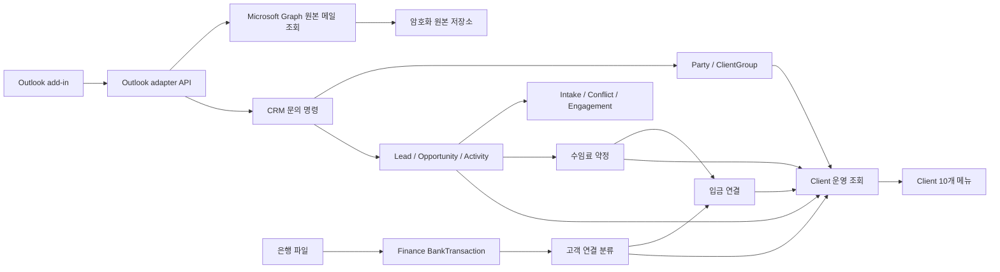
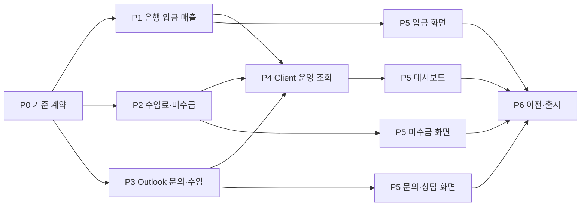

# 10인 로펌 Client 전체 메뉴 상세 실행계획

- 계획 버전: v2
- 작성일: 2026-07-30
- 기준 브랜치: `origin/main`
- 기준 커밋: `140f1ad10af310fe54637a9058c786b115917beb`
- 작업 브랜치: `codex/client-operations-v2-implementation-20260730`
- 계획 단위: 단계 → 작업 묶음(WP) → 검증 가능한 작업 단위(TUW)
- 실행 Goal: 문서 제목과 같은 `10인 로펌 Client 전체 메뉴 상세 실행계획`
- 문서 상태: 구현 진행 중 — P0 기준 계약 5/5, P1 은행 입금 매출 7/7, P2 수임료·미수금 4/6 완료, 전체 16/53 완료

## 0. v2에서 바로잡은 점

기존 v1의 33개 TUW는 방향은 맞았지만 일부 단위가 1~3일 안에 독립 구현·검증하기 어려웠다. v2는 다음을 바로잡고 53개 TUW로 다시 기준화한다.

1. 대시보드 전체, 두 개 메뉴 동시 구현, Outlook 증거 저장, 수임 결정과 수임료 반영처럼 서로 다른 결과를 한 TUW에 묶지 않는다.
2. `입금 매출`은 기간 동안의 흐름이고 `미수금`은 특정 시점의 잔액이므로 하나의 기간 필터를 억지로 공유하지 않는다.
3. 현재의 청구서 기반 Finance 조회와 새 Client 운영 조회를 섞지 않는다.
4. Outlook의 `원본 메일`은 정리된 본문이 아니라 서버가 다시 가져온 변경 불가 MIME 원본과 해시를 뜻한다. 화면 표시용 본문은 별도 사본으로 만든다.
5. `수임 확정`을 기존 계약서 서명 완료 상태와 혼동하지 않는다. 내부 수임 결정, 계약 완료, Matter 개설을 서로 다른 사실로 관리한다.
6. 현재 파일 저장형 런타임뿐 아니라 PostgreSQL 등록, 실제 API 라우팅, 이전과 되돌리기까지 계획에 포함한다.
7. 권한과 감사는 마지막 보안 단계에서 덧붙이지 않고 모든 읽기·쓰기 TUW의 완료 조건으로 둔다.
8. 숨긴 메뉴는 사이드바에서만 가리는 것이 아니라 직접 URL 접근도 통합 화면으로 보내거나 차단한다.
9. M365 코드는 delegated 권한과 기능 스위치 뒤에서 준비하고, 관리자 동의·시험 mailbox 영수증이 없으면 출시를 차단한다.
10. 모든 검증 시나리오를 고정 fixture, 테스트 파일 또는 실제 API·화면 영수증과 연결한다.

이 계획은 이전 33개 초안을 대체한다. v2 ID를 최초 실행 원장으로 사용하며, 2026-07-30에 P0의 5개 TUW, P1의 7개 TUW와 P2의 수임료 약정 스키마·생성·조회·수정·취소 및 입금 배분 저장 계약 4개 TUW를 구현·집중 검증했다.

## 1. 제품 목표

10인 로펌이 매일 다음 질문에 1분 안에 답할 수 있어야 한다.

- 새 문의가 들어왔는가?
- 오늘 상담은 누구와 언제 있는가?
- 수임 여부를 결정하지 않은 문의는 무엇인가?
- 이번 달 실제 입금 매출은 얼마인가?
- 매출이 높은 고객은 누구인가?
- 미수금이 큰 고객은 누구이며 얼마가 남았는가?
- 이름이 맞지 않아 연결하지 못한 은행 입금은 무엇인가?

Client는 작은 로펌의 운영 화면이다. 복식부기, 세무 신고, 가중 영업 예측, 범용 CRM 자동화는 이 메뉴의 목표가 아니다.

## 2. 범위와 규모 가정

| 항목 | v1 가정 | 설계 결과 |
|---|---|---|
| 내부 사용자 | 약 10명 | 분산 시스템이나 별도 캐시 계층을 만들지 않는다. |
| 통화 | KRW | 원 단위 정수, 환율 계산 없음 |
| 금액 의미 | 세금 포함 실제 입금액 | 부가세·수익 인식 분리는 Finance/회계 업무로 남김 |
| 은행 파일 | 한 번에 최대 5,000행 | 기존 import 상한과 거래 지문을 재사용 |
| Outlook | 사용자가 add-in 버튼을 누를 때만 | mailbox scan, webhook, event-based 자동 등록 없음 |
| Outlook 지원 범위 | Windows·Mac·웹의 메일 읽기 화면 | 모바일 Outlook과 공유 사서함은 1차 범위에서 제외 |
| Client 메뉴 | 현재 보이는 10개 | 숨은 메뉴 추가·복구 없음 |
| 리포트 | 정해진 4종 | 범용 리포트 빌더 없음 |
| 성능 목표 | 일반 조회 p95 1.5초 이내 | 직접 조회와 적절한 index로 시작, 필요할 때만 사전 집계 검토 |

## 3. 변경할 수 없는 업무 규칙

### 3.1 입금 기준 매출

`순입금 매출 = 고객과 연결된 입금 합계 - 원입금과 연결된 환불·입금취소 합계`

1. 청구서 발행 여부와 관계없이 고객과 연결된 실제 은행 입금을 매출로 인정한다.
2. 자동 연결은 정리한 이름의 유일한 정확 일치 또는 직원이 저장한 정확한 입금자 별칭만 허용한다.
3. 일부 문자열, 접두어, 유사도, AI 추정은 자동 매출로 인정하지 않는다.
4. 같은 정리 이름을 가진 고객이 둘 이상이면 `연결 확인 필요`로 둔다.
5. 고객과 연결되지 않은 입금은 매출 순위와 합계에서 제외한다.
6. 같은 은행거래 지문은 한 번만 반영한다.
7. 한 은행 입금은 한 고객에게만 연결한다. 한 고객의 여러 수임료 약정에는 나누어 연결할 수 있다.
8. 환불은 원입금 또는 고객과 직원이 명시적으로 연결했을 때만 해당 고객 매출에서 차감한다.
9. 연결을 바꾸면 집계와 순위를 다시 계산하되 은행거래 원본은 바꾸지 않는다.
10. 화면에는 항상 `은행 입금 기준`, 금액 기간, 마지막 집계 시각을 표시한다.
11. 이름 정리는 현재 `normalizeBankMatchValue`의 NFKC, 영문 소문자화, 지원 법인 표기와 공백·기호 제거 규칙을 버전으로 고정한다. 단어 순서를 바꾸거나 오탈자를 보정하지 않는다.
12. 저장 별칭은 권한 있는 직원이 특정 고객에 명시적으로 등록한 값만 사용한다. 정리 결과가 둘 이상의 고객과 같으면 별칭이 있어도 자동 연결하지 않는다.
13. 자동·수동 연결 기록에는 정리 전 이름, 정리된 이름, 규칙 버전, 연결 근거를 남긴다. 정리 규칙이 바뀌어도 과거 확정 연결을 자동으로 다시 쓰지 않는다.

### 3.2 수임료와 미수금

`미수금 = max(0, 확정된 수임료 - 해당 수임료에 연결된 입금)`

1. 수임료를 아직 정하지 못했으면 `null`로 저장하고 화면에는 `금액 미입력`으로 표시한다.
2. `금액 미입력`은 0원이 아니며 총 미수금과 순위의 분모·합계에서 제외한다.
3. 수임료와 입금은 원 단위 정수이며 음수 금액을 허용하지 않는다.
4. 한 고객에게 미결 약정이 여러 개면 납부기한 오름차순, 수임확정일 오름차순, ID 오름차순으로 자동 배분한다.
5. 납부기한이 없으면 수임확정일을 사용한다.
6. 수동 배분은 자동 배분보다 우선하고 재분류가 이를 덮어쓰지 않는다.
7. 입금이 약정액보다 크면 미수금은 0원이고 남는 금액은 `선입금·초과 입금`으로 표시한다.
8. 환불이 원입금과 연결되면 해당 배분을 되돌리고 필요한 만큼 미수금을 다시 연다.
9. 기존 Invoice·Payment·AR은 삭제하거나 덮어쓰지 않는다.
10. 기존 Matter의 정식 청구 설정과 새 수임료 약정은 서로 다른 목적을 화면에 명시한다.

### 3.3 문의와 수임

1. Outlook에서 버튼을 누르지 않으면 문의나 증거가 생기지 않는다.
2. 새 문의 등록 시 잠재 고객 Party와 Lead를 만들거나 기존 후보에 연결한다. 이 단계에서는 ClientGroup을 만들지 않는다.
3. 같은 메일을 다시 등록하면 기존 증거와 문의를 반환한다.
4. 한 메일 증거의 기본 문의 연결은 하나다. 다른 문의로 옮길 때는 사유와 감사를 남긴다.
5. 상담 일정의 권위는 앱이다.
6. `Outlook 일정 만들기`는 사용자가 눌렀을 때만 Graph를 호출한다. Outlook에서 이후 바꾼 일정은 자동으로 앱에 되돌아오지 않는다.
7. `수임 확정`은 내부 수임 결정이다.
8. 기존 `Engagement`는 계약서 승인·서명 사실이며 수임 결정과 구분한다.
9. 내부 수임 결정만으로 Matter를 자동 생성하지 않는다.
10. Matter 개설은 기존 이해상충·waiver·clearance 조건을 그대로 통과해야 한다.

## 4. 대표 계산 사례

| 사례 | 입금 매출 | 미수금 | 기대 상태 |
|---|---:|---:|---|
| 한빛 2,000만원 약정, `한빛` 입금 1,100만원 | 1,100만원 | 900만원 | 정확 연결 |
| 청구서 2,000만원, 은행 입금 없음 | 0원 | 약정 기준 | 청구서만으로 매출 증가 없음 |
| 약정 1,000만원, 입금 1,200만원 | 1,200만원 | 0원 | 초과 입금 200만원 |
| 약정 미입력, 입금 500만원 | 500만원 | 집계 제외 | 금액 미입력 |
| `한빛건설`, `한빛개발`이 있고 `한빛` 입금 | 0원 | 변동 없음 | 연결 확인 필요 |
| 같은 파일을 두 번 올림 | 최초 1회 | 최초 1회 | 중복 건너뜀 |
| 연결 입금 300만원 중 100만원 환불 | 순매출 200만원 | 100만원 재개 | 환불 연결 |
| 전월 300만원 입금, 이번 달 100만원 환불 | 전월 +300만원, 이번 달 -100만원 | 환불만큼 재개 | 기간별 순매출 |

## 5. 사용자 상태와 내부 상태

| 사용자 표시 | 내부 사실 | 허용 행동 |
|---|---|---|
| 새 문의 | Lead `inquiry_status=new` | 담당 지정, 확인 시작, 수임하지 않음 |
| 확인 중 | Lead `inquiry_status=reviewing` | 상담 예약, 수임 검토, 수임하지 않음 |
| 상담 예정 | Lead 상태 + 미완료 상담 Activity | 일정 변경, 상담 완료, 수임 검토 |
| 수임 검토 중 | Opportunity 존재 + `engagement_decision=pending` | 수임 확정, 수임하지 않음 |
| 수임 확정 | `engagement_decision=accepted` | 수임료 입력·수정, 계약 진행, Matter 개설 요청 |
| 수임하지 않음 | `engagement_decision=declined` 또는 Opportunity `closed_lost` | 종료 사유 확인, 권한 있는 재개 |

기존 Opportunity 단계 `new → qualified → intake_requested → intake_opened → closed_won/closed_lost`는 유지한다.

- 내부 수임 결정은 Opportunity의 `engagement_decision`으로 별도 기록한다.
- 이해상충 확인 전에도 내부 수임 의사는 기록할 수 있지만 `Matter 개설 대기`를 표시한다.
- `closed_won`은 기존 Intake 조건을 거쳐 Matter 개설 가능한 상태가 됐을 때만 사용한다.
- 기존 signed `Engagement`와 `수임 확정`을 같은 필드나 API로 처리하지 않는다.

## 6. 시스템 경계



### 6.1 권위

| 사실 | 권위 |
|---|---|
| 사람·회사·고객·별칭 | Master Data의 Party·ClientGroup |
| 문의·수임 검토·상담·내부 수임 결정 | CRM의 Lead·Opportunity·CRMActivity |
| 원본 메일 증거 메타데이터 | Email DMS의 `InquiryEmailEvidence`와 `InquiryEvidenceFileObject` |
| 문의와 증거의 연결 | Email DMS의 `lead_id`; CRM은 증거 ID만 조회 |
| 원본 MIME bytes | 기존 DMS S3/KMS 저장 어댑터를 재사용하는 Matter 이전 증거 저장 경로 |
| M365 연결 메타데이터 | Email DMS의 `M365Connection`; token 값은 보안 저장소 |
| 이해상충·waiver·계약 승인 | Intake |
| 은행거래 원본·고객 연결 | Finance의 BankTransaction·BankTransactionClassification |
| 수임료 약정·입금 배분 | Finance의 `FeeCommitment`·`ClientDepositAllocation` |
| Client KPI·그래프·순위 | Analytics의 조회 전용 `ClientOperationsReadModel` |
| 화면 상태 | 위 권위 데이터를 조합하며 별도 평행 저장소 없음 |

### 6.2 바꾸지 않는 기존 권위

- raw `BankTransaction`에는 고객 ID를 쓰지 않는다.
- 기존 `buildFinanceReadModel`의 청구·수납·AR 의미를 바꾸지 않는다.
- Client 운영 금액은 새 `buildClientOperationsReadModel`에서 계산한다.
- 기존 Outlook Matter 보관 API는 그대로 유지한다.
- 기존 Intake와 Matter 개설 조건을 약화하지 않는다.
- Matter가 없는 증거를 현재 Matter 필수 `DmsDocument`나 `DmsEmailThread`로 가장하지 않는다.
- Matter 개설 뒤에는 `source_inquiry_evidence_id`로 기존 증거를 참조한다. 원본 bytes를 다시 복사하거나 해시를 바꾸지 않는다.

## 7. 데이터 계약

### 7.1 `InquiryEmailEvidence`

| 필드 | 규칙 |
|---|---|
| `inquiry_email_evidence_id` | 안정적인 해시 기반 ID |
| `tenant_id`, `mailbox_address` | 복합 tenant 경계 |
| `lead_id` | 기본 문의 연결 1개 |
| `graph_immutable_message_id` | 가능하면 Graph immutable ID 사용 |
| `internet_message_id` | 주 중복 키 |
| `conversation_id` | 검색·표시용 |
| `mime_file_object_id` | 원본 MIME `InquiryEvidenceFileObject` |
| `mime_sha256`, `mime_byte_size` | 원본 무결성 |
| `subject`, `sender`, `recipients`, `received_at` | 화면용 메타데이터 |
| `display_file_object_id` | XSS 정리된 화면 표시용 별도 사본 |
| `attachment_manifest` | MIME 내부 첨부파일 이름·크기·형식 |
| `capture_status` | `pending_link`, `complete`, `failed` |
| `retention_policy_ref`, `legal_hold_state` | 기존 보존·legal hold 정책 상속 |
| `captured_by`, `captured_at` | 감사 |
| unique | tenant + mailbox + internet_message_id, 없으면 immutable Graph ID |

목록 API는 본문·MIME를 반환하지 않는다. 원본 열기는 별도 권한 검사와 민감 조회 감사를 거친다. MIME와 첨부파일은 악성 파일 검사 전에는 실행·미리보기하지 않고, 문의가 종료되어도 일반 UI에서 직접 삭제하지 않는다.

### 7.2 `InquiryEvidenceFileObject`

| 필드 | 규칙 |
|---|---|
| `inquiry_evidence_file_object_id` | MIME·화면용 사본별 고유 ID |
| `tenant_id`, `inquiry_email_evidence_id` | 필수 |
| `object_kind` | `original_mime` 또는 `sanitized_display` |
| `storage_pointer_ref` | DMS 저장 어댑터가 만든 불투명 참조 |
| `sha256`, `byte_size`, `mime_type` | 저장 뒤 다시 계산해 확인 |
| `scan_status` | `pending`, `clean`, `quarantined`, `failed` |
| `retention_policy_id`, `legal_hold_state` | DMS 보존 정책과 삭제 차단에 사용 |
| `kms_key_ref` | 실제 키가 아닌 기존 KMS 키 참조 |
| `created_by`, `created_at` | 감사 |

저장 경계는 다음으로 고정한다.

- 새 모델·서비스: `packages/email-dms/src/inquiry-evidence-model.js`, `packages/email-dms/src/inquiry-evidence-storage-service.js`
- PostgreSQL: 신규 `packages/email-dms/src/migrations/002_inquiry_evidence.sql`과 `packages/email-dms/src/migrations/index.js`
- 원장·운영 권위: 신규 `packages/email-dms/src/central-ledger.js`를 `apps/api/src/postgres-api-runtime-authority.js`에 등록
- 저장 bytes: `packages/dms/src/storage/storage-adapter.js`와 운영 `s3-storage-adapter.js`를 재사용한다.
- 런타임 조립: `apps/api/src/server.js`; Outlook 명령 연결: `apps/api/src/outlook-addin-runtime-context.js`
- 원본 MIME와 화면용 사본은 서로 다른 object ID를 사용한다. 원본은 수정하지 않고 화면용 사본만 다시 만들 수 있다.
- 일반 삭제 API를 만들지 않는다. 보존 기간 만료, legal hold 확인, 권한, 삭제 감사가 모두 통과하는 DMS 거버넌스 명령만 허용한다.
- Matter가 만들어지면 `DmsEmailThread.source_inquiry_evidence_id` 관계만 추가하고 같은 storage pointer와 SHA-256을 보존한다.

### 7.3 `M365Connection`

| 필드 | 규칙 |
|---|---|
| `m365_connection_id` | 사용자별 고유 ID |
| `tenant_id`, `user_id`, `entra_subject_id` | 서명 세션과 일치해야 함 |
| `mailbox_address_hash` | 표시·감사용 hash; 임의 mailbox 선택에 사용하지 않음 |
| `credential_ref` | 보안 저장소의 delegated token 묶음 참조 |
| `granted_scopes` | `Mail.Read`, `Calendars.ReadWrite`, `offline_access`만 허용 |
| `consented_at`, `expires_at`, `revoked_at` | 연결 상태 |
| `state_version` | 낙관적 동시성 |

일반 저장소에는 access token, refresh token, client secret을 넣지 않는다. 연결 해제는 provider revocation을 먼저 시도하고 `credential_ref`를 폐기한 뒤 감사 이벤트를 남긴다.

PostgreSQL 진입점은 신규 `packages/email-dms/src/migrations/001_m365_connection.sql`이며, `002_inquiry_evidence.sql`보다 먼저 실행한다.

### 7.4 `FeeCommitment` — 화면명 `수임료 약정`

| 필드 | 규칙 |
|---|---|
| `fee_commitment_id` | 고유 ID |
| `tenant_id`, `client_group_id`, `opportunity_id` | 필수 |
| `matter_id` | Matter 개설 후 선택적 연결 |
| `currency` | v1은 `KRW` |
| `agreed_amount` | 원 단위 정수 또는 null |
| `due_date` | 선택 |
| `accepted_at` | 자동 배분 순서에 사용 |
| `status` | `active`, `superseded`, `cancelled` |
| `source_fee_arrangement_id` | 정식 청구 설정과 연결 시 선택 |
| `state_version` | 낙관적 동시성 |
| `created_by`, `updated_by`, `reason` | 감사 |

수임료 약정은 Client의 단순 미수금 기준이다. 정식 청구 설정이 만들어져도 독립적으로 조용히 덮어쓰지 않는다. 두 금액이 다르면 `청구 설정과 금액이 다릅니다`를 표시하고 명시적 조정만 허용한다.

### 7.5 `ClientDepositAllocation` — 화면명 `입금 연결`

| 필드 | 규칙 |
|---|---|
| `client_deposit_allocation_id` | 고유 ID |
| `bank_transaction_classification_id` | 고객 연결이 확인된 입금만 |
| `fee_commitment_id` | 연결할 약정 |
| `allocated_amount` | 원 단위 양수 |
| `allocation_source` | `automatic` 또는 `manual` |
| `manual_lock` | 수동 배분 보호 |
| `reversed_amount` | 연결 환불로 되돌린 금액 |
| `state_version` | 낙관적 동시성 |
| `created_by`, `updated_by`, `reason` | 감사 |

불변식:

- 한 입금의 활성 배분 합계는 입금액을 넘지 않는다.
- 한 약정의 활성 배분 합계는 약정액을 넘지 않는다.
- 입금과 약정의 `tenant_id`, `client_group_id`, `currency`가 같아야 한다.
- 원입금보다 큰 환불 연결을 허용하지 않는다.

## 8. API 계획

### 8.1 Finance

| Method | Path | 목적 |
|---|---|---|
| POST | `/api/finance/bank-imports/preview` | XLSX/PDF 서버 파싱, 파일 해시, 신규·중복·오류 행 미리보기 |
| POST | `/api/finance/bank-imports` | 승인된 preview를 기존 import service로 확정 |
| GET | `/api/finance/bank-classifications` | 기존 분류 목록과 연결 근거 조회 |
| POST | `/api/finance/bank-classifications/auto` | 정확 일치·저장 별칭만 자동 연결 |
| POST | `/api/finance/bank-classifications/review` | 수동 연결·해제·별칭 저장·환불 연결 |
| GET | `/api/finance/fee-commitments` | 고객·수임 건별 약정 조회 |
| POST | `/api/finance/fee-commitments` | 수임료 약정 생성 |
| PATCH | `/api/finance/fee-commitments/:id` | version·사유 기반 수정 |
| GET | `/api/finance/client-deposit-allocations` | 입금 배분 조회 |
| POST | `/api/finance/client-deposit-allocations/reallocate` | 수동 재배분·되돌리기 |

### 8.2 Outlook·CRM

| Method | Path | 목적 |
|---|---|---|
| GET | `/api/outlook/connection` | 현재 사용자의 Graph 연결·scope·만료 상태 |
| POST | `/api/outlook/connection/authorize` | PKCE delegated 연결 시작 |
| GET | `/api/outlook/connection/callback` | state·PKCE 검증 뒤 보안 token ref 저장 |
| DELETE | `/api/outlook/connection` | provider token 폐기와 연결 해제 |
| POST | `/api/outlook/inquiries/from-email` | 현재 Outlook 메일로 새 문의 생성 또는 기존 문의 연결 |
| GET | `/api/crm/inquiries` | 사용자 상태 기준 문의 목록 |
| GET | `/api/crm/inquiries/:id` | 원본 증거·상담·결정이 연결된 문의 상세 |
| POST | `/api/crm/inquiries/:id/transitions` | 허용된 문의 상태 변경 |
| POST | `/api/crm/inquiries/:id/consultations` | 상담 예약과 Activity 생성 |
| PATCH | `/api/crm/activities/:id` | 상담 완료·결과·다음 행동 |
| POST | `/api/crm/consultations/:id/outlook-event` | 사용자 클릭 방식 Outlook 일정 생성 |
| POST | `/api/crm/inquiries/:id/engagement-decisions` | 수임 확정 또는 수임하지 않음 |
| POST | `/api/crm/inquiries/:id/engagement-repair` | 부분 실패한 고객·수임료 반영 재실행 |

### 8.3 조회·리포트

| Method | Path | 목적 |
|---|---|---|
| GET | `/api/analytics/clients/dashboard` | KPI·오늘 확인할 일·그래프·순위를 한 번에 반환 |
| GET | `/api/analytics/clients/revenue` | 기간별 고객 순입금 매출과 원본 상세 |
| GET | `/api/analytics/clients/receivables` | 시점별 고객 미수금·금액 미입력·초과 입금 |
| GET | `/api/analytics/clients/:id/operations` | 고객 상세용 문의·Matter·금액·접촉 요약 |
| GET | `/api/analytics/clients/reports/:report.csv` | 권한이 적용된 고정 리포트 CSV |

모든 응답은 `generated_at`, 사용한 시간 기준, 원천별 상태, 권한 필터 여부를 포함한다. 일부 원천이 실패하면 0으로 바꾸지 않고 `partial` 상태와 함께 반환한다.

## 9. 수임 확정 명령의 실패 처리

`수임 확정`은 CRM·Master Data·Finance를 건드리므로 단일 저장소 transaction처럼 가장하지 않는다.

1. CRM에 수임 결정을 멱등적으로 기록한다.
2. 기존 Party를 ClientGroup에 연결하거나 새 ClientGroup을 만든다.
3. 금액이 있거나 금액 미입력을 확인한 경우 Finance에 `FeeCommitment`를 만든다.
4. 각 단계는 같은 처리 ID에서 파생한 멱등성 키를 사용한다.
5. 완료된 단계는 재실행하지 않는다.
6. 일부 단계가 실패하면 문의에 `engagement_workflow_status=repair_required`를 남긴다.
7. 화면은 `수임 확정 처리 중` 또는 `반영 확인 필요`를 표시하고 권한 있는 사용자가 재실행한다.
8. Matter 생성은 이 처리 흐름에 포함하지 않는다.

보이지 않는 자동 대기열이나 범용 분산 처리 체계를 새로 만들지 않는다. 현재 규모에서는 단계별 처리 기록과 명시적 재실행 명령이면 충분하다.

## 10. 대시보드 지표 정의

서로 다른 시간 의미를 라벨로 분명히 한다.

| 화면 지표 | 정의 | 시간 기준 | 클릭 위치 |
|---|---|---|---|
| 새 문의 | 현재 `새 문의` 상태이며 접근 가능한 Lead 수 | 현재 | 새 문의, 상태=새 문의 |
| 오늘 상담 | Asia/Seoul 오늘의 미완료 상담 수 | 오늘 | 상담·수임 관리, 오늘 |
| 수임 검토 중 | engagement decision이 pending인 접근 가능한 문의 수 | 현재 | 수임 현황, 수임 검토 중 |
| 이번 달 입금 매출 | 이번 달 고객 연결 입금 - 연결 환불 | 이번 달 | 입금 매출 내역, 이번 달 |
| 총 미수금 | 금액이 확정된 active 약정의 미수금 합계 | 현재 시각 | 수임료·미수금 |

본문:

- `오늘 확인할 일`: 담당자 없는 새 문의, 지난 상담, 오늘 상담, 수임 결정 대기, 연결 확인 필요 입금, 수임료 금액 미입력
- `월별 입금 매출`: 최근 12개월
- `문의·상담·수임 현황`: 현재 상태별 건수
- `고객별 매출 순위`: 기본 올해 누적, 월/분기/올해 선택
- `고객별 미수금 순위`: 현재 잔액

매출 순위 정렬:

1. 순입금 매출 내림차순
2. 최근 입금일 내림차순
3. 고객 표시명 오름차순
4. 고객 ID 오름차순

미수금 순위 정렬:

1. 미수금 내림차순
2. 가장 이른 납부기한 오름차순
3. 고객 표시명 오름차순
4. 고객 ID 오름차순

## 11. Client 10개 메뉴

| 현재 메뉴 | 목표 표시명 | 1차 완료 범위 |
|---|---|---|
| 대시보드 | 대시보드 | 5개 KPI, 오늘 확인할 일, 최근 12개월 매출, 상태 현황, 매출·미수금 순위 |
| 고객 목록 | 고객 목록 | 고객 검색과 기본 정보, 문의, Matter, 접촉, 입금, 수임료·미수금 상세 |
| 신규 고객 | 신규 고객 | 개인·법인 입력, 중복 후보, 선택적 입금자 별칭 |
| 잠재 고객 | 새 문의 | Outlook/직접 등록, 담당, 다음 행동, 원본 메일 증거 |
| 매출 내역 | 입금 매출 내역 | 은행 파일, 고객 연결, 매출 인정 근거, 환불, 연결 확인 |
| Pipeline | 수임 현황 | 상태 탭이 있는 단순 목록; drag-and-drop·확률 없음 |
| 상담/수임 제안 | 상담·수임 관리 | 상담 예약·완료, 수임 확정·수임하지 않음, 수임료 입력 |
| 접촉 이력 | 접촉 이력 | 메일·전화·상담·메모, 결과, 다음 행동 |
| 청구 | 수임료·미수금 | 약정, 연결 입금, 남은 금액, 금액 미입력, 초과 입금 |
| 리포트 | 리포트 | 월별 매출, 매출 순위, 미수금 순위, 문의·상담·수임 현황 |

숨은 기존 section:

- Account·Contact·Relationship는 고객 상세로 이동한다.
- Intake·Conflict·Contract는 상담·수임 관리의 관련 상태와 링크로 이동한다.
- Data·Import·Settings는 Client 직접 경로에서 차단한다.
- 기존 hash나 직접 주소는 위 통합 대상만 앱 내부에서 새 화면으로 보내고 나머지는 찾을 수 없음으로 처리한다.

## 12. 기본 권한

실제 role ID에 하드코딩하기 전에 기능 권한 단위로 검증한다.

| 행동 | 기본 기능 권한 | 권장 사용자 |
|---|---|---|
| 문의·상담 조회/작성 | `crm.inquiry.read/write` | 변호사, 운영 스태프 |
| 본인 Outlook 연결/해제 | `outlook.connection.manage` | Outlook을 연결하는 내부 사용자 |
| Outlook 문의 등록 | `outlook.inquiry.capture` + 문의 write | 변호사, 운영 스태프 |
| 수임 확정/거절 | `crm.engagement.decide` | 담당 변호사, 파트너 |
| 은행 파일 업로드 | `finance.bank.import` | 운영 관리자, Finance |
| 고객 연결·별칭·환불 연결 | `finance.bank.classify` | 운영 관리자, Finance, 승인된 파트너 |
| 수임료·입금 배분 수정 | `finance.fee.write` | 운영 관리자, Finance, 승인된 파트너 |
| Client 금액 조회 | `analytics.client.read` + 고객 접근권한 | 허용된 내부 사용자 |
| CSV 내보내기 | `analytics.client.export` | 운영 관리자, Finance, 파트너 |
| 메일 원본 열기 | `crm.inquiry.evidence.read` | 문의 접근권한이 있는 사용자 |

고객·Matter·문의 접근권한을 먼저 계산한 뒤 집계한다. 접근할 수 없는 고객은 순위·합계·건수에도 포함하지 않는다.

## 13. Outlook 구현 원칙

1. add-in은 `Office.context.mailbox.item`에서 현재 item ID와 기본 표시값만 얻는다.
2. Outlook item ID는 `Office.context.mailbox.convertToRestId`로 Graph 호환 ID로 바꾸고, 서버 Graph 요청에는 `Prefer: IdType="ImmutableId"`를 일관되게 사용한다.
3. add-in은 사용자가 버튼을 눌렀을 때만 backend를 호출한다.
4. backend가 서명된 사용자와 연결된 본인 mailbox의 현재 메시지만 Graph `/me/messages/{id}`로 다시 가져온다. 요청 body의 tenant·mailbox·본문은 권위로 믿지 않는다.
5. Graph `$value` 응답의 MIME 원본을 암호화 저장하고 SHA-256을 기록한다.
6. 화면에는 XSS 정리된 별도 사본만 표시한다.
7. Graph 연동이나 관리자 동의가 준비되지 않으면 `Outlook 연결 설정이 필요합니다`를 보여주고 원본 증거가 없는 성공 상태를 만들지 않는다.
8. 일정 생성은 Graph 연동이 준비된 경우에만 사용자 클릭으로 실행한다.
9. consultation ID에서 만든 결정적 `transactionId`, Graph event ID와 web link를 저장해 재클릭 중복을 막는다.
10. background mailbox scan, event-based activation, calendar delta sync는 구현하지 않는다.
11. access token, refresh token, client secret, MIME 본문은 로그·감사 payload·일반 PostgreSQL 열에 쓰지 않는다.

### 13.1 Graph 권한과 토큰 경계

1차 구현은 사용자별 delegated 권한으로 고정한다.

| 항목 | 결정 |
|---|---|
| Office add-in 권한 | 메일 읽기 화면의 `ReadItem` |
| Graph 메일 권한 | delegated `Mail.Read` |
| Graph 일정 권한 | delegated `Calendars.ReadWrite` |
| 재연결 | delegated `offline_access`; 사용자가 연결 해제 가능 |
| mailbox 제한 | Entra 사용자와 매핑된 본인 `/me`만; 임의 `/users/{id}`와 공유 사서함 차단 |
| 앱 비밀 | 기존 AWS Secrets Manager 참조를 사용하고 앱에는 `credential_ref`만 저장 |
| 사용자 토큰 | 새 `M365Connection`에는 token 값이 아니라 보안 저장소 참조와 만료·scope만 저장 |
| 전송 | browser/add-in에 provider refresh token이나 client secret을 반환하지 않음 |
| 기본 상태 | `client_inquiry_outlook_v1=false`, provider runtime fail-closed |

구현 진입점은 `packages/email-dms/src/m365-graph-connection-service.js`, 기존 `packages/email-dms/src/m365-placeholder.js`, `apps/api/src/aws-secret-reference.js`, `apps/api/src/outlook-addin-runtime-context.js`, `apps/api/src/server.js`로 고정한다.

### 13.2 외부 준비 확인

다음 자료가 없으면 코드는 기능 스위치 뒤에 병합할 수 있어도 Outlook 출시 검증은 `차단됨`이다.

- Entra 앱 등록 ID와 승인된 redirect URI 목록
- `Mail.Read`, `Calendars.ReadWrite`, `offline_access` 관리자 동의 영수증
- ClientGroup이나 실고객 정보가 없는 전용 시험 mailbox
- 시험 mailbox에서 메일 1건을 등록해 Graph MIME SHA-256과 저장 SHA-256이 같다는 API 영수증
- 상담 일정 생성 재클릭 시 event 1건만 생기고 시험 후 삭제됐다는 영수증
- 잘못된 mailbox ID, 만료 token, 취소된 동의, scope 부족의 fail-closed 결과
- 토큰·메일 본문이 로그와 감사 payload에 없다는 검사 결과

Microsoft 공식 문서에 따라 read mode의 item ID와 `internetMessageId`를 사용하고, Graph에는 REST/immutable ID 변환과 `$value` MIME 조회를 적용한다.

## 14. 이전과 출시 방식

### 14.1 기능 스위치

- `client_deposit_revenue_v1`
- `m365_graph_connection_v1`
- `client_inquiry_outlook_v1`
- `client_dashboard_v2`

### 14.2 이전 순서

1. 새 schema와 API를 배포하되 기능 스위치는 끈다.
2. 기존 고객 연결 중 정확 일치와 수동 확인 건만 병행 집계한다.
3. 기존 `client_unique_prefix` 자동 연결은 삭제하지 않고 `연결 확인 필요`로 보낸다.
4. 기존 Invoice·Payment·AR은 그대로 둔다.
5. 기존 수임 건은 자동으로 약정액을 추정하지 않는다. 직원이 확인한 금액만 FeeCommitment로 만든다.
6. old/new 금액을 고객별·월별로 대사하고 차이 전건에 사유를 남긴다.
7. 2명 시험 사용자에게 대시보드 기능 스위치를 켠다.
8. 은행 업로드·문의·수임·미수금 핵심 시나리오를 실제 세션으로 확인한다.
9. 10명 전체로 확대한다.

### 14.3 되돌리기

- UI 기능 스위치를 끄면 기존 Client 화면으로 되돌아간다.
- 새 원본 거래·증거·감사 기록을 삭제하지 않는다.
- 이전 작업은 중간 저장 지점과 멱등성 키로 다시 실행할 수 있어야 한다.
- rollback은 새 데이터를 파기하는 명령이 아니라 읽기 경로를 이전 화면으로 바꾸는 절차다.

## 15. 핵심 검증 시나리오

| ID | 시나리오 | 기대 결과 |
|---|---|---|
| `VC-CL-REV-001` | 유일한 정확 고객명 입금 | 자동 고객 연결, 입금액 전액 매출 |
| `VC-CL-REV-002` | 저장된 입금자 별칭 | 같은 고객 자동 연결 |
| `VC-CL-REV-003` | 접두어만 일치 | 매출 제외, 연결 확인 필요 |
| `VC-CL-REV-004` | 같은 정리 이름 고객 2명 | 자동 연결 없음 |
| `VC-CL-REV-005` | 같은 파일 재업로드 | 거래·매출 증가 없음 |
| `VC-CL-REV-006` | 다른 파일의 같은 거래 | 거래 지문으로 1건 |
| `VC-CL-REV-007` | 수동 고객 재연결 | 합계·순위 즉시 변경, 원본 불변 |
| `VC-CL-REV-008` | 원입금과 연결된 환불 | 환불일 순매출 차감, 배분 되돌림 |
| `VC-CL-AR-001` | 일부 입금 | 약정-입금 미수금 |
| `VC-CL-AR-002` | 금액 미입력 | 총액·순위 제외 |
| `VC-CL-AR-003` | 초과 입금 | 미수 0, 초과 입금 표시 |
| `VC-CL-AR-004` | 여러 약정 | 납부기한·확정일·ID 순 자동 배분 |
| `VC-CL-AR-005` | 수동 배분 후 자동 재계산 | 수동 lock 보존 |
| `VC-CL-INQ-001` | Outlook 버튼 미클릭 | 어떤 문의·증거도 생성되지 않음 |
| `VC-CL-INQ-002` | 새 문의 등록 1회 | Party/Lead/원본 증거 각 1건 |
| `VC-CL-INQ-003` | 같은 메일 재클릭 | 같은 ID 반환 |
| `VC-CL-INQ-004` | 기존 문의에 연결 | 새 Lead 없이 증거 연결 |
| `VC-CL-INQ-005` | 위조 tenant/mailbox | 403, 정보 비노출 |
| `VC-CL-INQ-006` | Graph 연동 불가 | 명확한 차단 상태, 가짜 성공 없음 |
| `VC-CL-CON-001` | Asia/Seoul 상담 예약 | 오늘/예정 조회 정확 |
| `VC-CL-CON-002` | Outlook 일정 만들기 재클릭 | 같은 event ID, 중복 없음 |
| `VC-CL-ENG-001` | 수임 확정 + 금액 입력 | decision, ClientGroup, FeeCommitment 완료 |
| `VC-CL-ENG-002` | 수임 확정 + 금액 미정 | 금액 미입력 약정 |
| `VC-CL-ENG-003` | Finance 단계 실패 후 재실행 | 완료 단계 중복 없이 복구 |
| `VC-CL-ENG-004` | 수임하지 않음 | 종료 사유와 closed_lost |
| `VC-CL-MAT-001` | 수임 확정 후 conflict 미완료 | Matter 개설 차단, 문의·결정 보존 |
| `VC-CL-DASH-001` | 기준 fixture | KPI·그래프·순위 expected JSON 일치 |
| `VC-CL-DASH-002` | 일부 원천 API 500 | 0이 아니라 일부만 불러온 상태 |
| `VC-CL-PERM-001` | 접근 불가 고객 포함 | 합계·순위·건수 비노출 |
| `VC-CL-ROUTE-001` | 숨긴 메뉴 직접 주소 | 통합 화면으로 이동하거나 찾을 수 없음 |
| `VC-CL-MIG-001` | 이전 재실행 | 건수 변화 없이 동일 결과 |
| `VC-CL-PKG-001` | exact-main 패키지 | 로그인 화면과 API 값 일치 |

### 15.1 기준 fixture와 자동화 위치

`CL-P0-W01-T05`는 다음 파일을 만든다.

- `apps/api/test/fixtures/client-operations-v1/input.json`: 고객 3곳, 권한 2종, 문의·상담·수임, 약정, 입금, 환불, 동명이인
- `apps/api/test/fixtures/client-operations-v1/scenarios.json`: 위 32개 VC ID별 명령·입력·기대 HTTP status·기대 event 수
- `apps/api/test/fixtures/client-operations-v1/expected-revenue.json`
- `apps/api/test/fixtures/client-operations-v1/expected-receivables.json`
- `apps/api/test/fixtures/client-operations-v1/expected-dashboard.json`
- `apps/api/test/fixtures/client-operations-v1/expected-csv/`
- `scripts/validate-client-operations-fixture.mjs`

모든 테스트 이름은 VC ID로 시작한다. 따라서 빠진 시나리오는 validator가 실패하고, 다음 명령으로 묶음별 재현이 가능해야 한다.

| VC | 자동화 파일 | 실행·판정 |
|---|---|---|
| `VC-CL-REV-001`~`008` | 신규 `packages/billing/test/client-deposit-revenue.test.js` | `node --test --test-name-pattern='VC-CL-REV' packages/billing/test/client-deposit-revenue.test.js`; 거래·분류·순위 JSON deep-equal |
| `VC-CL-AR-001`~`005` | 신규 `packages/billing/test/fee-commitment-allocation.test.js` | `node --test --test-name-pattern='VC-CL-AR' packages/billing/test/fee-commitment-allocation.test.js`; 약정·배분·잔액 JSON deep-equal |
| `VC-CL-INQ-001`~`006` | 신규 `packages/email-dms/test/inquiry-evidence.test.js`, `apps/api/test/outlook-inquiry-api.test.js` | 두 파일에서 각 VC의 HTTP status, model count, SHA-256, 중복 ID, 본문 로그 비노출 assert |
| `VC-CL-CON-001`~`002` | 신규 `packages/crm/test/client-consultation.test.js`, `apps/api/test/outlook-consultation-api.test.js` | Asia/Seoul 경계 fixture와 같은 `transactionId` 재실행 event 1건 assert |
| `VC-CL-ENG-001`~`004` | 신규 `packages/crm/test/engagement-decision-workflow.test.js` | 처리 ID별 단계 영수증, 재실행 전후 record 수, 종료 사유 assert |
| `VC-CL-MAT-001` | 기존 `packages/intake/test/client-matter-g3-workflow.test.js` 보강 | direct Matter 우회 409/403, 기존 문의·결정 record 보존 assert |
| `VC-CL-DASH-001`~`002` | 신규 `packages/analytics/test/client-operations-read-model.test.js`, `apps/api/test/client-operations-api.test.js` | expected-dashboard deep-equal; 한 원천 500 때 `partial`이고 0으로 대체되지 않음 |
| `VC-CL-PERM-001` | 신규 `apps/api/test/client-operations-security.test.js` | 허용/차단 principal의 합계·순위·건수와 민감 원본 조회 403 비교 |
| `VC-CL-ROUTE-001` | 기존 `apps/web/test/ui-regression.test.mjs` 보강 | 모든 숨은 hash를 순회해 지원 화면 이동 또는 not-found assert |
| `VC-CL-MIG-001` | 신규 `apps/api/test/client-operations-migration.test.js` | 이전 명령 2회 후 table별 count·digest·검토 목록 deep-equal |
| `VC-CL-PKG-001` | 신규 `scripts/verify-client-operations-package.mjs` + 실제 화면 증거 | 빌드 SHA, API 영수증 SHA, 패키지 SHA, 로그인 화면의 기준 fixture 값 일치 |

공통 fixture 검사는 `node scripts/validate-client-operations-fixture.mjs` 한 줄로 실행한다. validator는 32개 VC ID의 중복·누락, 참조 무결성, 원 단위 정수, 기대 합계와 상세 합계, 테스트 이름 존재를 검사한다.

### 15.2 실제 API·화면 증거

실제 연동이나 패키지 검증은 `docs/qa/client-operations/<UTC-run-id>/` 아래에 다음을 분리해 남긴다.

- `request.json`: 비밀·메일 본문을 제거한 요청 요약, actor·tenant·idempotency key hash
- `response.json`: HTTP status, 생성 ID, outcome, source status
- `audit.json`: 기대 action·object ID·decision; payload digest만 허용
- `database.json`: 관련 table별 전후 건수와 record ID
- `provider.json`: Graph request ID, scope, mailbox hash, message/event ID hash, MIME SHA-256
- `screen.png`: 로그인한 실제 화면과 표시 값
- `manifest.json`: source SHA, migration SHA, API artifact SHA, desktop package SHA

합성 API 가로채기 화면은 레이아웃 확인에만 쓸 수 있고 `VC-CL-PKG-001` 증거가 될 수 없다.

## 16. TUW 공통 완료 기준

모든 TUW는 다음을 상속한다.

1. 한 가지 관찰 가능한 결과만 만든다.
2. 코드와 집중 테스트를 같은 TUW에 포함한다.
3. 위험도 A 또는 쓰기/M365/이전 작업은 권한·감사·멱등성 검증을 반드시 포함한다.
4. UI 작업은 불러오는 중, 데이터 없음, 권한 없음, 확인 필요, 일부만 불러옴, 오류를 필요한 범위에서 구분한다.
5. 실제 파일 또는 API를 다루는 TUW는 위조 입력·중복·부분 실패를 검증한다.
6. `git diff --check`가 통과한다.
7. 합성 API 가로채기만으로 완료하지 않는다.
8. H보다 큰 작업이 드러나면 구현 전에 다시 분해한다.
9. 검증란의 VC ID는 같은 ID로 시작하는 자동화 테스트나 15.2의 실제 영수증과 연결한다.
10. “확인”, “완료”, “접근성” 같은 문장만으로 닫지 않고 명령, 입력 fixture, 기대 assertion을 PR 설명에 기록한다.

규모:

- L: 0.5~2시간
- M: 2~6시간
- H: 1~3일

위험:

- A: 금액, M365, 민감 메일, 권한, 이전, 운영 영속성
- B: 일반 API·상태 전환·Client 화면
- C: 문구·문서·낮은 위험 표시 변경

## 17. 검증 가능한 작업 단위 — 53개

### P0 — 기준 계약

#### WP01 — 계산·상태·기준 데이터

| TUW | 종류·위험·규모 | 결과와 주요 수정 | 선행 | 검증 |
|---|---|---|---|---|
| `CL-P0-W01-T01` | decision·B·M | 입금 매출 용어·KRW·세금 포함·기간 규칙 결정 기록 | entry point | `VC-CL-REV-001`, `005`, `008` 예시 승인 |
| `CL-P0-W01-T02` | decision·B·M | 정확 일치·별칭·동명이인·환불 연결 정책 고정 | `CL-P0-W01-T01` | matcher 입력/기대 표 완성 |
| `CL-P0-W01-T03` | decision·B·M | 수임료·미수금·초과 입금·자동 배분 순서 고정 | `CL-P0-W01-T01` | `VC-CL-AR-001`~`005` expected 값 |
| `CL-P0-W01-T04` | decision/schema/security·A·H | 문의 상태·수임 결정·계약·Matter gate와 기능 권한 계약을 고정하고 capability 상수·기본 role mapping 등록 | 없음, 병렬 시작 단위 | 상태 전환/금지 전환/허용·차단 표 + role registry tests |
| `CL-P0-W01-T05` | schema·B·H | 15.1의 고객 3곳·32개 VC 입력과 expected JSON, fixture validator | `CL-P0-W01-T02`, `CL-P0-W01-T03`, `CL-P0-W01-T04` | `node scripts/validate-client-operations-fixture.mjs` |

### P1 — 은행 입금 매출

#### WP01 — 파일 입력과 고객 연결

| TUW | 종류·위험·규모 | 결과와 주요 수정 | 선행 | 검증 |
|---|---|---|---|---|
| `CL-P1-W01-T01` | runtime_write·A·H | 기존 XLSX 파서를 서버 미리보기 API에 연결; 파일 해시·계좌·신규/중복/오류 반환 | `CL-P0-W01-T02` | import-data 안전 테스트 + 미리보기 API |
| `CL-P1-W01-T02` | runtime_write·A·H | PDF 텍스트 추출 의존성·패키징·크기·출처 검사 후 미리보기 지원 | `CL-P1-W01-T01` | 승인 PDF/손상 PDF/과대 파일 |
| `CL-P1-W01-T03` | runtime_write·A·H | 미리보기 token/hash를 기존 `/bank-imports` 확정 경로에 연결 | `CL-P1-W01-T01` | 위조 미리보기 거절, 재실행 멱등 |
| `CL-P1-W01-T04` | runtime_write·A·M | `client_unique_prefix` 자동 연결 제거, 유일한 정확 일치와 저장 별칭만 허용 | `CL-P0-W01-T02` | `VC-CL-REV-001`~`004` |
| `CL-P1-W01-T05` | runtime_write·A·H | 수동 연결·해제·별칭 저장·동명이인 선택과 manual lock | `CL-P1-W01-T04` | `VC-CL-REV-002`, `004`, `007` |

#### WP02 — 매출 집계

| TUW | 종류·위험·규모 | 결과와 주요 수정 | 선행 | 검증 |
|---|---|---|---|---|
| `CL-P1-W02-T01` | runtime_write·A·H | 환불을 원입금/고객에 명시적으로 연결하고 분류·감사 기록 | `CL-P1-W01-T05` | `VC-CL-REV-008`, 과대 환불 거절 |
| `CL-P1-W02-T02` | runtime_read·A·H | BankTransactionClassification 기반 고객별 순입금 매출 조회와 안정 정렬 | `CL-P1-W01-T02`, `CL-P1-W01-T03`, `CL-P1-W01-T05`, `CL-P1-W02-T01` | 순위 합계=상세 합계, 권한 선필터 |

### P2 — 수임료·미수금

#### WP01 — 수임료 약정

| TUW | 종류·위험·규모 | 결과와 주요 수정 | 선행 | 검증 |
|---|---|---|---|---|
| `CL-P2-W01-T01` | schema·A·H | FeeCommitment 모델, Finance repository ID, 중앙원장 관계, PostgreSQL 등록 | `CL-P0-W01-T03`, `CL-P0-W01-T04` | schema/ledger/migration tests |
| `CL-P2-W01-T02` | runtime_write·A·H | 수임료 약정 생성·조회 API; null/0/KRW 검증 | `CL-P2-W01-T01` | `VC-CL-AR-001`~`003` |
| `CL-P2-W01-T03` | runtime_write·A·H | version·사유 기반 수정·취소와 정식 청구 설정 불일치 경고 | `CL-P2-W01-T02` | stale version 409, audit before/after |

#### WP02 — 입금 배분과 미수금

| TUW | 종류·위험·규모 | 결과와 주요 수정 | 선행 | 검증 |
|---|---|---|---|---|
| `CL-P2-W02-T01` | schema·A·H | ClientDepositAllocation 모델·원장 관계·PostgreSQL 등록 | `CL-P2-W01-T01`, `CL-P1-W01-T05` | 금액·tenant·client 불변식 |
| `CL-P2-W02-T02` | runtime_write·A·H | 납부기한→수임확정일→ID 순 자동 배분과 초과 입금 유지 | `CL-P2-W02-T01`, `CL-P2-W01-T02` | `VC-CL-AR-003`, `004` |
| `CL-P2-W02-T03` | runtime_read/write·A·H | 수동 재배분·manual lock·환불 되돌림·미수금/금액 미입력 순위 | `CL-P2-W02-T02`, `CL-P1-W02-T01` | `VC-CL-AR-001`~`005`, 순위=상세 |

### P3 — Outlook 문의·상담·수임

#### WP00 — M365 연결 준비

| TUW | 종류·위험·규모 | 결과와 주요 수정 | 선행 | 검증 |
|---|---|---|---|---|
| `CL-P3-W00-T01` | m365_integration·A·H | delegated Graph `M365Connection` 모델·migration, 보안 token ref, 본인 mailbox 제한, Mail/Calendar port를 기능 스위치 뒤에 구현 | `CL-P0-W01-T04` | fake provider 권한·만료·scope·mailbox tests + 13.2 외부 영수증 없으면 출시 차단 |

#### WP01 — 원본 메일 증거

| TUW | 종류·위험·규모 | 결과와 주요 수정 | 선행 | 검증 |
|---|---|---|---|---|
| `CL-P3-W01-T01` | schema·A·H | InquiryEmailEvidence·InquiryEvidenceFileObject 모델, 중복 키, Email DMS repository·`002_inquiry_evidence.sql`·중앙원장·runtime authority 등록 | `CL-P0-W01-T04` | 신규 email-dms model/migration/authority tests |
| `CL-P3-W01-T02` | m365_integration·A·H | add-in item ID→REST/Graph immutable ID 변환과 서버 `$value` MIME 조회 port | `CL-P3-W00-T01`, `CL-P3-W01-T01` | `VC-CL-INQ-005`, `006` + 시험 message MIME SHA |
| `CL-P3-W01-T03` | runtime_write·A·H | DMS storage adapter를 통한 MIME/표시 사본 저장, 해시, 격리, 보존·legal hold, 민감 조회 API | `CL-P3-W01-T02` | `packages/email-dms/test/inquiry-evidence.test.js`; 해시·격리·XSS·로그 비노출 |
| `CL-P3-W01-T04` | runtime_write·A·H | Party/Lead/증거를 단계별로 멱등 생성하는 문의 등록 처리 기록 | `CL-P3-W01-T03` | `VC-CL-INQ-002`~`006`, 부분 실패 재실행 |
| `CL-P3-W01-T05` | ui·A·H | add-in의 새 문의 등록·기존 문의 연결·Matter 보관 3개 행동과 결과 상태 | `CL-P3-W01-T04` | 미클릭 0건, 재클릭 동일 ID, keyboard |

#### WP02 — 문의와 상담

| TUW | 종류·위험·규모 | 결과와 주요 수정 | 선행 | 검증 |
|---|---|---|---|---|
| `CL-P3-W02-T01` | schema/runtime_write·B·H | Lead inquiry_status/source/received_at/next_action와 허용 전환 service | `CL-P0-W01-T04`, `CL-P3-W01-T04` | 허용/금지 전환, version, audit |
| `CL-P3-W02-T02` | runtime_read·B·H | Lead·Opportunity·Activity를 사용자 여섯 상태로 조합한 문의 목록/상세 API | `CL-P3-W02-T01` | 같은 문의의 목록/상세 상태 일치 |
| `CL-P3-W02-T03` | schema/runtime_write·B·H | CRMActivity에 scheduled/completed/outcome/next_action/timezone 필드와 상담 명령 | `CL-P3-W02-T01` | `VC-CL-CON-001`, confidential trim |
| `CL-P3-W02-T04` | m365_integration·A·H | 사용자 클릭 Graph 일정 생성, 결정적 transactionId·event ID·webLink 저장 | `CL-P3-W00-T01`, `CL-P3-W02-T03` | `VC-CL-CON-002`, 연동 꺼짐 시 비활성 |

#### WP03 — 수임 결정과 Matter 분리

| TUW | 종류·위험·규모 | 결과와 주요 수정 | 선행 | 검증 |
|---|---|---|---|---|
| `CL-P3-W03-T01` | runtime_write·A·H | engagement_decision과 처리 기록; ClientGroup·FeeCommitment 단계별 반영/복구 | `CL-P3-W02-T02`, `CL-P2-W01-T02` | `VC-CL-ENG-001`~`004` |
| `CL-P3-W03-T02` | security_acceptance·A·H | 수임 결정 후에도 Intake·Conflict·Matter 우회 차단, 증거·활동 인계 연결 | `CL-P3-W03-T01` | `VC-CL-MAT-001`, Matter 직접 지정 거절 |

### P4 — Client 운영 조회

#### WP01 — 권한 적용 집계

| TUW | 종류·위험·규모 | 결과와 주요 수정 | 선행 | 검증 |
|---|---|---|---|---|
| `CL-P4-W01-T01` | runtime_read·A·H | 접근 가능한 ClientGroup 집합을 먼저 계산하는 ClientOperationsReadModel 골격 | `CL-P1-W02-T02`, `CL-P2-W02-T03`, `CL-P3-W02-T02`, `CL-P3-W03-T01` | `VC-CL-PERM-001` |
| `CL-P4-W01-T02` | runtime_read·B·M | 현재/오늘/이번 달 기준 5개 KPI 계산 | `CL-P4-W01-T01` | fixture KPI expected JSON |
| `CL-P4-W01-T03` | runtime_read·B·M | 오늘 확인할 일의 6개 업무 유형·안정 정렬 | `CL-P4-W01-T01` | 누락/중복/기한 정렬 |
| `CL-P4-W01-T04` | runtime_read·A·H | 최근 12개월 매출, 문의 상태, 매출·미수금 순위와 상세 이동 정보 | `CL-P4-W01-T01` | `VC-CL-DASH-001`, 동률 정렬 |
| `CL-P4-W01-T05` | runtime_read·A·H | dashboard 묶음 응답, 원천별 갱신 시각, 일부만 불러옴·권한 없음·데이터 없음 구분 | `CL-P4-W01-T02`, `CL-P4-W01-T03`, `CL-P4-W01-T04` | `VC-CL-DASH-002`, 건수 비노출 |

### P5 — Client 10개 메뉴

#### WP01 — 메뉴와 대시보드

| TUW | 종류·위험·규모 | 결과와 주요 수정 | 선행 | 검증 |
|---|---|---|---|---|
| `CL-P5-W01-T01` | ui·B·M | 10개 자연스러운 메뉴명, 기존 직접 주소 이동/차단, 숨긴 메뉴 비활성 | `CL-P0-W01-T04` | `VC-CL-ROUTE-001`, 사이드바 테스트 |
| `CL-P5-W01-T02` | ui·B·H | 대시보드 KPI와 오늘 확인할 일, 실제 상세 이동 | `CL-P4-W01-T05` | fixture 숫자·route·상태별 화면 |
| `CL-P5-W01-T03` | ui·B·H | 월별 입금 매출 그래프, 문의 현황, 매출·미수금 상위 10개 | `CL-P4-W01-T05` | ranking/detail 합계, 1440/820/390 |

#### WP02 — 고객·문의·상담

| TUW | 종류·위험·규모 | 결과와 주요 수정 | 선행 | 검증 |
|---|---|---|---|---|
| `CL-P5-W02-T01` | ui·B·H | 고객 목록과 고객 상세 개요·연락처·Matter·문의 탭 | `CL-P4-W01-T01` | 권한별 탭/개수 비노출 |
| `CL-P5-W02-T02` | ui/runtime_write·B·H | 신규 고객 개인·법인 폼, 중복 후보, 선택적 입금자 별칭 | `CL-P5-W02-T01` | create/duplicate/review/audit |
| `CL-P5-W02-T03` | ui·B·H | 새 문의 목록·상세·원본 메일·담당·다음 행동 | `CL-P3-W02-T02`, `CL-P3-W01-T05` | Outlook/manual source, empty/denied |
| `CL-P5-W02-T04` | ui·B·H | 수임 현황의 상태 탭·검색·선택 레코드 행동 | `CL-P3-W03-T01` | 첫 레코드 임의 선택 없음 |
| `CL-P5-W02-T05` | ui·B·H | 상담·수임 관리와 접촉 이력의 예약·완료·결정·메모 | `CL-P3-W02-T04`, `CL-P3-W03-T01` | 오늘 상담, 결과, 수임 결정 |

#### WP03 — 입금·미수금·리포트

| TUW | 종류·위험·규모 | 결과와 주요 수정 | 선행 | 검증 |
|---|---|---|---|---|
| `CL-P5-W03-T01` | ui·A·H | 입금 매출 내역의 파일 preview/확정, 자동/수동 연결, 환불, 원본 상세 | `CL-P1-W02-T02` | 중복 파일, 연결 확인, 권한 |
| `CL-P5-W03-T02` | ui·A·H | 수임료·미수금의 약정, 배분, 금액 미입력, 초과 입금, 수정 사유 | `CL-P2-W02-T03` | AR 시나리오 5종, version 충돌 |
| `CL-P5-W03-T03` | ui·A·H | 고정 리포트 4종, CSV, 인쇄, 권한·감사 | `CL-P4-W01-T05` | 화면=CSV, export 권한 비확장 |

### P6 — 신뢰성·이전·출시

#### WP01 — 보안·영속성·이전

| TUW | 종류·위험·규모 | 결과와 주요 수정 | 선행 | 검증 |
|---|---|---|---|---|
| `CL-P6-W01-T01` | security_acceptance·A·H | P0 기능 권한 계약을 기준으로 집계 전 권한검사, 민감 메일 조회, 내보내기 공격 테스트 | `CL-P5-W01-T03`, `CL-P5-W02-T05`, `CL-P5-W03-T03` | `VC-CL-PERM-001`, 감사 완전성 |
| `CL-P6-W01-T02` | security_acceptance·A·M | 이미 P0에서 등록한 capability를 production signed session의 사용자별 허용/차단 표로 재검증 | `CL-P6-W01-T01` | `apps/api/test/client-operations-security.test.js`; allow/deny 표 전건 |
| `CL-P6-W01-T03` | migration·A·H | PostgreSQL 실제 연결, model registry, API 라우팅, 이전 재실행·되돌리기 | `CL-P2-W01-T01`, `CL-P2-W02-T01`, `CL-P3-W00-T01`, `CL-P3-W01-T01`, `CL-P3-W02-T01` | `apps/api/test/client-operations-migration.test.js`; schema count/digest와 재실행 |
| `CL-P6-W01-T04` | migration·A·H | 기존 정확/수동 분류 병행 집계, 접두어 연결 검토 분리, 수임료 수동 확인 대사 | `CL-P6-W01-T03`, `CL-P4-W01-T05` | `VC-CL-MIG-001`, 차이 전건 사유 |

#### WP02 — 제품 마감과 출시 증거

| TUW | 종류·위험·규모 | 결과와 주요 수정 | 선행 | 검증 |
|---|---|---|---|---|
| `CL-P6-W02-T01` | ui·B·H | 전 메뉴 불러오는 중·데이터 없음·권한 없음·확인 필요·일부만 불러옴·오류, 한국어 문구, 접근성·반응형 | `CL-P5-W01-T03`, `CL-P5-W02-T05`, `CL-P5-W03-T03`, `CL-P6-W01-T02` | 1440/820/390, 키보드, 화면읽기 |
| `CL-P6-W02-T02` | ops_runbook·A·H | 가져오기 실패, Graph 실패, 수임 처리 복구, 일부 집계 지표·알림·운영 절차 | `CL-P6-W01-T04` | 모의 장애 4종 처리 기록 |
| `CL-P6-W02-T03` | gate_assembly·A·H | 핵심 E2E, full regression, web/add-in build, exact-main 로그인 패키지 증거 | `CL-P6-W02-T01`, `CL-P6-W02-T02` | `VC-CL-PKG-001`, 별도 게이트 증거 |

## 18. 의존성과 병렬화



병렬 작업 흐름:

- 은행 입금: P1의 가져오기·분류·매출
- 수임료: P2-W01은 P1과 병렬, 입금 배분 P2-W02에서 P1과 합류
- 문의·M365: P3
- 화면 공통: P5-W01-T01의 메뉴·직접 주소 처리

대시보드 수치 구현은 P1·P2·P3의 조회 계약이 닫히기 전 시작하지 않는다.

## 19. 작업 소유 파일

### Finance·Analytics

- `packages/import-data/src/amic-cashflow-source.js`
- `packages/billing/src/bank-transaction-service.js`
- `packages/billing/src/bank-classification-service.js`
- `packages/billing/src/finance-repository.js`
- `packages/billing/src/central-ledger.js`
- `packages/analytics/src/finance-read-model.js`
- 신규 `packages/analytics/src/client-operations-read-model.js`
- `apps/api/src/finance-runtime-context.js`
- `apps/api/src/analytics-runtime-context.js`

### CRM·Intake·Outlook

- `packages/email-dms/src/email-model.js`
- `packages/email-dms/src/m365-placeholder.js`
- 신규 `packages/email-dms/src/m365-graph-connection-service.js`
- 신규 `packages/email-dms/src/inquiry-evidence-model.js`
- 신규 `packages/email-dms/src/inquiry-evidence-storage-service.js`
- 신규 `packages/email-dms/src/central-ledger.js`
- 신규 `packages/email-dms/src/migrations/001_m365_connection.sql`
- 신규 `packages/email-dms/src/migrations/002_inquiry_evidence.sql`
- 신규 `packages/email-dms/src/migrations/index.js`
- `packages/dms/src/storage/storage-adapter.js`
- `packages/dms/src/storage/s3-storage-adapter.js`
- `packages/crm/src/model.js`
- `packages/crm/src/lead-service.js`
- `packages/crm/src/opportunity-service.js`
- `packages/crm/src/activity-service.js`
- `packages/crm/src/intake-handoff-service.js`
- `packages/intake/src/engagement-service.js`
- `apps/api/src/crm-intake-runtime-context.js`
- `apps/api/src/outlook-addin-runtime-context.js`
- `apps/api/src/aws-secret-reference.js`
- `apps/api/src/postgres-api-runtime-authority.js`
- `apps/api/src/server.js`
- `apps/api/src/routes/crm.js`
- `apps/addin/src/main.jsx`
- `apps/addin/manifest.xml`

### Web·권한·영속성

- `apps/web/src/components/ClientsSurface.jsx`
- `apps/web/src/components/Shell.jsx`
- `apps/web/src/data/apiClient.js`
- 필요할 때만 Client 하위 컴포넌트로 분리
- `apps/api/src/lawos-role-registry.js`
- `apps/api/src/production-lawos-role-registry.js`
- `apps/api/src/session-auth.js`
- PostgreSQL model/migration authority 파일

`ClientsSurface.jsx` 전체 재작성이나 새 범용 CRM 화면 기반은 만들지 않는다.

## 20. 검증 명령 묶음

```bash
node scripts/validate-client-operations-fixture.mjs
node --test packages/import-data/test/amic-cashflow-source.test.js
node --test apps/api/test/client-bank-import-preview-api.test.js
node --test apps/api/test/bank-import-preview-token.test.js apps/api/test/bank-import-confirmation.test.js
node --test scripts/test/client-pdf-runtime-contract.test.mjs apps/desktop/test/runtime-package.test.mjs
node --test packages/billing/test/bank-transaction-service.test.js packages/billing/test/bank-classification-service.test.js
node --test packages/billing/test/client-deposit-revenue.test.js packages/billing/test/fee-commitment-allocation.test.js
node --test packages/email-dms/test/inquiry-evidence.test.js
node --test packages/analytics/test/runtime-services.test.js packages/analytics/test/client-operations-read-model.test.js
node --test packages/crm/test/model.test.js packages/crm/test/client-matter-g3-service-ui.test.js
node --test packages/crm/test/client-consultation.test.js packages/crm/test/engagement-decision-workflow.test.js
node --test packages/intake/test/runtime-services.test.js packages/intake/test/client-matter-g3-workflow.test.js
node --test apps/api/test/crm-intake-api.test.js apps/api/test/outlook-addin-api.test.js apps/api/test/outlook-inquiry-api.test.js
node --test apps/api/test/outlook-consultation-api.test.js apps/api/test/client-operations-api.test.js
node --test apps/api/test/client-operations-security.test.js apps/api/test/client-operations-migration.test.js
npm --workspace apps/web run test:ui
npm --workspace apps/web run build
npm --workspace apps/addin run build
npm test
```

각 WP에는 위 전체 묶음이 아니라 해당 집중 테스트와 실제 API receipt를 붙인다. 마지막 gate에서만 전체 회귀와 패키지를 실행한다.

## 21. 출시 검증 단계

| 단계 | 확인할 사실 |
|---|---|
| G-A 기준 | 계산·상태 fixture가 승인되고 청구서가 입금 매출을 올리지 않음 |
| G-B Finance | 중복·정확 연결·환불·미수금·초과 입금의 상세와 집계가 일치 |
| G-C1 CRM/Email DMS | 버튼 1회=문의/증거 1건, 원본 해시, 자동 수집 없음, 수임 결정 복구 가능 |
| G-C2 M365 외부 준비 | 13.2의 관리자 동의·시험 mailbox·MIME·일정·비밀 비노출 영수증이 모두 있음 |
| G-D 운영 조회 | 권한 선집계, 일부만 불러옴 구분, KPI·그래프·순위 기대값 일치 |
| G-E 화면 | 10개 메뉴에서 실제 조회·등록·수정·상태 전환 완료 |
| G-F 이전 | 병행 집계 대사, 접두어 연결 검토 분리, 재실행, 기능 스위치 되돌리기 통과 |
| G-G 패키지 | 소스, CI, 이전, API, 패키지, 배포, 로그인 화면 증거가 각각 존재 |

## 22. 1차 범위에서 하지 않는 일

- 숨은 Client 사이드바 메뉴 복구
- 송장 발행을 매출 인정 조건으로 만들기
- 부가세 분리, 수익 인식, 복식부기 재구현
- 외화·환율 계산
- 은행 Open API·자동 계좌 수집
- 입금자명 유사도·AI 자동 연결
- 한 은행 입금을 여러 고객으로 자동 분할
- Outlook mailbox scan·webhook·event-based 자동 문의 등록
- Outlook 일정 양방향 동기화
- 모바일 Outlook·공유 사서함
- 수임 확정만으로 자동 Matter 생성
- 영업 확률·가중 매출·끌어서 상태를 바꾸는 영업 보드
- 범용 리포트 빌더
- 새 event bus·범용 saga platform
- AGPL/GPL 코드 직접 복사

## 23. 재검토 시점

다음 중 하나가 발생할 때만 구조를 더 키운다.

- 사용자 수가 50명 이상이거나 dashboard p95가 1.5초를 지속적으로 넘음
- 은행거래가 tenant당 수백만 건을 넘어 사전 집계가 필요함
- 양방향 Outlook 일정 동기화가 실제 운영 요구로 확정됨
- 외화 사건과 환율 기준이 필요해짐
- 수임료 분할 일정이 실제 미수금 관리의 필수 조건이 됨
- 한 입금을 여러 고객에게 나누는 사례가 반복됨

## 24. 조사 근거

### 현재 코드

- 현재 Client 대시보드는 `billed_amount`와 `ar_balance`를 순위에 사용한다.
- 은행 분류는 이미 `invoice_required:false`, `matter_required:false`를 지원한다.
- 이 브랜치에서는 기존 `client_unique_prefix` 자동 연결을 없애고, 유일한 정확 일치·직원이 저장한 입금자명만 자동 연결하도록 좁혔다.
- 현재 Outlook email file API는 `matter_id`가 필수이며 M365 연동 런타임은 꺼져 있다.
- 현재 Opportunity→Matter 직접 우회는 차단돼 있다.
- 기존 PDF 사전 검증은 로컬 `pdftotext` 실행 파일에 의존했으므로 데스크톱 패키지와 API 런타임에서 같은 결과를 보장하지 못했다. `unpdf@1.8.0`을 고정해 프로세스 안에서 읽고, 파일 8MB·100쪽·추출 문자 100만 자 상한과 PDF 파일 머리글 검사를 적용한다.
- 등록 확정은 10분 유효 HMAC 확인 토큰에 테넌트·사용자·계좌·파일 형식·파일 해시·미리보기 해시를 묶는다. 확정 때 원본 파일을 서버가 다시 읽으며, 사용자가 보낸 거래행과 일괄등록 객체는 거절한다. 같은 요청키는 같은 미리보기 해시에만 재사용할 수 있고, 만료 뒤에는 이미 성공한 요청의 결과 조회만 허용한다.

### OSS 패턴

- [unpdf v1.8.0의 서버 런타임용 PDF.js 추출 래퍼](https://github.com/unjs/unpdf/tree/v1.8.0)
- [Mozilla PDF.js](https://github.com/mozilla/pdf.js)
- [Frappe CRM Lead→Deal 전환](https://github.com/frappe/crm/blob/f8c07ff250474bd98a353a5157e6dac3511935eb/frontend/src/components/Modals/ConvertToDealModal.vue#L23-L86)
- [Twenty 연결된 활동 작성](https://github.com/twentyhq/twenty/blob/33fb57d128f47cde325f619f25a99e9e52b06f14/packages/twenty-front/src/modules/activities/hooks/useOpenCreateActivityDrawer.ts#L58-L139)
- [EspoCRM 고객 상세 관계 패널](https://github.com/espocrm/espocrm/blob/f27d302fc74ccf4a38c227a3e0f19387e6e4109d/application/Espo/Modules/Crm/Resources/layouts/Account/bottomPanelsDetail.json#L1-L33)
- [ERPNext Payment Entry](https://github.com/frappe/erpnext/blob/develop/erpnext/accounts/doctype/payment_entry/payment_entry.py)
- [Microsoft Office Add-ins 문서](https://github.com/OfficeDev/office-js-docs-pr)

위 프로젝트의 상호작용과 검증 원칙만 참고하며 코드를 복사하지 않는다.

### Microsoft 공식 구현 근거

- [Outlook 읽기 화면의 item ID·internetMessageId](https://learn.microsoft.com/en-us/javascript/api/outlook/office.messageread?view=outlook-js-preview)
- [Graph immutable ID](https://learn.microsoft.com/en-us/graph/outlook-immutable-id)
- [Graph 메시지 MIME 조회](https://learn.microsoft.com/en-us/graph/outlook-get-mime-message)
- [Graph 일정 생성과 transactionId](https://learn.microsoft.com/en-us/graph/api/calendar-post-events?view=graph-rest-1.0)

### 화면 리서치

- [10인 로펌 Client 대시보드 개선 보고서](https://www.lazyweb.com/report/lazyweb/d121abca-f64a-4f14-9183-cc3ad1b22785/?source=create)

화면은 카드 수를 늘리기보다 오늘 처리할 일, 하나의 매출 추이, 짧은 상태 현황, 고객 순위를 우선한다.

## 25. 이번 브랜치의 범위

이 브랜치는 승인된 v2 실행계획과 53개 TUW의 구현을 담는다. 첫 체크포인트는 P0 기준 계약이며, 이후 선행관계에 따라 P1부터 순서대로 진행한다.

운영 데이터 변경, AWS 작업, 배포, 실제 M365 관리자 동의, 시험 mailbox 연결, go-live는 이 브랜치의 코드 구현과 별도 승인·증거 단계로 유지한다. 로컬 테스트나 합성 fixture 통과를 배포 또는 출시 완료로 부르지 않는다.

## 26. 실행 원장

| 체크포인트 | 상태 | 구현 결과 | 검증 증거 |
|---|---|---|---|
| `CL-P0-W01-T01` | 완료 | KRW 원 단위·세금 포함 총액·기간 흐름인 `입금 매출` 계약 고정 | fixture의 월별 매출·환불·중복 합계 |
| `CL-P0-W01-T02` | 완료 | 정확 일치·승인 별칭만 자동 연결하고 동명이인·부분 일치는 확인 대상으로 고정 | 기존 `normalizeBankMatchValue`를 재사용한 validator |
| `CL-P0-W01-T03` | 완료 | 미수금·금액 미입력·선입금·초과 입금·배분 순서 계약과 기대값 고정 | 미수금 900만 원, 선입금·초과 입금 200만 원 deep-equal |
| `CL-P0-W01-T04` | 완료 | 문의·수임·계약·Matter 분리와 9개 Client 기능 권한, 5개 사용자 유형 매핑 등록 | 서명 세션 허용·차단 및 production 최고권한 복원 테스트 |
| `CL-P0-W01-T05` | 완료 | 고객 3곳, 32개 VC, JSON·CSV 기대값과 fail-closed validator 등록 | `node scripts/validate-client-operations-fixture.mjs` PASS |
| `CL-P1-W01-T01` | 완료 | 기존 안전 XLSX 파서를 `/api/finance/bank-imports/preview`에 연결; 해시·계좌·신규·중복·오류 건수와 검토 행 반환, 제품 레코드 미생성 | 정상·중복·직원 403·손상 파일·위장 MIME, Finance/HRX XLSX 회귀 32/32 |
| `CL-P1-W01-T02` | 완료 | `unpdf@1.8.0`을 API·내부 데스크톱 의존성으로 고정하고 XLSX와 같은 미리보기 계약에 PDF를 연결; 8MB·100쪽·100만 자·확장자/MIME 형식·PDF 파일 머리글 제한, 제품 레코드 미생성 | 정상·손상·위장 MIME·과대 파일·쪽수·문자 수·패키지 계약과 기존 Finance/Import/PostgreSQL 회귀 40/40, 운영 의존성 보안 취약점 0건 |
| `CL-P1-W01-T03` | 완료 | 서버 서명 확인 토큰을 `/api/finance/bank-imports`에 연결; 원본 재해석, 사용자 제공 거래행 거절, 신규 행만 원자 등록, 미리보기 해시별 요청키 고정, 만료 전후 안전 재실행 | 변조·만료·사용자/파일 변경·거래행 위조·중복만 남은 파일·요청키 충돌 집중 검증 13/13, Finance·PostgreSQL 등록 회귀 24/24, 운영 시작·공용 PostgreSQL 권한 회귀 49/49 |
| `CL-P1-W01-T04` | 완료 | 고객의 정식 이름과 승인 별칭을 분리해 추적하고, 정리한 이름이 고객 1곳에 정확히 일치할 때만 자동 매출 처리; 이름 일부만 일치·동명이인·미등록 입금자는 원본을 바꾸지 않고 `연결 확인 필요`로 분류 | 정확 이름·승인 별칭은 자동 연결, 부분 일치·동명이인·미등록은 확인 대상으로 고정한 집중 검증 7/7, Finance API 16/16, Analytics 23/23, 32개 Client 시나리오 계약 34/34 |
| `CL-P1-W01-T05` | 완료 | 기존 검토 API를 재사용해 수동 연결·재연결·해제와 `이 입금자명 기억`을 지원; 수동 결과에 잠금·담당자·시각·사유를 남기고 자동 재분류에서 보호; 동명이인은 고객번호가 포함된 선택지로 구분 | `VC-CL-REV-002`, `004`, `007`과 중복 결정 차단 4/4, 은행 분류 회귀 합계 11/11, 실제 API 수동 잠금·일반 직원 403, Playwright 연결·해제·저장 payload 및 700px 가로 넘침 검증, 렌더링 화면 확인 |
| `CL-P1-W02-T01` | 완료 | 출금 환불은 자동 확정하지 않고 원입금 선택을 요구; 확정 고객 입금과 같은 통화일 때 원입금·고객을 서버가 연결하고 수동 잠금·감사를 남김; 같은 요청 안의 여러 환불까지 합산해 누적 환불이 원입금액을 넘으면 원자적으로 거절; 환불 관계를 Finance 중앙원장 참조에 등록 | `VC-CL-REV-008` 포함 고객입금·분류·원장 집중 검증 14/14, Finance API·PostgreSQL 20/20, Analytics 23/23, 32개 Client 시나리오 계약 34/34; 실제 API 성공과 `FINANCE_REFUND_AMOUNT_EXCEEDED` 409, 원본 거래 불변·환불 규칙 자동 저장 금지 |
| `CL-P1-W02-T02` | 완료 | 확정 고객 입금과 원입금에 연결된 환불만 기간별로 계산하는 `buildClientDepositRevenue`를 등록; 청구서·Matter 없이 KRW 원 단위로 집계하고 중복 지문을 1회만 반영; 허용 고객 목록을 원천 조회 전에 적용하고 매출→최근 입금일→고객명→고객 ID 순으로 안정 정렬; 합계·순위·월별·상세를 상호 대사 | `VC-CL-REV-001`~`008`과 입력·권한 runtime 11/11, 기준 fixture 3,300만 원·12개월 월별 값 deep-equal, 고객입금·분류·중앙원장 집중 20/20, Billing 전체 131/131, 32개 Client 시나리오 계약 34/34; 비허용 고객의 손상 분류도 합계·오류·건수에 영향 없음 |
| `CL-P2-W01-T01` | 완료 | `FeeCommitment`의 필수 고객·수임 검토 건, 선택 Matter·청구 설정, KRW 정수 또는 null 금액, 납부기한, 수임확정 시각, 3개 상태, version·작성/수정자·사유를 fail-closed로 정규화; Finance 기본 ID·금액 필드·mutable 분류와 고객/Opportunity/청구 설정 원장 관계 등록 | 모델·파일 저장소·필수 관계 2/2, Finance 중앙원장·실제 임시 PostgreSQL import/readback/shadow 2/2, Billing 전체 133/133, Finance PostgreSQL API adapter 2/2; 0원과 `금액 미입력` 구분, 음수·소수·비KRW·잘못된 날짜/상태/version 거절 |
| `CL-P2-W01-T02` | 완료 | `GET/POST /api/finance/fee-commitments`를 `finance.fee.write` 권한에 연결; 서버 세션 사용자를 작성자로 고정하고 ClientGroup의 당사자와 Opportunity 당사자, 선택 Matter·청구 설정의 고객/사건/통화를 교차 검증; 같은 Opportunity의 활성 약정 중복, 참조 런타임 누락, 다른 요청에 멱등성 키 재사용을 fail-closed로 거절; null·0원·KRW를 구분해 안정 정렬 조회 | `VC-CL-AR-001`~`003` 서비스 5/5, 실제 서명 세션 API 1/1, PostgreSQL 다중 도메인 생성/readback 1/1; Billing 전체 136/136, Finance API 전체 19/19, PostgreSQL API authority 전체 7/7, 32개 Client 시나리오 계약 PASS |
| `CL-P2-W01-T03` | 완료 | `PATCH /api/finance/fee-commitments/:id`에 기대 version과 변경 사유를 의무화하고 서버 세션 사용자를 수정자로 고정; 금액·납부기한·Matter·청구 설정만 수정할 수 있으며 취소는 다른 변경과 섞지 않는 최종 상태 전환으로 처리; stale version, 이미 취소된 약정, 불변 필드 변경, 효과 없는 변경, 다른 요청에 같은 요청키 재사용을 fail-closed로 거절; 조회·응답에서 정식 청구 설정 금액과 같음·다름·비교 불가를 계산해 `청구 설정과 금액이 다릅니다` 경고를 제공; 변경 전·후, 사유, 변경 필드, version을 감사 기록에 보존 | 서비스 수정·재실행·stale·취소 1/1, 실제 서명 세션 PATCH·조회·권한 1/1, PostgreSQL version 2 저장·감사 해시 readback 1/1; Billing 전체 137/137, Finance API 전체 19/19, PostgreSQL API authority 전체 7/7, 32개 Client 시나리오 계약 34/34 |
| `CL-P2-W02-T01` | 완료 | `ClientDepositAllocation`에 고객·확정 입금 분류·은행 거래·수임료 약정을 필수 연결하고, KRW 원 단위 배분액·되돌린 금액, 자동/수동 출처, 수동 잠금, 상태·version·작성/수정자·사유를 정규화; 수동 배분은 잠금을 의무화하고 전액 되돌림 상태를 금액에서 계산; 한 배분 또는 활성 배분 합계가 원입금·약정액을 넘거나 다른 테넌트·고객, 미확정/출금 분류, 금액 미입력 약정에 연결되면 Finance 원장에서 fail-closed; Finance 기본 ID·금액 필드·mutable 분류와 필수 원장 관계를 등록 | 모델·금액·상태 및 원장 관계·tenant·client·합계 한도 집중 검증 2/2, 실제 임시 PostgreSQL import/readback/shadow 1/1; Billing 전체 139/139, Finance PostgreSQL API adapter 2/2 |
| `CL-P2-W02-T02` | 다음 | 납부기한→수임확정일→ID 순 자동 배분과 선입금·초과 입금 유지 | 시작 전 |

P0 집중 검증:

```bash
node scripts/validate-client-operations-fixture.mjs
node --test scripts/test/client-operations-fixture.test.mjs \
  apps/api/test/client-operations-role-registry.test.js \
  apps/api/test/production-lawos-role-registry.test.js
```

기존 인증·권한 회귀도 함께 실행해 49/49 통과했다. 이 수치는 P0 계약과 세션 권한 회귀만 뜻하며, 아직 구현하지 않은 P1~P6의 runtime VC가 통과했다는 뜻은 아니다.
