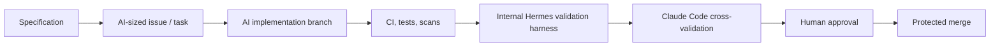

# Development Tooling Strategy v0.1

This project distinguishes between the Law Firm OS product repo, the internal Hermes validation harness, and third-party autonomous agents such as Nous Hermes Agent.

## Decision

Law Firm OS development should be AI-led, but review-gated.

AI is the primary producer of code, tests, UI, refactors, documentation, and validation fixes. Hermes, Claude Code, tests, and human review are the control layers that decide whether AI-produced work can advance.

| Role | Tooling Decision |
| --- | --- |
| Standard IDE | VS Code with minimal extensions and dev containers where possible |
| Primary AI developer | Codex Pro/Plus with workspace-write sandbox, approval on request, network off by default |
| Fast UI AI developer | Cursor Pro with Privacy Mode ON, only for synthetic/non-sensitive product code |
| Cross-validation reviewer | Claude Code Pro/Max with training opt-out and manual permissions |
| Experimental autonomous agent | Nous Hermes Agent only in isolated synthetic R&D sandboxes |
| Product validation harness | Internal Hermes harness as deterministic validation, evidence, and gate layer |

## What Changes

The internal Hermes harness must not be treated as a production coding agent.

It should be scoped down to:

- validate product contracts;
- preserve phase plans and acceptance gates;
- collect command evidence;
- check no-write or review-first boundaries;
- expose operator review surfaces;
- prevent unsafe agent/tool assumptions from entering the product repo.

It should not:

- write directly to production branches;
- access real client, matter, billing, or document data;
- hold production secrets;
- run autonomous production agents;
- bypass PR review, CI, or human approval.

## Personal/Pro Tooling Policy

If Business or Enterprise plans are not being used, AI may still be the development producer, but it must never be the final approval authority.

Required:

- Cursor Privacy Mode ON.
- OpenAI and Anthropic training/data-use opt-out.
- No real client, matter, document, billing, settlement, credential, or production data in AI context.
- Small task scope for each AI implementation slice.
- Manual approval for shell commands and file writes.
- Synthetic fixtures only.
- Claude Code cross-validation plus human review for auth, permission, DMS, billing, settlement, and AI governance code.

Forbidden:

- Full repo unrestricted access when unnecessary.
- Auto-merge.
- Production DB or production secret access.
- Agent-driven production deployment.
- AI-only approval of tenant isolation, permission trimming, settlement formulas, or AI retrieval policy.

## Nous Hermes Agent Policy

Nous Hermes Agent is not approved as a primary Law Firm OS development tool.

Allowed only:

- synthetic repo experiments;
- isolated sandbox R&D;
- open-source workflow comparison;
- agent orchestration research with no production repo access.

Forbidden:

- production repo write access;
- real legal documents or client data access;
- production secrets, SSH keys, or cloud credentials;
- billing, settlement, permission, DMS, or AI governance code mutation;
- CI/CD or deployment authority.

## Practical Operating Model

The safe conclusion is not "AI cannot be the developer." The safe conclusion is "AI can be the developer only if Hermes, Claude Code, tests, and humans are separate verification layers."
