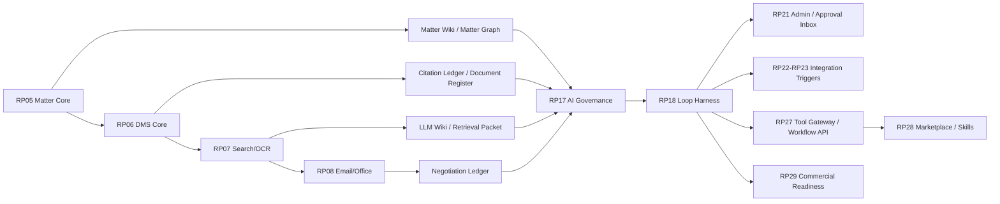

# Law Firm OS Enterprise v2 + Loop Development Timetable

작성일: 2026-06-09

상태: planning-only timetable. 이 문서는 v2 overlay와 Loop System overlay를 엔터프라이즈급 SaaS 계획으로 개선한 뒤 기존 CP/RP 개발 순서에 연결한다. 이 문서는 구현, ledger 변경, contract 변경, validator 변경, closeout, `production_ready` 선언을 승인하지 않는다.

## 1. Master Sequence

전체 개발 순서는 하나의 CP 라인으로 유지한다.

```text
CP00-145-176  Active baseline and RP04 completion
CP00-177-299  v2 knowledge/evidence spine
CP00-300-480  Business domain substrate
CP00-481-551  Enterprise governance and AI safety
CP00-552-583  Loop core enterprise harness
CP00-584-715  Client/admin/integration operations
CP00-716-838  Legal depth, migration, hardening, platform
CP00-839-890  Marketplace and commercial readiness
```

## 2. Detailed Timetable

| Stage | CP range | RP | Primary development | v2 enterprise plan | Loop enterprise plan | Exit gate |
| --- | --- | --- | --- | --- | --- | --- |
| 0A | CP00-145-155 | RP03 Audit And Compliance Kernel | Finish current audit/compliance kernel work already owned by active development session | No new v2 insertion | No Loop insertion | Existing pack closeout only |
| 0B | CP00-156-176 | RP04 | Complete pre-Matter foundation before v2 begins | Prepare CP177 reference only | Prepare Loop planning reference only | CP176 complete, no overlay code drift |
| 1A | CP00-177-197 | RP05 Matter Core | Matter lifecycle, Matter state, task/checklist/calendar foundations | Matter Wiki, Matter Graph skeleton, Matter knowledge ownership, graph provider boundary | Future Loop context references only; no Loop engine | Matter context can later feed Loop without leaking hidden fields |
| 1B | CP00-198-234 | RP06 DMS Core | Document, DocumentVersion, register, versioning, source hierarchy | Document Register, Citation Ledger, immutable source/version binding, source panel contract | Future verifier source checks; no Loop engine | AI/legal output can cite immutable document versions |
| 1C | CP00-235-271 | RP07 Search OCR And Index | OCR, search, semantic index, retrieval | LLM Wiki, RetrievalContextPacket, GraphRAG, candidate vs confirmed knowledge | Future Context Builder source packets; no Loop engine | Retrieval is permission-trimmed and auditable |
| 1D | CP00-272-299 | RP08 Email And Office Native DMS | Email filing, Office-native save, attachment extraction, negotiation evidence | Negotiation Ledger, email/document graph sources, redline/clause event lineage | Future event triggers and negotiation loops; no Loop engine | Negotiation state is source-backed and reviewable |
| 2A | CP00-300-321 | RP09 CRM And Business Development | Lead, opportunity, activity, proposal, campaign, referral | Client relationship evidence links | Future client relationship and BD follow-up loops | CRM data is Matter/client traceable |
| 2B | CP00-322-342 | RP10 Intake Conflict Engagement | Conflict check, waiver, engagement, fee terms | Conflict/engagement source evidence | Future intake/conflict review loops | Conflict and waiver decisions are auditable |
| 2C | CP00-343-364 | RP11 Time Expense Disbursement | Time entry, rates, expenses, disbursement evidence | Billing/time source evidence | Future timekeeping recovery loops | Time/expense records link to evidence |
| 2D | CP00-365-392 | RP12 Billing And Invoicing | Proforma, invoice, tax invoice, write-down/off | Invoice evidence and client-visible billing support | Future invoice preflight and budget forecast loops | Invoice actions are approval/audit ready |
| 2E | CP00-393-426 | RP13 Payments AR Accounting Export | Payment matching, AR aging, journal entry, VAT export | Finance source traceability | Future AR/accounting exception loops | Accounting exports are traceable |
| 2F | CP00-427-453 | RP14 Partner Settlement | Origination, allocation, working credit, settlement lock | Settlement evidence | Future settlement verification loops | Settlement locks and decisions are auditable |
| 2G | CP00-454-480 | RP15 Firm Analytics | Matter P&L, forecast, WIP, management analytics | Analytics source lineage | Future performance/predictive loops | Analytics can distinguish facts, estimates, forecasts |
| 3A | CP00-481-514 | RP16 Governance DLP Retention | DLP, legal hold, retention, break-glass, incident response | Retention/DLP policy for wiki, graph, citation, export | Data boundary policy for Loop context, model route, tool calls | DLP/retention/ethical wall applies before AI/Loop use |
| 3B | CP00-515-551 | RP17 AI Governance | Model policy, retrieval scope, audit, citation, AI approval | Local AI Worker, hybrid routing, AIResult lifecycle, citation validation | BudgetEnvelope, ModelRoutingPolicy, RetrievalScope, AIApproval prerequisites | No model/tool call without policy, budget, citation/review path |
| 4A | CP00-552-583 | RP18 AI Legal Workflows | Precedent, clause, markup, DD extraction, drafting, reports | Consume Matter Wiki, LLM Wiki, Citation Ledger, Authority/Citation policy | LoopDefinition, LoopRun, DAGPlan, worker/verifier, execution, verification, partial result | Core Loop harness exists and fails closed |
| 5A | CP00-584-610 | RP19 Client Portal | Client users, secure link, client review, Q&A, watermark | Client-visible source panel and permission-trimmed summaries | Client-facing output approval loops | Client-visible AI output cannot bypass approval |
| 5B | CP00-611-638 | RP20 Data Room And VDR | M&A room, RFI, CP, closing binder, access analytics | VDR evidence, binder citation, access graph | Data room review and RFI/CP loops | External sharing and VDR loops are policy-gated |
| 5C | CP00-639-659 | RP21 Admin Console | Taxonomy, templates, workflow, policy, usage, billing plan | Admin controls for wiki/graph/citation/export policies | Loop Dashboard, Approval Inbox, budget/admin controls, kill switch | Operator can inspect, pause, disable, and audit Loop runs |
| 5D | CP00-660-687 | RP22 External Integrations I | Microsoft 365, Google Workspace, Slack/Teams, e-sign | External source ingestion and export control | Email/calendar/doc/sign triggers; external action hard blocks | Integration triggers are deduped, permissioned, audited |
| 5E | CP00-688-715 | RP23 External Integrations II | Bank, card, WEHAGO, 더존, tax export, DART | Finance/tax source lineage | Billing/accounting/tax exception loops | Financial Loop actions require policy and approval |
| 6A | CP00-716-749 | RP24 Korean Legal Depth | HWPX, Korean clauses, litigation, corporate documents | Authority Graph, freshness, supersession, jurisdiction binding | Korean legal verifier constraints and authority freshness checks | Superseded/uncited authority blocks high-risk output |
| 6B | CP00-750-781 | RP25 Migration Platform | File server, SharePoint, Drive, iManage import | Backfill Document Register, Citation Ledger, graph/source lineage | Migrated matters become Loop-readable only after lineage validation | Migration does not create unverified knowledge |
| 6C | CP00-782-813 | RP26 Enterprise SaaS Hardening | Dedicated DB/storage/index/key, SSO, MFA, SCIM | Private/Sovereign deployment and local worker boundary | Local/private model routing, fail-closed confidential jobs, HA Loop operations | Deployment mode affects routing, residency, observability |
| 6D | CP00-814-838 | RP27 Platform Extensibility | Public API, webhooks, workflow builder | Obsidian export, graph/model/tool provider extensions | Tool Gateway, workflow API, extension permission, idempotency, webhook callback | External tools cannot bypass Loop policy |
| 7A | CP00-839-866 | RP28 Marketplace And Custom AI Apps | App registry, connector SDK, custom AI app review gate | Knowledge/graph/citation extension packaging | Skill Registry, Playbook Manager, Loop marketplace, regression/golden cases | Marketplace loops require trust, version pinning, regression cases |
| 7B | CP00-867-890 | RP29 Commercial Readiness | CI/CD, observability, SOC2/ISMS-P, release | Private/Sovereign packaging, audit reports, SLA | Loop metrics, cost reporting, support runbooks, commercial audit package | Enterprise release-ready |

## 3. CP Entry Briefs

### 3.1 CP00-177 Entry Brief

Read before CP00-177:

- `docs/spec-v2-integration/v2-cp177-entry-brief.md`
- `docs/spec-v2-integration/v2-rp-anchor-map.md`
- `docs/enterprise-v2-loop-roadmap/enterprise-v2-loop-plan-upgrade.md`

Development posture:

- Implement v2 Matter knowledge/evidence hooks.
- Do not implement Loop engine.
- Leave stable Matter context references for future Loop context building.

### 3.2 CP00-515 Entry Brief

Read before CP00-515:

- `docs/spec-v2-integration/v2-rp-anchor-map.md`
- `docs/loop-system-integration/loop-rp-anchor-map.md`
- `docs/loop-system-integration/loop-enterprise-harness-update.md`
- `docs/enterprise-v2-loop-roadmap/enterprise-v2-loop-plan-upgrade.md`

Development posture:

- Implement AI governance prerequisites for both v2 and Loop.
- Treat budget, model routing, retrieval scope, citation validation, and AI approval as Loop preconditions.
- Do not allow model/tool execution without policy and audit evidence.

### 3.3 CP00-552 Entry Brief

Read before CP00-552:

- `docs/loop-system-integration/loop-enterprise-harness-update.md`
- `docs/loop-system-integration/loop-rp-anchor-map.md`
- `docs/loop-system-integration/loop-overlay-closeout-pack-map.json`
- `docs/enterprise-v2-loop-roadmap/enterprise-v2-loop-development-timetable.md`

Development posture:

- Implement core Loop harness.
- Worker/verifier split is mandatory for high-risk legal work.
- DAG materialization, budget gating, model route decision, tool policy, approval route, and audit must exist before completion.

### 3.4 CP00-639 Entry Brief

Development posture:

- Add admin/operator surfaces for Loop.
- Approval Inbox must show source, diff, risk, recommendation, budget, and approval scope.
- Admin must be able to pause/disable risky loops.

### 3.5 CP00-814 Entry Brief

Development posture:

- Tool Gateway and workflow API must enforce permission, sandbox, credentials, idempotency, replay protection, rate limits, and audit.
- External tools cannot become authority sources without source/citation policy.

### 3.6 CP00-839 Entry Brief

Development posture:

- Marketplace loops and skills require regression/golden cases.
- Tenant version pinning and trust score are required before firm-wide deployment.

## 4. Dependency Graph



## 5. Validation Roadmap

| Validation | First expected stage | Purpose |
| --- | --- | --- |
| `v2-spec-overlay:validate` | Before CP00-177 | Ensure v2 requirements have RP/CP anchors |
| `matter-wiki:validate` | RP05 | Matter Wiki source/review/permission contract |
| `matter-graph:validate` | RP05/RP06 | Graph node/edge vocabulary and permission trimming |
| `citation-ledger:validate` | RP06 | Product-wide immutable citation source anchors |
| `llm-wiki:validate` | RP07 | Candidate/confirmed/disputed retrieval separation |
| `negotiation-ledger:validate` | RP08 | Email/redline/clause event lineage |
| `local-ai-worker:validate` | RP17/RP26 | Local/private model routing and provenance |
| `loop-budget:validate` | RP17/RP18 | BudgetEnvelope and usage gating |
| `loop-model-routing:validate` | RP17 | Model routing by task/risk/cost/data boundary |
| `loop-worker-verifier:validate` | RP18 | Worker/verifier separation |
| `loop-dag-plan:validate` | RP18 | Bounded DAG and branch audit |
| `loop-tool-gateway:validate` | RP27 | Tool permission, sandbox, idempotency, audit |
| `loop-regression:validate` | RP28 | Skill/Loop golden cases and marketplace trust |
| `enterprise-release:validate` | RP29 | SLA, observability, audit report, commercial support |

## 6. Completion Definition

The enterprise v2 + Loop plan is complete when:

1. CP00-145-CP00-176 remains controlled by the active development session.
2. CP00-177 has v2 knowledge/evidence entry guidance.
3. CP00-515 has AI governance and Loop prerequisite guidance.
4. CP00-552 has Loop core harness guidance.
5. CP00-639, CP00-814, CP00-839, and CP00-867 have operator/platform/market/commercial guidance.
6. Every high-risk AI or Loop output is source-backed, permission-trimmed, verifier-checked, budget-aware, approval-routed, and auditable.

