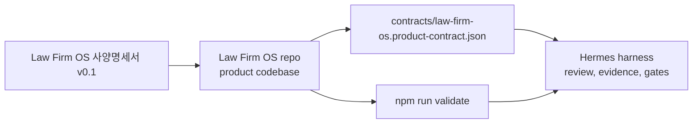

# Hermes Harness Connection

Hermes is the validation and supervision harness. Law Firm OS is the product codebase.

This refers to the internal `/Users/jws/Documents/Codex/Hermes` harness, not Nous Hermes Agent. Nous Hermes Agent is treated as a separate third-party autonomous agent and is not approved for production repo access.

Hermes should not contain the Law Firm OS source tree. Instead, this repo exposes a small validation contract in `hermes/project.json`.

## Connection Model



## What Hermes Should Check First

- The product contract remains Matter-first.
- CRM, DMS, Billing, Settlement, and AI share Client, Matter, Permission, and Audit concepts.
- DMS is modeled as an independent document, email, version, search, and knowledge layer.
- AI is blocked from using documents outside the user's permission scope.
- Audit is required for document access, permission changes, billing changes, settlement runs, and AI access.
- Runtime automation remains review-first until explicit human approval gates exist.
- Third-party autonomous agents remain blocked from production repo writes, production secrets, and real client/matter data.

## First Harness Command

From this repo:

```bash
npm run validate
```

Hermes can call that command and store the output as product-contract evidence.

## Attachment Levels

- `H0`: read this repo's `hermes/project.json` and run `npm run validate`.
- `H1`: after core domain tests exist, run `npm run validate` and `npm test`.
- `H2`: after UI/domain build exists, add `npm run build`.
- `H3`: when permission, DMS, audit, or AI code begins, add security-focused gates.
- `H4`: near release candidate, create a human review and release evidence packet.

The practical rule: attach Hermes lightly now, but do not expand Hermes deeply until Law Firm OS has real P0 domain code and tests.
