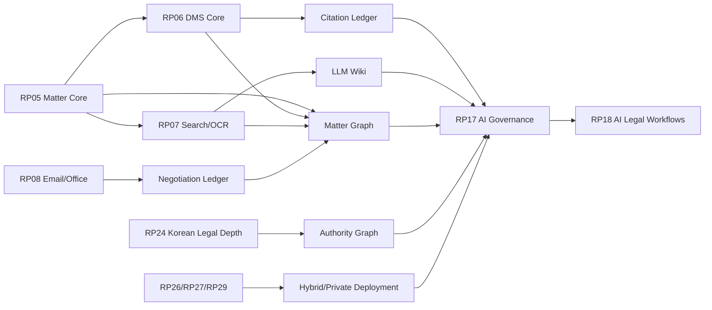

# Law Firm OS v2.0 RP Anchor Map

작성일: 2026-06-09

상태: planning-only anchor map. 이 문서는 `v2-missing-requirements-spec.md`의 누락 요구사항을 기존 Law Firm OS RP/CP/microphase 실행 구조에 연결한다. 이 문서는 구현, ledger 변경, contract 변경, validator 변경, closeout, `production_ready` 선언을 승인하지 않는다.

## 1. Live Boundary

- 기준 live cursor: `CP00-144` 완료, `CP00-145` 다음
- 병렬 개발 세션 범위: `CP00-145-CP00-176`
- 이 문서의 안전 범위: `docs/spec-v2-integration/*`
- 앵커맵의 첫 실제 구현 소비 지점: `CP00-177` / `RP05 Matter Core`

다른 세션이 `CP00-145-CP00-176`을 진행하는 동안 이 문서는 `RP05+` 진입 전에 읽을 planning reference로만 사용한다.

## 2. Anchor Rules

1. 기존 closeout pack 흐름을 대체하지 않는다.
2. `CP00-145-CP00-176`에는 직접 요구사항을 삽입하지 않는다.
3. P0 요구사항은 `mapped` 또는 `partial_mapped`만 허용하고, `rejected`로 두지 않는다.
4. 최초 구현 CP는 가장 이른 책임 RP에만 둔다. 후속 RP는 확장, 검증, UI, governance, deployment 역할로 구분한다.
5. 모든 AI, graph, wiki, citation 요구사항은 permission/audit/security trimming anchor를 반드시 가진다.
6. 이 문서의 anchor는 future-pack input이다. 실제 완료는 각 CP closeout evidence와 commit으로만 인정한다.

## 3. RP/CP Ranges Used By This Map

| RP | CP range | Role in v2 overlay |
| --- | --- | --- |
| RP05 Matter Core | CP00-177-CP00-197 | Matter Wiki shell, Matter Graph skeleton, Matter knowledge ownership |
| RP06 DMS Core | CP00-198-CP00-234 | Document Register, DocumentVersion anchors, Citation Ledger source spine |
| RP07 Search OCR And Index | CP00-235-CP00-271 | LLM Wiki retrieval, OCR lineage, semantic/GraphRAG source packets |
| RP08 Email And Office Native DMS | CP00-272-CP00-299 | Negotiation Ledger, email/filed-message graph sources, Office save-to-DMS hooks |
| RP16 Governance DLP Retention | CP00-481-CP00-514 | register retention, DLP, legal hold, external sharing policy |
| RP17 AI Governance | CP00-515-CP00-551 | AI result lifecycle, model routing, citation validation, review queue |
| RP18 AI Legal Workflows | CP00-552-CP00-583 | workflow consumption of wiki/graph/citation/negotiation outputs |
| RP24 Korean Legal Depth | CP00-716-CP00-749 | Authority Graph, jurisdiction freshness, Korean legal authority controls |
| RP25 Migration Platform | CP00-750-CP00-781 | migrated document lineage, version reconstruction, register backfill |
| RP26 Enterprise SaaS Hardening | CP00-782-CP00-813 | hybrid/private deployment, local worker operations, reliability |
| RP27 Platform Extensibility | CP00-814-CP00-838 | Obsidian export, graph/provider extension, model/tool registries |
| RP29 Commercial Readiness | CP00-867-CP00-890 | Private/Sovereign packaging, SLA, support, final coverage gate |

## 4. Requirement Anchor Matrix

| Requirement ID | Priority | First CP | Primary RP | Secondary RPs | Decision | Implementation intent |
| --- | --- | --- | --- | --- | --- | --- |
| V2-MISS-KNOW-001 | P0 | CP00-177 | RP05 | RP06, RP07, RP17, RP18 | mapped | Model MatterWiki as first-class Matter knowledge workspace |
| V2-MISS-KNOW-002 | P0 | CP00-235 | RP07 | RP17, RP18, RP27 | mapped | Model LLMWiki as permission-trimmed retrieval layer |
| V2-MISS-KNOW-003 | P1 | CP00-814 | RP27 | RP05, RP17, RP22 | mapped | Add Obsidian-compatible controlled export |
| V2-MISS-GRAPH-001 | P0 | CP00-177 | RP05 | RP06, RP07, RP08, RP17, RP18 | mapped | Define graph-provider boundary and permission-trimmed traversal |
| V2-MISS-GRAPH-002 | P0 | CP00-177 | RP05 | RP06, RP07, RP08, RP17, RP24 | mapped | Define minimum Matter Graph node/edge vocabulary |
| V2-MISS-GRAPH-003 | P1 | CP00-177 | RP05 | RP06, RP07, RP08, RP17, RP18, RP24 | partial_mapped | Define named graph views; full UI realization may occur across later RPs |
| V2-MISS-CITE-001 | P0 | CP00-198 | RP06 | RP07, RP17, RP18, RP24 | mapped | Establish product-wide Citation Ledger and immutable source anchors |
| V2-MISS-CITE-002 | P0 | CP00-198 | RP06 | RP07, RP17, RP18, RP19 | mapped | Define source panel/evidence UX contract over citation ledger |
| V2-MISS-AI-001 | P0 | CP00-515 | RP17 | RP18, RP26, RP27, RP29 | mapped | Define Local AI Worker capability and provenance |
| V2-MISS-AI-002 | P0 | CP00-515 | RP17 | RP18, RP26, RP27 | mapped | Define hybrid model routing policy and audit persistence |
| V2-MISS-AI-003 | P0 | CP00-515 | RP17 | RP18, RP19, RP29 | mapped | Define AIResult lifecycle through client delivery |
| V2-MISS-DMS-001 | P1 | CP00-198 | RP06 | RP07, RP08, RP16, RP25 | mapped | Define Document Register as named contract |
| V2-MISS-DMS-002 | P1 | CP00-198 | RP06 | RP07, RP08, RP25 | mapped | Define source lineage for documents, email, OCR, imports, and migration |
| V2-MISS-NEG-001 | P1 | CP00-272 | RP08 | RP05, RP06, RP18 | mapped | Define Negotiation Ledger and links to graph/citation/document versions |
| V2-MISS-AUTH-001 | P1 | CP00-716 | RP24 | RP07, RP17, RP18 | mapped | Define Authority Graph and freshness controls |
| V2-MISS-DEPLOY-001 | P1 | CP00-782 | RP26 | RP27, RP29 | mapped | Define deployment modes and hybrid worker boundary |
| V2-MISS-PLAN-001 | P2 | planning-only | docs/spec-v2-integration | all dependent RPs | mapped | Keep v2 Stage-to-RP overlay without replacing CP plan |

## 5. First-Use Entry Points

### 5.1 CP00-177 Entry: Matter Core

`CP00-177` is the first implementation point that must consume this anchor map.

Required CP00-177 pre-read:

- `v2-missing-requirements-spec.md`
- `v2-source-index.md`
- `v2-rp-anchor-map.md`
- `v2-gap-adjudication.md`
- `v2-no-omission-coverage-matrix.md`
- `v2-cp177-entry-brief.md`

Required decisions before code:

- `MatterWiki` is not a free-form note.
- `MatterGraph` exists as a domain skeleton even if graph provider implementation is deferred.
- `CitationLedger` is not implemented in RP05, but RP05 must leave stable references for later RP06 source anchors.
- Matter Graph view must not expose hidden nodes or hidden labels.

### 5.2 CP00-198 Entry: DMS Core

`CP00-198` consumes the v2 DMS and citation requirements.

Required decisions before code:

- DMS `DocumentVersion` is the immutable citation source version.
- `DocumentRegister` is named and distinct from generic document metadata.
- `CitationLedgerEntry` is product-wide, not only AI-governance local metadata.
- Source lineage must survive migration, email filing, OCR, and reprocessing.

### 5.3 CP00-235 Entry: Search OCR And Index

`CP00-235` consumes retrieval and LLM Wiki requirements.

Required decisions before code:

- `LLMWikiEntry` is permission-trimmed retrieval material.
- GraphRAG context packets must record visible and trimmed counts.
- Candidate knowledge and confirmed knowledge are separate.
- Disputed facts and open questions are first-class, not flattened text.

### 5.4 CP00-272 Entry: Email And Office Native DMS

`CP00-272` consumes negotiation requirements.

Required decisions before code:

- Email filing can create `NegotiationEvent` records.
- Clause changes must link to `DocumentVersion` and Citation Ledger.
- Negotiation summaries are review-required until approved.
- Word/Outlook add-ins are input surfaces, not authority sources.

### 5.5 CP00-515 Entry: AI Governance

`CP00-515` consumes local AI, routing, AI result lifecycle, citation validation, and LLM Wiki policies.

Required decisions before code:

- Local AI Worker jobs still pass through AI Governance.
- External LLM routing is policy-controlled and audit-persisted.
- AI output cannot become confirmed or client-delivered without review/citation constraints.
- Uncited high-risk output must block or route to review.

### 5.6 CP00-716 Entry: Korean Legal Depth

`CP00-716` consumes Authority Graph requirements.

Required decisions before code:

- Authority freshness is a product contract, not model memory.
- Korean legal authority depth is jurisdiction-specific but not product-narrowing.
- Superseded authority must trigger review-required state.

### 5.7 CP00-782 Entry: Enterprise SaaS Hardening

`CP00-782` consumes deployment and hybrid boundary requirements.

Required decisions before code:

- Deployment mode affects data residency, AI routing, storage, backup, observability, support, and integration limits.
- Local worker failure must fail closed for confidential jobs.
- Private/Sovereign packaging requires SLA/security review/CMK support readiness.

## 6. Dependency Graph

## 7. Validation Anchors

| Validation surface | First expected RP | Purpose |
| --- | --- | --- |
| `v2-spec-overlay:validate` | planning-only before CP00-177 | Ensure every v2 requirement has decision and RP anchor |
| `matter-wiki:validate` | RP05 | Validate wiki shell, sections, source links, snapshots, review state |
| `matter-graph:validate` | RP05/RP06 | Validate node/edge vocabulary, traversal trimming, graph snapshots |
| `citation-ledger:validate` | RP06 | Validate immutable anchors, source hashes, citation states, uncited output blocks |
| `document-register:validate` | RP06 | Validate register fields, lineage, source hierarchy, AI processed state |
| `llm-wiki:validate` | RP07 | Validate retrieval packets, candidate/confirmed separation, disputed facts |
| `negotiation-ledger:validate` | RP08 | Validate email/redline/clause event lineage |
| `local-ai-worker:validate` | RP17/RP26 | Validate worker provenance, routing decisions, fail-closed behavior |
| `authority-graph:validate` | RP24 | Validate authority freshness, supersession, jurisdiction binding |
| `deployment-mode:validate` | RP26/RP29 | Validate deployment mode effects and Private/Sovereign packaging |

## 8. Completion Criteria

This anchor map is complete when:

1. Every `V2-MISS-*` requirement has a primary RP, first CP, dependent RP list, and decision.
2. Every P0 requirement has an implementation intent and validation surface.
3. `CP00-145-CP00-176` remains untouched by this planning layer.
4. `CP00-177` has an explicit entry brief.
5. The overlay JSON matches this map.
