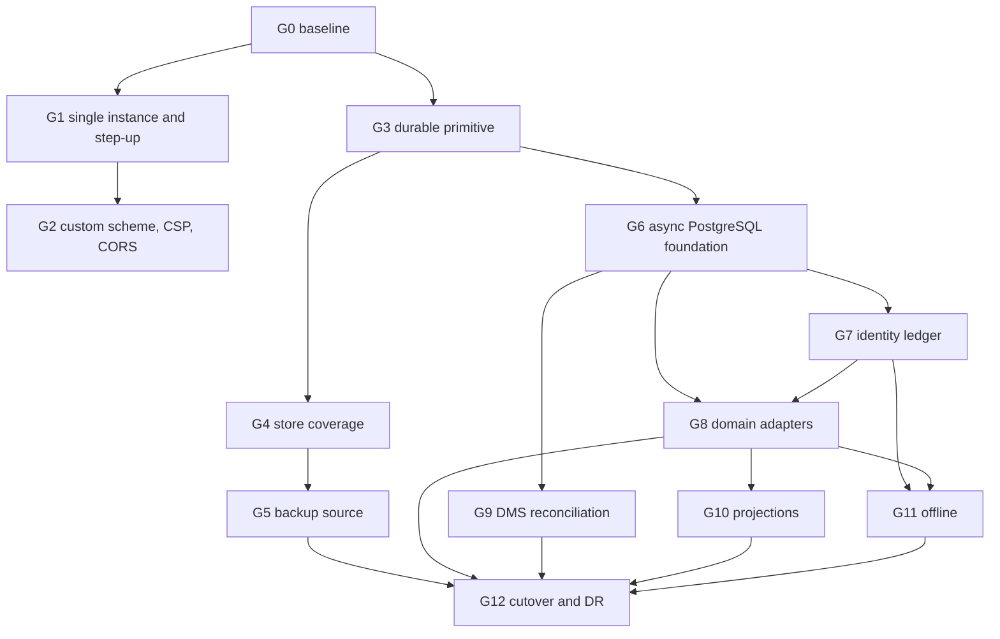

# Law Firm OS 런타임 안전성·중앙 원장 전환 상세 TUW 실행계획

- 작성일: 2026-07-16 KST
- 상태: `DETAILED_PLAN_READY_WITH_EVIDENCE_V0_2_ERRATUM`
- 상위 계획: `workbook/lawos-runtime-safety-central-ledger-implementation-plan-2026-07-16.md`
- 근거 검토: `workbook/lawos-current-main-runtime-safety-analysis-review-2026-07-16.md`
- 기준 `origin/main`: `b46a686f719875c6980ecba9bc213a605f58fa45`
- 계획 작성 브랜치: `codex/runtime-safety-validation-20260716`
- 계획 작성 worktree: `/private/tmp/lawos-runtime-safety-validation-20260716`
- 적용 대상: 현재 Forest v0.1.17 UI와 Law Firm OS modular monolith
- 계획 규모: 13개 workstream, 147개 TUW, 13개 final terminal
- 비승인 범위: release, tag, AWS mutation/deploy, production migration, real-data cutover, go-live

## 1. 문서의 역할

상위 계획이 방향·ADR·큰 work package를 고정한다면, 이 문서는 실제 구현자가 한 번에 집어 들 수 있는 최소 실행 단위(TUW)와 그 사이의 의존성을 고정한다.

이 문서의 TUW는 다음 조건을 동시에 만족해야 한다.

1. 종료 시 참이 되는 결과가 하나다.
2. 기본 크기는 코드·테스트 합계 1~4개 파일, 0.5시간~3일이다.
3. 선행 TUW가 ID로 명시된다.
4. 검증 명령 또는 수동 절차가 정해져 있다.
5. 실패 시 중단점과 rollback 종류가 정해져 있다.
6. `SOURCE_DONE`, `VERIFIED`, `MERGE_READY`, `STAGING_EXECUTED`, `PRODUCTION_CUTOVER`를 혼용하지 않는다.
7. 외부 승인 TUW는 에이전트가 임의로 `DONE` 처리할 수 없다.

이 계획은 기존 Forest UI를 재설계하지 않는다. UI가 영향을 받는 TUW는 현재 Forest 화면의 회귀 검증만 수행한다. 과거 UI, 오래된 branch, 사용자 루트의 미커밋 파일을 복원하거나 덮어쓰지 않는다.

## 2. TUW 상태와 크기 계약

### 2.1 두 개의 독립 상태축

| 축 | 허용 상태 | 의미 |
|---|---|---|
| `implementation_state` | `PLANNED`, `READY`, `IN_PROGRESS`, `VERIFIED`, `BLOCKED`, `BLOCKED_NOT_REPRODUCIBLE`, `DISABLED_BY_APPROVED_DECISION` | 저장소 소스와 로컬 검증 또는 승인된 비활성화 상태 |
| `execution_state` | `NOT_APPLICABLE`, `APPROVAL_REQUIRED`, `EXECUTE_READY`, `EXECUTED`, `REHEARSED`, `BLOCKED_EXTERNAL` | staging·AWS·production 등 외부 실행 상태 |

2026-07-17 evidence v0.2 erratum부터 `SOURCE_DONE`, `MERGE_READY`, `MERGED`는 receipt 상태가 아니라 Git/통합 보고의 별도 사실선이다. `EXECUTED`는 검증 완료를 의미하지 않으며, `REHEARSED` 또는 해당 gate receipt가 별도로 필요하다. `DISABLED_BY_APPROVED_DECISION`은 유효한 서명 결정과 fail-closed negative proof가 있을 때만 허용된다.

### 2.2 크기·위험·실행자

| 표기 | 의미 |
|---|---|
| `L` | 0.5~2시간. 문서, inventory, 단일 test 또는 작은 guard |
| `M` | 2~6시간. 하나의 helper/adapter와 대상 test |
| `H` | 1~3일. schema·migration·runtime wiring·통합 검증. H를 초과하면 분해 |
| `A` | 보안, 권한, 인증, 개인정보, migration, backup/restore, provider, production 영향 |
| `B` | 공통 persistence/API contract 또는 여러 도메인에 파급되는 코드 |
| `C` | read-only inventory, 문서, 합성 test fixture |
| `agent` | 저장소 source와 합성/local 검증만 수행 |
| `human` | 결정·승인·실데이터·production 실행의 소유자 |
| `hybrid` | agent가 packet/source를 만들고 human이 승인·실행 |

## 3. 공통 실행 프로토콜

모든 TUW가 아래 규칙을 상속한다.

1. 실행 직전 `git fetch origin main`, 기준 SHA, ancestor, worktree 경로, branch, HEAD, clean 상태를 기록한다.
2. 사용자 루트 `/Users/jws/Documents/Codex/Law Firm OS`에서는 수정, 정리, reset, stash, commit을 하지 않는다.
3. terminal workstream마다 최신 승인 기준에서 새 clean worktree와 `codex/rs-<workstream>-<date>` branch를 만든다.
4. 한 worktree에서 `IN_PROGRESS` TUW는 하나만 둔다. 하나의 TUW가 검증되기 전 다음 TUW를 시작하지 않는다.
5. TUW의 `touchpoints` 밖 파일이 필요해지면 즉시 중단하고 계획을 갱신한다.
6. 구현-검증 시도는 TUW당 3회다. 세 번째 실패 뒤에는 추가 수정하지 않고 blocker와 세 시도를 기록한다.
7. 실데이터, token, secret, 원문 PII를 git evidence에 넣지 않는다. count, salted hash, invariant 결과만 기록한다.
8. 증거 기본 경로는 `workbook/lawos-runtime-safety-evidence/<TUW-ID>/command-evidence.json`이다. 실행 시에만 생성한다.
9. 신규 evidence v0.2에는 `schema_version`, `tuw_id`, 두 상태축, `target_source_sha`, `target_tree`, `toolchain_sha`, `profile`, ordinal이 일치하는 `commands[]`/`results[]`, `started_at`, `finished_at`, `safe_counts`, `skip_count`, `output_path`, `output_sha256`, closed boolean `claims`, `external_actions`를 넣는다. legacy supersession은 원본 경로와 SHA-256을 `legacy_evidence`로 보존한다.
10. `--require-verified`는 내부적으로 `--require-all`을 포함하며 모든 호출에서도 두 flag를 명시한다. raw output은 Git 밖에 보관하고 Git에는 allowlisted hash evidence만 둔다.
11. 제품 코드 commit은 terminal 검증보다 앞설 수 있지만, terminal evidence 없이 source merge candidate가 될 수 없다.
12. release/tag/notarization upload/AWS deploy/production write는 이 계획만으로 권한이 생기지 않는다.
13. 현재 packaged surface가 source 가정과 다르면 source-only 판단을 중단하고 packaged screen/runtime을 다시 기준으로 삼는다.

## 4. 중단 코드와 rollback 종류

### 4.1 공통 중단 코드

| 코드 | 중단 조건 | 후속 조치 |
|---|---|---|
| `STOP-BASE` | `origin/main`이 바뀌었거나 기준 tree가 달라짐 | 새 worktree에서 baseline·diff·대상 test 재수행 |
| `STOP-ROOT` | 사용자 루트 변경이 감지됨 | 작업 중단, 해당 변경을 건드리지 않고 사용자에게 보고 |
| `STOP-SCOPE` | touchpoint 밖 변경이 필요함 | 계획과 file ownership 갱신 전 구현 금지 |
| `STOP-DATA` | count/hash/invariant 차이가 설명되지 않음 | write/cutover 금지, discrepancy ledger 생성 |
| `STOP-PII` | evidence/log/render에 secret·PII가 노출됨 | 산출물 폐기·redact 후 보안 검토 |
| `STOP-SEC` | 권한·tenant·IPC·CORS·CSP negative test 실패 | merge 금지, fail-closed 상태 유지 |
| `STOP-LOCK` | writer lock owner를 안전하게 판별할 수 없음 | lock 강제 해제 금지, operator 판정 요청 |
| `STOP-EXT` | AWS/provider/IdP/real-data/staging/production 권한 또는 별도 사용자 실행 지시가 필요함 | 승인·지시가 없으면 외부 접촉 0, `APPROVAL_REQUIRED`; 유효한 승인과 정확한 named-environment 시도 뒤 환경 불가 hash가 있을 때만 `BLOCKED_EXTERNAL` |
| `STOP-3X` | 서로 다른 세 수정 시도 후에도 검증 실패 | blocker와 재현 명령 기록 후 중단 |

### 4.2 rollback 종류

| 코드 | 적용 시점 | 허용 rollback |
|---|---|---|
| `RB-CODE` | deploy/cutover 전 | 해당 source commit revert, 기존 안전 guard는 약화 금지 |
| `RB-FILE` | file authority 과도기 | 마지막 valid generation 복원 또는 forward repair; CAS/lock 비활성화 금지 |
| `RB-DB-PRE` | DB가 아직 write authority가 아님 | adapter selection을 검증된 file v2로 복귀 가능 |
| `RB-DB-POST` | DB가 새 write를 한 건이라도 수락함 | 낡은 JSON fallback 금지; PITR 또는 forward repair만 허용 |
| `RB-DMS-STAGE` | DMS finalize 전 | staged orphan 정리·session 실패 처리; committed legal-hold object 삭제 금지 |
| `RB-EXT` | 외부 승인 전 | 실행하지 않음. source/packet만 유지 |

## 5. 외부 의존 레지스트리

| 키 | 필요한 결정·권한 | 차단 범위 | source work 가능 여부 | 연결 TUW·필수 receipt |
|---|---|---|---|---|
| `EXT-PLAN-APPROVAL` | 이 상세계획의 source execution 승인 | 첫 구현 TUW 진입 | packet·plan만 가능 | `RS-GOV-008`: 사용자 승인 기록 |
| `EXT-AWS-BACKUP` | bucket/KMS/policy/role/scheduler mutation 승인 | 실제 off-device backup 활성화 | queue·processor·fake integration 가능 | `RS-BKP-005` packet → `RS-CUT-008` active-backup receipt → `RS-CUT-010` restore receipt |
| `EXT-PG-PROD` | production DB vendor/instance/region/secret/IAM 승인 | production DB 연결·cutover | disposable PostgreSQL adapter/test 가능 | `RS-DBF-012` source checkpoint → `RS-CUT-008` provisioned-instance receipt → `RS-CUT-009` cutover receipt |
| `EXT-STAGING` | 승인된 staging DB·tenant·credential | shadow/rehearsal | local/disposable rehearsal 가능 | `RS-CUT-005`~`RS-CUT-007`: staging migration·switch·smoke receipt |
| `EXT-REAL-DATA` | real-client-data inventory/import 승인 | 실데이터 dry-run·cutover | synthetic importer/test 가능 | `RS-CUT-005`, `RS-CUT-009`: PII-safe count/hash/invariant receipt |
| `EXT-DMS-PROVIDER` | MAT-DEC-03: SharePoint/OneDrive 대 object storage | 실제 document original write | provider-neutral source 가능 | `RS-DMS-001`, `RS-DMS-010`, `RS-CUT-010`: decision·sandbox·restore receipt |
| `EXT-IDP` | IdP/MFA/passkey provider와 credential transition | production authentication 전환 | provider-neutral interface 가능 | `RS-IDN-009`: interface/local adapter; 실제 provider 전환은 별도 승인 execution packet이며 `G7-IDN` source claim에 포함하지 않음 |
| `EXT-RETENTION` | backup 보존·삭제·legal hold·PIPA 결정 | retention/lifecycle 실제 적용 | decision packet 가능 | `RS-BKP-007`, `RS-DMS-001`, `RS-CUT-008`: 승인된 retention/legal-hold matrix |
| `EXT-READINESS-AUTHORITY` | UI/Enterprise readiness record의 mutable control-plane 또는 immutable artifact 권위 결정 | readiness 이식과 `PROJECTIONS_SOURCE_VERIFIED` claim | packet·source-local 분류와 negative proof 가능 | `RS-PRJ-005`, `RS-PRJ-006`, `RS-CUT-002`: RFC 8785 canonical payload + detached Ed25519 receipt |
| `EXT-PROD-WINDOW` | write freeze·migration·rollback window 승인 | production cutover | runbook·synthetic rehearsal 가능 | `RS-CUT-001`, `RS-CUT-008`, `RS-CUT-009`: operator·window·abort authorization |
| `EXT-RELEASE` | exact-main build/tag/release/AWS deploy 승인 | release와 배포 | source test만 가능 | 이 source plan의 TUW가 실행하지 않음; `RS-CUT-008`은 별도 release/deploy receipt 없으면 production 진입 금지 |
| `EXT-WIN-SIGN` | Authenticode 자격·승인 | Windows distribution | source/build preflight만 가능 | source merge 비차단, Windows release 차단; 이 계획 밖 release checklist에서만 해제 |

## 6. 검증 계약 카탈로그

`현재`는 지금 존재하는 명령, `신설`은 해당 TUW가 만들어야 하는 검증 진입점이다.

| VC | 상태 | 검증 명령 또는 절차 | PASS 기준 |
|---|---|---|---|
| `VC-BASE-001` | 현재 | `git fetch origin main`; `git rev-parse`; `git merge-base --is-ancestor`; `git status --porcelain=v1` | ancestor exit 0, 전용 worktree clean |
| `VC-DOC-001` | 현재 | `node scripts/validate-runtime-safety-governance.mjs` | TUW·dependency·terminal·path·writer·approval evidence 누락·중복·순환 0 |
| `VC-DESK-BASE` | 현재 | `node --test apps/desktop/test/origin-policy.test.mjs apps/desktop/test/session-ipc.test.mjs apps/desktop/test/runtime-package.test.mjs` | 7/7 PASS |
| `VC-DESK-SA` | 신설 | `node --test apps/desktop/test/single-instance.test.mjs apps/api/test/operational-step-up-preflight.test.js` | 두 번째 instance 무초기화, operational default secret 전건 거부 |
| `VC-DESK-SB` | 신설 | `node --test apps/desktop/test/app-protocol.test.mjs apps/desktop/test/csp.test.mjs apps/desktop/test/origin-policy.test.mjs apps/desktop/test/session-ipc.test.mjs` | traversal·file URL·새 창·untrusted IPC 전건 거부 |
| `VC-CORS-001` | 신설 | `node --test apps/api/test/cors-negative.test.js apps/api/test/master-data-api.test.js` | `null`·arbitrary origin 미반환, exact custom/dev origin만 허용 |
| `VC-DUR-001` | 신설 | `node --test packages/persistence/test/durable-file.test.js packages/persistence/test/multi-process-generation.test.js packages/persistence/test/store-fault-injection.test.js packages/persistence/test/store-permissions.test.js` | lost write 0, conflict 검출, 마지막 generation parse 가능, mode 일치 |
| `VC-STORE-001` | 신설 | `node scripts/validate-runtime-store-writer-coverage.mjs` | 16 manifest path와 operational out-of-manifest writer 미분류 0, 직접 JSON write 예외 0 |
| `VC-BKP-001` | 신설 | `node --test packages/persistence/test/s3-backup-queue.test.js scripts/test/runtime-store-backup-restore.test.mjs` | enqueue→retry→receipt→isolated restore PASS |
| `VC-PG-001` | 신설 | `node --test packages/persistence/test/postgres-transaction.test.js packages/persistence/test/postgres-repository-contract.test.js` | transaction·RLS·idempotency·outbox·conflict 전건 PASS |
| `VC-AUTH-001` | 신설 | `node --test apps/api/test/session-auth-api.test.js apps/api/test/auth-restart-revocation.test.js apps/api/test/auth-concurrency.test.js` | restart persistence, cross-process revoke, lock threshold 정확 |
| `VC-MD-001` | 신설 | `node --test packages/master-data/test/*.test.js apps/api/test/master-data-runtime.test.js apps/api/test/master-data-api.test.js` | file/PG contract와 API 회귀 PASS |
| `VC-MAT-001` | 신설 | `node --test packages/matter/test/*.test.js apps/api/test/matter-worktree-*.test.js apps/api/test/matter-vault-persistence.test.js` | Matter invariant·API·restart PASS |
| `VC-CRM-001` | 신설 | `node --test packages/crm/test/*.test.js packages/intake/test/*.test.js apps/api/test/crm-intake-api.test.js` | CRM/Intake/clearance/tenant 회귀 PASS |
| `VC-HRX-001` | 신설 | `node --test packages/hrx/test/*.test.js apps/api/test/hrx/*.test.js` | HRX migration·ledger·payroll·authz 회귀 0 fail |
| `VC-FIN-001` | 신설 | `node --test packages/billing/test/*.test.js apps/api/test/finance*.test.js` | finance ledger·invoice·WIP·API 회귀 PASS |
| `VC-PORTAI-001` | 신설 | `node --test packages/client-portal/test/*.test.js packages/ai-governance/test/*.test.js` | revocation·policy·audit·tenant 회귀 PASS |
| `VC-DMS-001` | 신설 | `node --test packages/dms/test/*.test.js packages/dms/test/upload-reconciliation.test.js apps/api/test/vault*.test.js` | 모든 kill point orphan/dangling 자동 탐지, hash·hold 보존 |
| `VC-PRJ-001` | 신설 | `node --test packages/analytics/test/*.test.js apps/api/test/home-dashboard*.test.js` | restart persistence, telemetry 비차단, projection watermark 일치 |
| `VC-OFF-001` | 신설 | `node --test apps/desktop/test/offline-cache.test.mjs apps/desktop/test/offline-replay-conflict.test.mjs` | encrypted cache, exactly-once replay, silent overwrite 0 |
| `VC-CUT-001` | 신설 | `node scripts/validate-central-ledger-cutover-readiness.mjs` | 승인·hash·count·shadow·restore·rollback-cutoff 누락 0 |
| `VC-SEC-001` | 현재+확장 | `node scripts/validate-matter-desktop-security.mjs`; `node scripts/validate-hrx-security-negative-tests.mjs` | validator PASS, 새 trust boundary 포함 |
| `VC-PREFLIGHT-001` | 현재 | `node scripts/validate-store-path-preflight.mjs` | 5 scenarios PASS, production claim false |

신설 VC가 존재하지 않는 상태에서 관련 TUW를 `VERIFIED`로 올릴 수 없다. test filename을 만들기만 하고 failure case를 검증하지 않으면 PASS가 아니다.

## 7. Gate와 허용 claim

| Gate | terminal TUW | 필수 증거 | 통과 후 허용 claim | 여전히 금지되는 claim |
|---|---|---|---|---|
| `G0-BASE` | `RS-GOV-008` | baseline·inventory·decision ledger | `PLAN_EXECUTION_READY` | source implemented |
| `G1-SA` | `RS-SA-008` | single-instance·step-up tests | `TRUST_BOUNDARY_A_SOURCE_VERIFIED` | package/release secure |
| `G2-SB` | `RS-SB-010` | scheme·CSP·CORS·package smoke | `TRUST_BOUNDARY_B_LOCAL_VERIFIED` | public release |
| `G3-DUR` | `RS-DUR-012` | multi-process·fault·mode tests | `DURABLE_WRITER_PRIMITIVE_VERIFIED` | all stores migrated |
| `G4-STO` | `RS-STO-015` | 16-path coverage·direct-write scan | `FILE_AUTHORITY_TRANSITION_SAFE` | central ledger complete |
| `G5-BKP` | `RS-BKP-008` | fake upload·isolated restore | `BACKUP_SOURCE_LOCAL_VERIFIED` | AWS backup active, RPO/RTO met |
| `G6-DBF` | `RS-DBF-012` | disposable PG contract·RLS | `POSTGRES_SOURCE_FOUNDATION_VERIFIED` | production DB selected |
| `G7-IDN` | `RS-IDN-010` | restart/revoke/concurrency tests | `IDENTITY_LEDGER_SOURCE_VERIFIED` | IdP cutover complete |
| `G8-DOM` | `RS-DOM-030` | domain import/shadow/rehearsal receipts | `DOMAIN_ADAPTERS_SOURCE_VERIFIED` | production migrated |
| `G9-DMS-SRC` | `RS-DMS-009` | provider-neutral reconciliation | `DMS_SOURCE_CHECKPOINT_VERIFIED`, `SOURCE_MERGE_CANDIDATE` | provider selected/active, staging, production, release |
| `G9-DMS-EXT` | `RS-DMS-010` | MAT-DEC-03 + sandbox receipt | `DMS_PROVIDER_STAGING_VERIFIED` | production upload/go-live |
| `G10-PRJ` | `RS-PRJ-006` | restart/rebuild/watermark | `PROJECTIONS_SOURCE_VERIFIED` | analytics SLO met |
| `G11-OFF` | `RS-OFF-006` | encrypted offline/replay tests | `OFFLINE_SOURCE_VERIFIED` | device rollout complete |
| `G12-CUT` | `RS-CUT-012` | per-domain approval·cutover·DR receipts | `CENTRAL_LEDGER_CUTOVER_VERIFIED` | release/go-live without EXT-RELEASE |

### 7.1 approval-dependent outcome erratum

| 범위 | signed-approved/enabled | signed-rejected/disabled | unsigned/missing |
|---|---|---|---|
| `RS-PRJ-005`~`006` | 둘 다 `VERIFIED/NOT_APPLICABLE`, `PROJECTIONS_SOURCE_VERIFIED` 가능 | `RS-PRJ-005`는 결정 검증으로 `VERIFIED`; `RS-PRJ-006`은 `DISABLED_BY_APPROVED_DECISION`; CUT dependency 미충족 | `RS-PRJ-005`는 `READY/APPROVAL_REQUIRED`, `RS-PRJ-006`은 `PLANNED/APPROVAL_REQUIRED`, verified false |
| `RS-OFF-001`~`006` | 6개 모두 `VERIFIED/NOT_APPLICABLE` | `RS-OFF-001`, `006`은 결정/fail-closed 검증으로 `VERIFIED`; `002`~`005`는 `DISABLED_BY_APPROVED_DECISION` | `RS-OFF-001`은 `READY/APPROVAL_REQUIRED`, 나머지는 `PLANNED/APPROVAL_REQUIRED`, verified false |
| `RS-DMS-010`, `RS-CUT-*` 외부 경로 | 유효한 승인 receipt와 별도 exact user execution instruction이 모두 있을 때만 execute selector 허용 | rejection receipt를 보존하고 product/external write 0; source-local 선행 결과만 유지 | 외부 접촉·write 0, `APPROVAL_REQUIRED`; `BLOCKED_EXTERNAL` 사용 금지 |

147행 command manifest는 `.omo/plans/lawos-runtime-safety-147-command-catalog-20260717.md`와 `workbook/lawos-runtime-safety-evidence/evidence-rerun-manifest-v0.2.json`의 catalog SHA-256 일치로 고정한다. 두 파일은 source/governance artifact이며, 실행 raw log allowlist를 넓히지 않는다.

## 8. 의존성 개요

`SA`와 `DUR`은 서로 다른 worktree에서 병렬 가능하다. `SB`는 `SA`와 `apps/desktop/src/main/main.js` 소유권이 겹치므로 직렬이다. `DBF`는 `DUR` terminal 뒤 시작하며, `STO`의 도메인별 adapter 이식과 병렬화할 수 있으나 `packages/persistence`는 DBF lane만 수정한다.

## 9. file ownership과 병렬 충돌 규칙

| Workstream | 주 소유 경로 | 병렬 가능 | 직렬 통합 경로 |
|---|---|---|---|
| `RS-SA` | `apps/desktop/src/main/main.js`, step-up/preflight 파일 | `RS-DUR` | `apps/api/src/server.js` |
| `RS-SB` | desktop main/origin/window, `apps/web/index.html`, CORS | `RS-STO`의 package-only TUW | desktop main, `apps/api/src/server.js` |
| `RS-DUR` | `packages/persistence/src/durable-file.js`, 신규 lock/append helper | `RS-SA` | `packages/persistence/src/index.js` |
| `RS-STO` | 각 domain file repository | domain별 병렬 | `apps/api/src/server.js`는 한 번에 한 domain |
| `RS-BKP` | backup queue/scripts/runbook | `RS-DBF` | root `package.json` script 변경 시 직렬 |
| `RS-DBF` | `packages/persistence/src/postgres/*`, async contract | domain inventory | `apps/api/src/server.js`, persistence exports |
| `RS-IDN` | session-auth/auth stores/desktop auth | domain package adapters | `apps/api/src/server.js`, desktop auth |
| `RS-DOM` | domain package와 해당 runtime context | 서로 다른 domain package | `apps/api/src/server.js`, shared route dispatcher |
| `RS-DMS` | DMS package와 vault runtime | projection work | `apps/api/src/server.js` |
| `RS-PRJ` | Home/Analytics/readiness | DMS provider adapter | `apps/api/src/server.js` |
| `RS-OFF` | desktop offline cache/outbox | provider sandbox | desktop auth/session 통합 |
| `RS-CUT` | scripts/runbooks/evidence | 없음 | 실제 staging/production window는 단일 operator |

같은 파일이 두 lane의 touchpoint에 들어가면 package code를 먼저 병합하고 `apps/api/src/server.js` wiring을 별도 integration TUW로 직렬 처리한다. 충돌 해결을 위해 한 lane의 변경을 다른 lane이 재작성하지 않는다.

### 9.1 store authority coverage matrix

이 표는 현재 `STORE_PATH_MANIFEST`의 16개 required path와 1개 derived path를 모두 TUW에 귀속한다. `RS-GOV-003`에서 source를 다시 스캔하고, 이름·writer·authority 분류가 달라지면 `STOP-BASE` 또는 `STOP-SCOPE`로 재기준선을 잡는다.

| 현재 path | bounded context | file writer 안전화 | 중앙 원장·projection 후속 | 최종 coverage |
|---|---|---|---|---|
| `hrx-store.json` | HRX | `RS-STO-006` | `RS-DOM-016`~`RS-DOM-022` | `RS-STO-015`, `RS-DOM-030` |
| `master-data-store.json` | canonical Master Data | `RS-STO-005` | `RS-DOM-002`~`RS-DOM-005` | `RS-STO-015`, `RS-DOM-030` |
| `matter-store.json` | Matter | `RS-STO-002` | `RS-DOM-006`~`RS-DOM-010` | `RS-STO-015`, `RS-DOM-030` |
| `dms-store.json` | DMS metadata | `RS-STO-011` | `RS-DMS-002`~`RS-DMS-010` | `RS-STO-015`, `RS-DMS-010` |
| `crm-store.json` | CRM | `RS-STO-003` | `RS-DOM-011`~`RS-DOM-015` | `RS-STO-015`, `RS-DOM-030` |
| `intake-store.json` | Intake | `RS-STO-004` | `RS-DOM-011`~`RS-DOM-015` | `RS-STO-015`, `RS-DOM-030` |
| `crm-master-data-store.json` | CRM Master Data | `RS-STO-005` | `RS-DOM-002`~`RS-DOM-005` | `RS-STO-015`, `RS-DOM-030` |
| `finance-store.json` | Finance/Billing | `RS-STO-007` | `RS-DOM-023`~`RS-DOM-027` | `RS-STO-015`, `RS-DOM-030` |
| `analytics-store.json` | Analytics projection | `RS-STO-008` | `RS-PRJ-004` | `RS-STO-015`, `RS-PRJ-006` |
| `ai-store.json` | AI governance | `RS-STO-009` | `RS-DOM-029` | `RS-STO-015`, `RS-DOM-030` |
| `portal-store.json` | Client Portal | `RS-STO-010` | `RS-DOM-028` | `RS-STO-015`, `RS-DOM-030` |
| `ui-readiness-store.json` | UI readiness | `RS-STO-012` | `RS-PRJ-005` | `RS-STO-015`, `RS-PRJ-006` |
| `enterprise-readiness-store.json` | Enterprise readiness | `RS-STO-012` | `RS-PRJ-005` | `RS-STO-015`, `RS-PRJ-006` |
| `security-audit-events.ndjson` | API security audit | `RS-STO-014` | `RS-IDN-006` | `RS-STO-015`, `RS-IDN-010` |
| `auth/credential-store.json` | API auth credentials | `RS-STO-013` | `RS-IDN-001`~`RS-IDN-010` | `RS-STO-015`, `RS-IDN-010` |
| `auth/password-reset-store.json` | API password reset | `RS-STO-013` | `RS-IDN-009` | `RS-STO-015`, `RS-IDN-010` |
| `dms-store.json.objects/` | derived DMS bytes | `RS-DUR-010`, `RS-DMS-007` | `RS-DMS-003`~`RS-DMS-010` | `RS-STO-015`, `RS-DMS-010` |

manifest 밖 writer는 `RS-STO-001`에서 별도로 분류한다. 최소 확인 대상은 `packages/authz/src/trust-runtime-store.js`, `packages/persistence/src/connection.js`의 synthetic persistence, local durable secret material writer다. operational로 판정된 writer만 `RS-STO-015`의 허용 목록에 들어가며, synthetic/test/secret-material 분류에는 source 근거와 비운영 조건이 필요하다.

## 10. 상세 TUW ledger

표기 형식은 `work_type / risk / weight / executor`다. 모든 행의 초기 `implementation_state`는 `PLANNED`다. `external` 열이 있으면 초기 `execution_state`는 `APPROVAL_REQUIRED` 또는 `BLOCKED_EXTERNAL`이다.

### 10.1 RS-GOV — 기준선·통제면

| ID | 분류 | 관찰 가능한 결과 | touchpoints | depends_on | 검증 | stop/rollback |
|---|---|---|---|---|---|---|
| `RS-GOV-001` | gate/C/L/agent | 최신 `origin/main`, 기준 ancestor, HEAD, tree가 receipt로 고정됨 | git metadata, evidence only | — | `VC-BASE-001` | `STOP-BASE` / `RB-CODE` |
| `RS-GOV-002` | gate/C/L/agent | 사용자 루트와 전용 worktree의 보호 규칙·clean 상태가 기록됨 | evidence only | `RS-GOV-001` | `VC-BASE-001` | `STOP-ROOT` / `RB-CODE` |
| `RS-GOV-003` | inventory/B/M/agent | 16 manifest path, derived DMS path, direct/append writer, out-of-manifest writer 목록이 한 inventory로 고정됨 | `apps/api/src/store-path-manifest.js`, writer source read-only | `RS-GOV-001` | `VC-DOC-001` | `STOP-SCOPE` / `RB-CODE` |
| `RS-GOV-004` | inventory/B/M/agent | 동기식 repository·transaction·API caller call graph와 async 전환 면적이 domain별로 고정됨 | repository/runtime source read-only | `RS-GOV-001`, `RS-GOV-003` | `VC-DOC-001` | `STOP-SCOPE` / `RB-CODE` |
| `RS-GOV-005` | decision/A/M/hybrid | 13 domain store와 auth/audit/DMS bytes의 authority·projection·artifact·PII·retention 분류가 미결 0으로 기록됨 | detailed plan/evidence | `RS-GOV-003`, `RS-GOV-004` | `VC-DOC-001` | `STOP-DATA`, `STOP-PII` / `RB-EXT` |
| `RS-GOV-006` | decision/A/M/hybrid | 외부 의존 11건의 owner·필요 receipt·차단 gate가 decision ledger에 연결됨 | detailed plan/evidence | `RS-GOV-005` | `VC-DOC-001` | `STOP-EXT` / `RB-EXT`; `EXT-*` registry |
| `RS-GOV-007` | gate/B/M/agent | 현재 Desktop 7, API 19, persistence 7, preflight 5, security validator baseline이 source SHA에 귀속됨 | evidence only | `RS-GOV-001`, `RS-GOV-002` | `VC-DESK-BASE`, `VC-PREFLIGHT-001`, `VC-SEC-001` | `STOP-BASE`, `STOP-SEC` / `RB-CODE` |
| `RS-GOV-008` | gate/A/L/human | 계획·scope·첫 tranche·비승인 범위가 사람에게 수락되어 G0가 열림 | approval receipt | `RS-GOV-003`, `RS-GOV-004`, `RS-GOV-005`, `RS-GOV-006`, `RS-GOV-007` | `VC-DOC-001` | `STOP-EXT` / `RB-EXT`; terminal, `EXT-PLAN-APPROVAL` |

### 10.2 RS-SA — single-instance와 operational step-up

| ID | 분류 | 관찰 가능한 결과 | touchpoints | depends_on | 검증 | stop/rollback |
|---|---|---|---|---|---|---|
| `RS-SA-001` | security/A/M/agent | 두 번째 Electron instance가 local API/store를 열면 실패하는 test가 먼저 존재함 | `apps/desktop/test/single-instance.test.mjs` | `RS-GOV-008` | `VC-DESK-SA` expected-red | `STOP-SEC` / `RB-CODE` |
| `RS-SA-002` | runtime/B/M/agent | `requestSingleInstanceLock()`이 userData/local API/secure store 초기화 전에 실행됨 | `apps/desktop/src/main/main.js` | `RS-SA-001` | `VC-DESK-SA` | `STOP-SEC` / `RB-CODE` |
| `RS-SA-003` | runtime/B/M/agent | `second-instance`가 기존 창을 restore/focus하고 새 창을 만들지 않음 | desktop main/window test | `RS-SA-002` | `VC-DESK-SA` | `STOP-SEC` / `RB-CODE` |
| `RS-SA-004` | security/A/M/agent | macOS `open-url`와 second-instance deep link가 단일 queue를 쓰며 raw reset token을 log하지 않음 | desktop main/deep-link tests | `RS-SA-003` | `VC-DESK-SA`, `VC-SEC-001` | `STOP-PII`, `STOP-SEC` / `RB-CODE` |
| `RS-SA-005` | security/A/M/agent | operational secret 미설정·빈 값·known default를 거부하는 failing test가 존재함 | `apps/api/test/operational-step-up-preflight.test.js` | `RS-GOV-008` | `VC-DESK-SA` expected-red | `STOP-SEC` / `RB-CODE` |
| `RS-SA-006` | security/A/M/agent | runtime-profile-aware step-up config validator가 local-dev만 명시 default를 허용함 | `apps/api/src/hrx-step-up-token.js`, 신규 config helper | `RS-SA-005` | `VC-DESK-SA` | `STOP-SEC` / `RB-CODE` |
| `RS-SA-007` | security/A/M/agent | operational API가 listen 전에 validator를 실행하고 config error exit 78로 닫힘 | `apps/api/src/server.js`, preflight wiring | `RS-SA-006` | `VC-DESK-SA`, `VC-PREFLIGHT-001` | `STOP-SEC` / `RB-CODE` |
| `RS-SA-008` | gate/A/M/agent | single-instance·deep-link·step-up·기존 IPC/package regression이 exact SHA에서 전부 PASS함 | evidence only | `RS-SA-004`, `RS-SA-007` | `VC-DESK-SA`, `VC-DESK-BASE`, `VC-SEC-001` | `STOP-SEC`, `STOP-3X` / `RB-CODE`; terminal |

### 10.3 RS-SB — custom scheme·CSP·CORS·Electron patch

| ID | 분류 | 관찰 가능한 결과 | touchpoints | depends_on | 검증 | stop/rollback |
|---|---|---|---|---|---|---|
| `RS-SB-001` | security/A/M/agent | custom scheme의 traversal·encoded traversal·symlink escape test가 먼저 실패함 | `apps/desktop/test/app-protocol.test.mjs` | `RS-SA-008` | `VC-DESK-SB` expected-red | `STOP-SEC` / `RB-CODE` |
| `RS-SB-002` | security/A/M/agent | `matter-app` scheme이 app ready 전 standard·secure·fetch-capable로 등록됨 | desktop main, 신규 protocol helper | `RS-SB-001` | `VC-DESK-SB` | `STOP-SEC` / `RB-CODE` |
| `RS-SB-003` | security/A/H/agent | resolver가 packaged web root의 canonical regular file만 반환함 | protocol helper/tests | `RS-SB-002` | `VC-DESK-SB` | `STOP-SEC` / `RB-CODE` |
| `RS-SB-004` | security/A/M/agent | packaged origin이 `matter-app://app` exact origin으로 바뀌고 `file://`는 거부됨 | `apps/desktop/src/main/origin-policy.js`, tests | `RS-SB-003` | `VC-DESK-SB` | `STOP-SEC` / `RB-CODE` |
| `RS-SB-005` | security/A/M/agent | navigation·IPC sender·window open이 exact origin을 공유하고 새 창 기본값이 deny임 | desktop main/origin/session IPC tests | `RS-SB-004` | `VC-DESK-SB` | `STOP-SEC` / `RB-CODE` |
| `RS-SB-006` | security/A/M/agent | packaged HTML에 restrictive CSP가 적용되고 wildcard·unsafe-eval이 없음 | `apps/web/index.html`, build/desktop test | `RS-SB-003` | `VC-DESK-SB` | `STOP-SEC` / `RB-CODE` |
| `RS-SB-007` | security/A/M/agent | 실제 Electron request의 custom origin 값이 integration receipt로 확인됨 | protocol integration test/evidence | `RS-SB-005`, `RS-SB-006` | `VC-DESK-SB` | `STOP-BASE`, `STOP-SEC` / `RB-CODE` |
| `RS-SB-008` | security/A/M/agent | API allowlist에서 `null`이 제거되고 exact custom/dev origin만 허용됨 | `apps/api/src/server.js`, CORS tests | `RS-SB-007` | `VC-CORS-001` | `STOP-SEC` / `RB-CODE` |
| `RS-SB-009` | dependency/B/M/agent | 실행일 최신 지원 42.x patch를 재확인해 Electron/lockfile을 최소 patch upgrade함 | `apps/desktop/package.json`, lockfile | `RS-SB-008` | desktop full test/build smoke | `STOP-BASE`, `STOP-3X` / `RB-CODE` |
| `RS-SB-010` | gate/A/H/agent | scheme·CSP·CORS·IPC·navigation·internal packaged smoke가 모두 PASS하고 release action은 0임 | evidence only | `RS-SB-009` | `VC-DESK-SB`, `VC-CORS-001`, `VC-DESK-BASE`, `VC-SEC-001` | `STOP-SEC`, `STOP-3X` / `RB-CODE`; terminal |

### 10.4 RS-DUR — process-safe durable writer primitive

| ID | 분류 | 관찰 가능한 결과 | touchpoints | depends_on | 검증 | stop/rollback |
|---|---|---|---|---|---|---|
| `RS-DUR-001` | contract/B/M/agent | `__lawos_store` envelope schema와 generation/hash/writer invariant가 test로 고정됨 | persistence schema/test | `RS-GOV-008` | `VC-DUR-001` expected-red | `STOP-DATA` / `RB-CODE` |
| `RS-DUR-002` | runtime/B/M/agent | metadata 없는 legacy JSON을 generation 0으로 읽고 unknown field를 보존함 | durable reader/tests | `RS-DUR-001` | `VC-DUR-001` | `STOP-DATA` / `RB-CODE` |
| `RS-DUR-003` | runtime/A/H/agent | exclusive lock이 PID·host·token·timestamp를 atomic create하고 bounded wait함 | 신규 persistence lock helper/tests | `RS-DUR-001` | `VC-DUR-001` | `STOP-LOCK` / `RB-FILE` |
| `RS-DUR-004` | runtime/A/M/agent | dead same-host owner만 stale recovery하고 live/remote/불명 owner는 fail closed함 | lock helper/tests | `RS-DUR-003` | `VC-DUR-001` | `STOP-LOCK` / `RB-FILE` |
| `RS-DUR-005` | runtime/A/H/agent | lock 내부 disk generation 재확인과 expected-generation CAS가 stale writer를 거부함 | durable writer/tests | `RS-DUR-002`, `RS-DUR-003` | `VC-DUR-001` | `STOP-DATA`, `STOP-LOCK` / `RB-FILE` |
| `RS-DUR-006` | runtime/A/H/agent | `0600` temp→file fsync→rename→directory fsync와 `0700` directory가 공통 writer에 구현됨 | `packages/persistence/src/durable-file.js`, tests | `RS-DUR-005` | `VC-DUR-001` | `STOP-DATA` / `RB-FILE` |
| `RS-DUR-007` | backup/A/M/agent | generation backup 이름이 generation+UUID를 포함하고 collision 없이 prune됨 | durable backup helper/tests | `RS-DUR-006` | `VC-DUR-001` | `STOP-DATA` / `RB-FILE` |
| `RS-DUR-008` | backup/A/M/agent | backup queue event가 atomic create·fsync·0600·UUID를 사용함 | `packages/persistence/src/s3-backup-queue.js`, tests | `RS-DUR-006` | `VC-DUR-001` | `STOP-DATA` / `RB-FILE` |
| `RS-DUR-009` | audit/A/H/agent | NDJSON append helper가 exclusive append lock·O_APPEND·fsync·sequence/hash continuity를 보장함 | 신규 append helper/tests | `RS-DUR-003`, `RS-DUR-006` | `VC-DUR-001` | `STOP-DATA`, `STOP-LOCK` / `RB-FILE` |
| `RS-DUR-010` | storage/A/H/agent | binary/sidecar writer가 temp·fsync·rename·digest readback·compensation hook을 제공함 | persistence byte helper/tests | `RS-DUR-006` | `VC-DUR-001` | `STOP-DATA` / `RB-FILE` |
| `RS-DUR-011` | test/A/H/agent | kill-before-write, mid-temp, post-rename, disk-full, stale-lock fault harness가 결정론적으로 재현됨 | persistence fault tests | `RS-DUR-004`, `RS-DUR-006`, `RS-DUR-009`, `RS-DUR-010` | `VC-DUR-001` | `STOP-3X` / `RB-CODE` |
| `RS-DUR-012` | gate/A/H/agent | Matter·HRX 두 process에서 lost write 0, 한 writer conflict, 마지막 generation valid가 증명됨 | evidence only | `RS-DUR-007`, `RS-DUR-008`, `RS-DUR-011` | `VC-DUR-001` | `STOP-DATA`, `STOP-3X` / `RB-FILE`; terminal |

### 10.5 RS-STO — 모든 operational file writer 이식

| ID | 분류 | 관찰 가능한 결과 | touchpoints | depends_on | 검증 | stop/rollback |
|---|---|---|---|---|---|---|
| `RS-STO-001` | inventory/B/M/agent | manifest 밖 file writer가 operational·synthetic·test·secret-material로 분류되고 미분류 0임 | authz trust store, persistence connection, local secret writer read-only | `RS-GOV-003`, `RS-DUR-012` | `VC-STORE-001` | `STOP-SCOPE` / `RB-CODE` |
| `RS-STO-002` | runtime/A/M/agent | Matter repository가 expected generation을 유지하고 conflict를 호출자에게 반환함 | `packages/matter/src/repository.js`, tests | `RS-DUR-012` | `VC-DUR-001`, `VC-MAT-001` | `STOP-DATA` / `RB-FILE` |
| `RS-STO-003` | runtime/B/M/agent | CRM repository가 공통 writer/CAS contract를 사용함 | `packages/crm/src/runtime-repository.js`, tests | `RS-DUR-012` | `VC-STORE-001`, `VC-CRM-001` | `STOP-DATA` / `RB-FILE` |
| `RS-STO-004` | runtime/A/M/agent | Intake repository가 공통 writer/CAS contract를 사용함 | `packages/intake/src/runtime-repository.js`, tests | `RS-DUR-012` | `VC-STORE-001`, `VC-CRM-001` | `STOP-DATA` / `RB-FILE` |
| `RS-STO-005` | runtime/B/M/agent | canonical·CRM Master Data 두 instance가 공통 writer/CAS contract를 사용함 | `packages/master-data/src/repository.js`, tests | `RS-DUR-012` | `VC-STORE-001`, `VC-MD-001` | `STOP-DATA` / `RB-FILE` |
| `RS-STO-006` | runtime/A/H/agent | HRX file store transaction이 공통 writer와 disk generation을 사용함 | `packages/hrx/src/store/file-store.js`, tests | `RS-DUR-012` | `VC-DUR-001`, `VC-HRX-001` | `STOP-DATA`, `STOP-LOCK` / `RB-FILE` |
| `RS-STO-007` | runtime/A/M/agent | Finance repository의 직접 JSON write가 공통 writer로 교체됨 | `packages/billing/src/finance-repository.js`, tests | `RS-DUR-012` | `VC-STORE-001`, `VC-FIN-001` | `STOP-DATA` / `RB-FILE` |
| `RS-STO-008` | runtime/B/M/agent | Analytics repository의 직접 JSON write가 공통 writer로 교체됨 | `packages/analytics/src/runtime-repository.js`, tests | `RS-DUR-012` | `VC-STORE-001`, `VC-PRJ-001` | `STOP-DATA` / `RB-FILE` |
| `RS-STO-009` | runtime/A/M/agent | AI governance repository의 직접 JSON write가 공통 writer로 교체됨 | `packages/ai-governance/src/runtime-repository.js`, tests | `RS-DUR-012` | `VC-STORE-001`, `VC-PORTAI-001` | `STOP-DATA` / `RB-FILE` |
| `RS-STO-010` | runtime/A/M/agent | Portal repository의 직접 JSON write가 공통 writer로 교체됨 | `packages/client-portal/src/runtime-repository.js`, tests | `RS-DUR-012` | `VC-STORE-001`, `VC-PORTAI-001` | `STOP-DATA` / `RB-FILE` |
| `RS-STO-011` | runtime/A/M/agent | DMS metadata repository의 직접 JSON write가 공통 writer로 교체됨 | `packages/dms/src/repository.js`, tests | `RS-DUR-012` | `VC-STORE-001`, `VC-DMS-001` | `STOP-DATA` / `RB-FILE` |
| `RS-STO-012` | runtime/B/M/agent | UI readiness와 Enterprise readiness repository가 공통 writer를 사용함 | platform/enterprise readiness repositories, tests | `RS-DUR-012` | `VC-STORE-001` | `STOP-DATA` / `RB-FILE` |
| `RS-STO-013` | security/A/M/agent | credential/reset JSON이 공통 writer·0600·CAS를 사용하고 token material을 log하지 않음 | auth credential/reset stores, tests | `RS-DUR-012` | `VC-STORE-001`, `VC-AUTH-001` | `STOP-PII`, `STOP-DATA` / `RB-FILE` |
| `RS-STO-014` | audit/A/M/agent | security audit NDJSON이 공통 append helper와 continuity 검증을 사용함 | `apps/api/src/session-auth.js`, tests | `RS-DUR-009` | `VC-STORE-001`, `VC-AUTH-001` | `STOP-DATA` / `RB-FILE` |
| `RS-STO-015` | gate/A/H/agent | 16 manifest path, DMS bytes, operational out-of-manifest writer의 coverage가 100%이고 허용되지 않은 직접 write가 0임 | coverage validator/evidence | `RS-STO-001`, `RS-STO-002`, `RS-STO-003`, `RS-STO-004`, `RS-STO-005`, `RS-STO-006`, `RS-STO-007`, `RS-STO-008`, `RS-STO-009`, `RS-STO-010`, `RS-STO-011`, `RS-STO-012`, `RS-STO-013`, `RS-STO-014` | `VC-STORE-001`, `VC-DUR-001` | `STOP-DATA`, `STOP-SCOPE` / `RB-FILE`; terminal |

### 10.6 RS-BKP — backup queue·복원·권한

| ID | 분류 | 관찰 가능한 결과 | touchpoints | depends_on | 검증 | stop/rollback |
|---|---|---|---|---|---|---|
| `RS-BKP-001` | backup/A/M/agent | queue event가 device/store/generation/hash/reason/profile을 PII 없이 기록함 | backup queue schema/tests | `RS-STO-015` | `VC-BKP-001` | `STOP-PII`, `STOP-DATA` / `RB-CODE` |
| `RS-BKP-002` | backup/A/H/agent | queue processor가 pending event를 읽어 idempotent upload receipt를 남김 | 신규 processor/script/tests | `RS-BKP-001` | `VC-BKP-001` | `STOP-EXT` / `RB-CODE` |
| `RS-BKP-003` | backup/A/M/agent | retry/backoff/dead-letter가 poison event를 격리하고 정상 queue 진행을 막지 않음 | processor/tests | `RS-BKP-002` | `VC-BKP-001` | `STOP-DATA` / `RB-CODE` |
| `RS-BKP-004` | backup/A/M/agent | backup snapshot이 16 manifest path와 derived DMS object inventory를 hash/count로 캡처함 | backup script/tests | `RS-STO-015` | `VC-BKP-001` | `STOP-DATA`, `STOP-PII` / `RB-CODE` |
| `RS-BKP-005` | infra/A/H/hybrid | S3 script가 dry-run·bucket capability preflight·no-mutation mode를 명확히 분리함 | `scripts/backup-runtime-stores-to-s3.mjs`, tests | `RS-BKP-001`, `RS-BKP-004` | `VC-BKP-001` | `STOP-EXT` / `RB-EXT`; `EXT-AWS-BACKUP` |
| `RS-BKP-006` | backup/A/H/agent | restore가 격리 directory에서 parse/hash/count/domain invariant를 검증하고 current overwrite를 기본 거부함 | `scripts/restore-from-s3.mjs`, tests | `RS-BKP-005` | `VC-BKP-001` | `STOP-DATA` / `RB-FILE` |
| `RS-BKP-007` | ops/A/M/hybrid | 기존 backup의 0755/0644 보정 도구가 dry-run 기본이고 retention/legal packet이 연결됨 | 신규 permission tool, runbook, decision packet | `RS-BKP-004` | `VC-BKP-001`, `VC-DOC-001` | `STOP-EXT`, `STOP-PII` / `RB-EXT`; `EXT-RETENTION` |
| `RS-BKP-008` | gate/A/H/agent | local fake store에서 enqueue→retry→receipt→isolated restore가 PASS하며 AWS 활성 claim은 false임 | evidence only | `RS-BKP-003`, `RS-BKP-006`, `RS-BKP-007` | `VC-BKP-001` | `STOP-DATA`, `STOP-3X` / `RB-CODE`; terminal |

### 10.7 RS-DBF — async repository v2·PostgreSQL foundation

| ID | 분류 | 관찰 가능한 결과 | touchpoints | depends_on | 검증 | stop/rollback |
|---|---|---|---|---|---|---|
| `RS-DBF-001` | contract/B/H/agent | Promise read/write/transaction/idempotency/audit를 정의한 최소 RepositoryPortV2 contract가 test로 고정됨 | persistence contract/test | `RS-DUR-012` | `VC-PG-001` expected-red | `STOP-SCOPE` / `RB-CODE` |
| `RS-DBF-002` | runtime/B/H/agent | Matter reference file repository가 v2 contract를 구현해 기존 sync 동작과 같은 결과를 냄 | persistence adapter, Matter test | `RS-DBF-001`, `RS-STO-002` | `VC-PG-001`, `VC-MAT-001` | `STOP-DATA` / `RB-DB-PRE` |
| `RS-DBF-003` | runtime/B/H/agent | API dispatcher가 Promise handler와 기존 sync handler를 안전하게 처리하고 error taxonomy를 보존함 | API dispatcher/tests | `RS-DBF-001` | API targeted tests | `STOP-SEC`, `STOP-SCOPE` / `RB-CODE` |
| `RS-DBF-004` | infra/A/M/agent | 기존 `pg`로 timeout·TLS policy·sanitized error를 갖는 pool helper가 구현됨 | 신규 `packages/persistence/src/postgres/*` | `RS-DUR-012` | `VC-PG-001` | `STOP-PII`, `STOP-SEC` / `RB-CODE` |
| `RS-DBF-005` | runtime/A/H/agent | transaction helper가 BEGIN·SET LOCAL tenant·commit/rollback을 강제함 | postgres transaction helper/tests | `RS-DBF-004` | `VC-PG-001` | `STOP-SEC` / `RB-DB-PRE` |
| `RS-DBF-006` | schema/A/H/agent | 실제 SQL checksum/history/forward-only migration runner가 disposable PG에서 동작함 | migration runner/tests | `RS-DBF-004` | `VC-PG-001` | `STOP-DATA` / `RB-DB-PRE` |
| `RS-DBF-007` | security/A/H/agent | tenant-scoped table RLS template과 cross-tenant negative test가 제공됨 | PG RLS helper/tests | `RS-DBF-005`, `RS-DBF-006` | `VC-PG-001`, `VC-SEC-001` | `STOP-SEC` / `RB-DB-PRE` |
| `RS-DBF-008` | runtime/A/M/agent | idempotency key가 request hash를 비교하고 same-key/different-payload를 거부함 | PG idempotency helper/tests | `RS-DBF-005` | `VC-PG-001` | `STOP-DATA` / `RB-DB-PRE` |
| `RS-DBF-009` | audit/A/H/agent | domain row·audit·outbox가 한 transaction에서만 commit됨 | PG audit/outbox helper/tests | `RS-DBF-005`, `RS-DBF-008` | `VC-PG-001` | `STOP-DATA`, `STOP-SEC` / `RB-DB-PRE` |
| `RS-DBF-010` | runtime/A/M/agent | expected version mismatch가 overwrite 없이 typed conflict/HTTP 409로 매핑됨 | PG conflict helper/API test | `RS-DBF-005` | `VC-PG-001` | `STOP-DATA` / `RB-DB-PRE` |
| `RS-DBF-011` | test/B/H/agent | file v2와 PG v2가 같은 domain-neutral contract suite를 통과함 | PG contract harness | `RS-DBF-002`, `RS-DBF-007`, `RS-DBF-009`, `RS-DBF-010` | `VC-PG-001` | `STOP-DATA`, `STOP-3X` / `RB-DB-PRE` |
| `RS-DBF-012` | gate/A/H/agent | authority selection이 명시적이며 operational DB init 실패 시 JSON fallback 없이 시작 거부되고 disposable PG 전체 contract가 PASS함 | API config/evidence | `RS-DBF-003`, `RS-DBF-011`, `RS-STO-015` | `VC-PG-001`, `VC-PREFLIGHT-001` | `STOP-SEC`, `STOP-DATA` / `RB-DB-PRE`; terminal |

### 10.8 RS-IDN — Identity·session·security ledger

| ID | 분류 | 관찰 가능한 결과 | touchpoints | depends_on | 검증 | stop/rollback |
|---|---|---|---|---|---|---|
| `RS-IDN-001` | schema/A/H/agent | account status·login failure·break-glass·session JTI·reset hash·security audit schema와 RLS가 적용됨 | 신규 auth SQL migration/tests | `RS-DBF-012` | `VC-AUTH-001`, `VC-PG-001` | `STOP-SEC`, `STOP-DATA` / `RB-DB-PRE` |
| `RS-IDN-002` | runtime/A/H/agent | auth repository가 v2 transaction과 tenant context를 사용함 | auth repository/tests | `RS-IDN-001` | `VC-AUTH-001` | `STOP-SEC` / `RB-DB-PRE` |
| `RS-IDN-003` | security/A/H/agent | failed login/account lock update가 concurrent request에서도 threshold를 건너뛰지 않음 | session-auth/auth repository tests | `RS-IDN-002` | `VC-AUTH-001` | `STOP-SEC` / `RB-DB-PRE` |
| `RS-IDN-004` | security/A/H/agent | break-glass request·approve·revoke가 durable하고 audit 없는 transition을 거부함 | session-auth/auth repository tests | `RS-IDN-002` | `VC-AUTH-001`, `VC-SEC-001` | `STOP-SEC` / `RB-DB-PRE` |
| `RS-IDN-005` | security/A/H/agent | token verification이 active JTI와 current account status를 확인하고 cross-process revoke를 반영함 | token/session middleware tests | `RS-IDN-002` | `VC-AUTH-001` | `STOP-SEC` / `RB-DB-PRE` |
| `RS-IDN-006` | audit/A/M/agent | login 성공·실패·lock·unlock·step-up·logout이 secret 없이 append-only audit로 남음 | session-auth/audit tests | `RS-IDN-003`, `RS-IDN-004`, `RS-IDN-005` | `VC-AUTH-001` | `STOP-PII`, `STOP-SEC` / `RB-DB-PRE` |
| `RS-IDN-007` | security/A/M/agent | idempotent server logout/revoke endpoint가 JTI를 commit한 뒤 성공 응답함 | API route/tests | `RS-IDN-005`, `RS-IDN-006` | `VC-AUTH-001` | `STOP-SEC` / `RB-DB-PRE` |
| `RS-IDN-008` | security/A/M/agent | desktop logout이 server revoke를 시도하고 local secure cache를 항상 제거하며 실패 상태를 안전하게 표시함 | desktop auth/session tests | `RS-IDN-007` | `VC-AUTH-001`, desktop session tests | `STOP-SEC`, `STOP-PII` / `RB-CODE` |
| `RS-IDN-009` | security/A/H/agent | password-reset와 step-up lifecycle이 expiring/revocable hash state와 audit를 공유하고, provider-neutral MFA/passkey interface와 local/internal test adapter가 operational default-secret fallback 없이 동작함 | auth repository/routes/provider interface/tests | `RS-IDN-002`, `RS-IDN-006` | `VC-AUTH-001` | `STOP-SEC`, `STOP-PII`, `STOP-EXT` / `RB-DB-PRE`; production provider는 `EXT-IDP` |
| `RS-IDN-010` | gate/A/H/agent | API restart·다중 process·tenant negative·revoke·break-glass·logout 회귀가 전부 PASS함 | evidence only | `RS-IDN-008`, `RS-IDN-009` | `VC-AUTH-001`, `VC-SEC-001` | `STOP-SEC`, `STOP-3X` / `RB-DB-PRE`; terminal |

### 10.9 RS-DOM — domain별 중앙 원장 adapter

모든 domain은 `inventory → schema → adapter contract → idempotent importer → shadow read → async runtime → rehearsal` 순서를 따른다. shadow는 비교만 하며 장기 dual-write를 하지 않는다.

| ID | 분류 | 관찰 가능한 결과 | touchpoints | depends_on | 검증 | stop/rollback |
|---|---|---|---|---|---|---|
| `RS-DOM-001` | contract/A/H/agent | domain migration receipt·import hash·shadow diff·rollback cutoff 공통 schema가 고정됨 | migration/evidence helper/tests | `RS-DBF-012` | `VC-PG-001` | `STOP-DATA` / `RB-DB-PRE` |
| `RS-DOM-002` | inventory/A/M/agent | canonical/CRM Master Data의 ID·중복·reference·PII mapping과 second-authority 제거 규칙이 고정됨 | Master Data source read-only/evidence | `RS-GOV-005`, `RS-DOM-001` | `VC-MD-001` | `STOP-DATA` / `RB-DB-PRE` |
| `RS-DOM-003` | schema/A/H/agent | Master Data domain SQL·RLS·unique/FK migration이 disposable PG에서 적용됨 | master-data migrations/tests | `RS-DOM-002` | `VC-MD-001`, `VC-PG-001` | `STOP-DATA` / `RB-DB-PRE` |
| `RS-DOM-004` | runtime/A/H/agent | Master Data PG adapter가 file v2와 같은 contract를 통과함 | master-data repository PG/tests | `RS-DOM-003` | `VC-MD-001` | `STOP-DATA` / `RB-DB-PRE` |
| `RS-DOM-005` | migration/A/H/agent | 두 Master Data JSON의 idempotent import·dedupe receipt·shadow comparison·runtime rehearsal이 PASS함 | importer/runtime context/tests | `RS-DOM-004` | `VC-MD-001` | `STOP-DATA` / `RB-DB-PRE` |
| `RS-DOM-006` | inventory/A/M/agent | Matter model·worktree·timeline·idempotency·audit invariant와 SQL gap이 고정됨 | Matter source/migrations read-only | `RS-DOM-001` | `VC-MAT-001` | `STOP-DATA` / `RB-DB-PRE` |
| `RS-DOM-007` | schema/A/H/agent | Matter 기존 SQL이 PostgreSQL/RLS/version contract에 맞게 보완됨 | Matter migrations/tests | `RS-DOM-006` | `VC-MAT-001`, `VC-PG-001` | `STOP-DATA` / `RB-DB-PRE` |
| `RS-DOM-008` | runtime/A/H/agent | Matter PG adapter가 create/update/transaction/idempotency/audit contract를 통과함 | Matter repository PG/tests | `RS-DOM-007` | `VC-MAT-001` | `STOP-DATA` / `RB-DB-PRE` |
| `RS-DOM-009` | migration/A/H/agent | Matter import·count/hash/invariant·shadow comparison이 차이 0 또는 전건 사유 상태임 | Matter importer/tests | `RS-DOM-008` | `VC-MAT-001` | `STOP-DATA` / `RB-DB-PRE` |
| `RS-DOM-010` | runtime/A/H/agent | Matter runtime/API가 async port를 사용하고 disposable cutover rehearsal을 통과함 | Matter runtime contexts/API tests | `RS-DOM-009` | `VC-MAT-001` | `STOP-DATA`, `STOP-SEC` / `RB-DB-PRE` |
| `RS-DOM-011` | inventory/A/M/agent | CRM·Intake·clearance의 shared references·conflict decision·audit invariant가 고정됨 | CRM/Intake source read-only | `RS-DOM-001`, `RS-DOM-005` | `VC-CRM-001` | `STOP-DATA` / `RB-DB-PRE` |
| `RS-DOM-012` | schema/A/H/agent | CRM SQL/RLS와 PG adapter가 contract를 통과함 | CRM migrations/repository/tests | `RS-DOM-011` | `VC-CRM-001`, `VC-PG-001` | `STOP-DATA` / `RB-DB-PRE` |
| `RS-DOM-013` | schema/A/H/agent | Intake SQL/RLS와 PG adapter가 decision audit·clearance invariant를 보존함 | Intake migrations/repository/tests | `RS-DOM-011` | `VC-CRM-001`, `VC-PG-001` | `STOP-DATA`, `STOP-SEC` / `RB-DB-PRE` |
| `RS-DOM-014` | migration/A/H/agent | CRM·Intake importer와 shadow comparison이 tenant·reference 차이 0임 | CRM/Intake importers/tests | `RS-DOM-012`, `RS-DOM-013` | `VC-CRM-001` | `STOP-DATA` / `RB-DB-PRE` |
| `RS-DOM-015` | runtime/A/H/agent | CRM/Intake runtime이 async ports를 사용하고 handoff·conflict API rehearsal을 통과함 | CRM/Intake runtime context/API tests | `RS-DOM-014` | `VC-CRM-001`, `VC-SEC-001` | `STOP-DATA`, `STOP-SEC` / `RB-DB-PRE` |
| `RS-DOM-016` | inventory/A/H/agent | HRX 29 migrations·store port·append-only tables·CAS tables의 PostgreSQL dialect/semantic gap이 전건 분류됨 | HRX migrations/store read-only | `RS-DOM-001` | `VC-HRX-001` | `STOP-DATA`, `STOP-SCOPE` / `RB-DB-PRE` |
| `RS-DOM-017` | contract/A/H/agent | async HRX StorePortV2가 query/transaction/migrate/close와 기존 service 호출 변환 규칙을 고정함 | HRX store port/tests | `RS-DOM-016` | `VC-HRX-001` | `STOP-SCOPE` / `RB-DB-PRE` |
| `RS-DOM-018` | schema/A/H/agent | HRX SQL migration이 disposable PostgreSQL에서 fresh/upgrade/recovery를 통과함 | HRX migrations/tests | `RS-DOM-017` | `VC-HRX-001`, `VC-PG-001` | `STOP-DATA` / `RB-DB-PRE` |
| `RS-DOM-019` | runtime/A/H/agent | HRX PostgreSQL store adapter가 transaction·unique·CAS·append-only contract를 통과함 | HRX PG store/tests | `RS-DOM-018` | `VC-HRX-001` | `STOP-DATA` / `RB-DB-PRE` |
| `RS-DOM-020` | migration/A/H/agent | HRX JSON import가 table별 count/hash/FK/ledger recomputation을 대사함 | HRX importer/tests | `RS-DOM-019` | `VC-HRX-001` | `STOP-DATA`, `STOP-PII` / `RB-DB-PRE` |
| `RS-DOM-021` | runtime/A/H/agent | HRX API/service가 async store를 사용하며 leave/payroll/People 경로가 회귀 없이 동작함 | HRX runtime/routes/API tests | `RS-DOM-020` | `VC-HRX-001`, `VC-SEC-001` | `STOP-DATA`, `STOP-SEC` / `RB-DB-PRE` |
| `RS-DOM-022` | gate/A/H/agent | HRX full regression·restart·two-process·shadow·disposable cutover rehearsal이 PASS함 | evidence only | `RS-DOM-021` | `VC-HRX-001` | `STOP-DATA`, `STOP-3X` / `RB-DB-PRE` |
| `RS-DOM-023` | inventory/A/M/agent | Finance record를 mutable document와 append-only ledger로 분류하고 money/time invariant를 고정함 | billing source read-only | `RS-DOM-001` | `VC-FIN-001` | `STOP-DATA` / `RB-DB-PRE` |
| `RS-DOM-024` | schema/A/H/agent | Finance SQL/RLS/unique/version schema가 disposable PG에 적용됨 | billing migrations/tests | `RS-DOM-023` | `VC-FIN-001`, `VC-PG-001` | `STOP-DATA` / `RB-DB-PRE` |
| `RS-DOM-025` | runtime/A/H/agent | Finance PG adapter가 ledger/idempotency/audit contract를 통과함 | billing repository PG/tests | `RS-DOM-024` | `VC-FIN-001` | `STOP-DATA` / `RB-DB-PRE` |
| `RS-DOM-026` | migration/A/H/agent | Finance importer/shadow가 KRW 합계·WIP·AR·invoice reference를 대사함 | billing importer/tests | `RS-DOM-025` | `VC-FIN-001` | `STOP-DATA`, `STOP-PII` / `RB-DB-PRE` |
| `RS-DOM-027` | runtime/A/H/agent | Finance runtime/API async 전환과 disposable cutover rehearsal이 PASS함 | finance runtime/API tests | `RS-DOM-026` | `VC-FIN-001` | `STOP-DATA` / `RB-DB-PRE` |
| `RS-DOM-028` | runtime/A/H/agent | Portal schema/PG adapter/runtime이 invite·secure-link·revocation·audit를 보존함 | Portal migrations/repository/runtime/tests | `RS-DOM-001`, `RS-IDN-010` | `VC-PORTAI-001`, `VC-SEC-001` | `STOP-SEC`, `STOP-DATA` / `RB-DB-PRE` |
| `RS-DOM-029` | runtime/A/H/agent | AI governance schema/PG adapter/runtime이 policy·review·citation·audit를 보존함 | AI migrations/repository/runtime/tests | `RS-DOM-028` | `VC-PORTAI-001`, `VC-SEC-001` | `STOP-PII`, `STOP-SEC` / `RB-DB-PRE` |
| `RS-DOM-030` | gate/A/H/agent | Master Data·Matter·CRM·Intake·HRX·Finance·Portal·AI의 importer/shadow/rehearsal receipt가 completeness validator를 통과함 | evidence/validator | `RS-DOM-005`, `RS-DOM-010`, `RS-DOM-015`, `RS-DOM-022`, `RS-DOM-027`, `RS-DOM-029` | 모든 domain VC | `STOP-DATA`, `STOP-3X` / `RB-DB-PRE`; terminal |

### 10.10 RS-DMS — metadata·upload session·provider reconciliation

| ID | 분류 | 관찰 가능한 결과 | touchpoints | depends_on | 검증 | stop/rollback |
|---|---|---|---|---|---|---|
| `RS-DMS-001` | decision/A/M/human | MAT-DEC-03이 provider·ACL authority·versioning·retention·legal hold 책임과 함께 승인됨 | decision receipt | `RS-GOV-006` | `VC-DOC-001` | `STOP-EXT` / `RB-EXT`; `EXT-DMS-PROVIDER` |
| `RS-DMS-002` | schema/A/H/agent | metadata·upload session·idempotency·audit·outbox schema와 RLS가 적용됨 | DMS migrations/tests | `RS-DBF-012` | `VC-DMS-001`, `VC-PG-001` | `STOP-DATA` / `RB-DB-PRE` |
| `RS-DMS-003` | contract/A/M/agent | adapter contract가 stage/stat/finalize/delete-orphan/digest/retention capability를 명시함 | DMS storage adapter/tests | `RS-DMS-002` | `VC-DMS-001` | `STOP-SCOPE` / `RB-CODE` |
| `RS-DMS-004` | runtime/A/H/agent | upload session 생성 후 staged object put과 digest readback이 idempotent하게 동작함 | DMS document/storage service/tests | `RS-DMS-003` | `VC-DMS-001` | `STOP-DATA` / `RB-DMS-STAGE` |
| `RS-DMS-005` | runtime/A/H/agent | document/version/file-object/audit/outbox finalize가 한 DB transaction에서 commit됨 | DMS services/repository/tests | `RS-DMS-004` | `VC-DMS-001` | `STOP-DATA` / `RB-DMS-STAGE` |
| `RS-DMS-006` | runtime/A/H/agent | reconciler가 pending/bytes-stored/failed/expired session을 재시도 또는 orphan cleanup함 | 신규 reconciler/tests | `RS-DMS-005` | `VC-DMS-001` | `STOP-DATA` / `RB-DMS-STAGE` |
| `RS-DMS-007` | storage/A/M/agent | local file adapter가 kill point에서 temp/sidecar를 정리하고 compensation API를 구현함 | file storage adapter/tests | `RS-DMS-006` | `VC-DMS-001` | `STOP-DATA` / `RB-DMS-STAGE` |
| `RS-DMS-008` | security/A/M/agent | committed legal-hold object가 cleanup/delete 경로에서 fail closed함 | DMS hold/reconciler tests | `RS-DMS-006` | `VC-DMS-001`, `VC-SEC-001` | `STOP-SEC` / `RB-DMS-STAGE` |
| `RS-DMS-009` | migration/A/H/agent | DMS metadata import/shadow/async runtime과 모든 kill-point reconciliation test가 provider 없이 PASS함 | DMS importer/runtime/tests | `RS-DMS-007`, `RS-DMS-008` | `VC-DMS-001` | `STOP-DATA`, `STOP-3X` / `RB-DB-PRE`; source checkpoint |
| `RS-DMS-010` | integration/A/H/hybrid | 승인 provider sandbox에서 upload/download/version/ACL/reconcile/hold roundtrip receipt가 존재함 | provider adapter/evidence | `RS-DMS-001`, `RS-DMS-009`, `RS-DOM-010` | `VC-DMS-001` | `STOP-EXT`, `STOP-SEC` / `RB-EXT`; terminal, `EXT-DMS-PROVIDER` |

### 10.11 RS-PRJ — Home·Analytics·readiness projection

| ID | 분류 | 관찰 가능한 결과 | touchpoints | depends_on | 검증 | stop/rollback |
|---|---|---|---|---|---|---|
| `RS-PRJ-001` | schema/A/H/agent | Home operational decision schema/repository가 durable하고 tenant/version contract를 가짐 | Home repository/migration/tests | `RS-DBF-012` | `VC-PRJ-001`, `VC-PG-001` | `STOP-DATA` / `RB-DB-PRE` |
| `RS-PRJ-002` | audit/A/M/agent | Home audit가 append-only transaction에 연결되고 restart 후 유지됨 | Home runtime/tests | `RS-PRJ-001` | `VC-PRJ-001` | `STOP-DATA` / `RB-DB-PRE` |
| `RS-PRJ-003` | telemetry/B/M/agent | usage telemetry가 outbox/buffer를 사용하며 실패해도 operational transaction을 깨지 않음 | Home runtime/tests | `RS-PRJ-002` | `VC-PRJ-001` | `STOP-DATA` / `RB-DB-PRE` |
| `RS-PRJ-004` | projection/B/H/agent | Analytics가 source watermark·freshness·rebuild contract를 갖고 독립 authority가 아님 | Analytics repository/runtime/tests | `RS-DOM-030` | `VC-PRJ-001` | `STOP-DATA` / `RB-DB-PRE` |
| `RS-PRJ-005` | decision/A/H/hybrid | UI/Enterprise readiness 각 record가 mutable control-plane 또는 immutable artifact로 분류·이식됨 | readiness repositories/evidence | `RS-GOV-005`, `RS-DBF-012` | `VC-STORE-001`, `VC-DOC-001` | `STOP-EXT`, `STOP-DATA`, `STOP-SCOPE` / `RB-DB-PRE`; `EXT-READINESS-AUTHORITY` |
| `RS-PRJ-006` | gate/A/H/agent | 승인된 readiness outcome 아래 restart·projection rebuild·watermark·telemetry failure·Forest Home 회귀가 PASS함 | evidence only | `RS-PRJ-003`, `RS-PRJ-004`, `RS-PRJ-005` | `VC-PRJ-001` | `STOP-EXT`, `STOP-DATA`, `STOP-3X` / `RB-DB-PRE`; terminal, `EXT-READINESS-AUTHORITY` |

### 10.12 RS-OFF — encrypted offline cache/outbox

| ID | 분류 | 관찰 가능한 결과 | touchpoints | depends_on | 검증 | stop/rollback |
|---|---|---|---|---|---|---|
| `RS-OFF-001` | decision/A/H/hybrid | offline 허용 action·read-only action·금지 action·conflict UX가 route 단위로 승인되거나 signed-disabled로 닫힘 | offline decision matrix | `RS-IDN-010`, `RS-DOM-030` | `VC-DOC-001` | `STOP-EXT`, `STOP-SCOPE` / `RB-CODE`; `EXT-READINESS-AUTHORITY` |
| `RS-OFF-002` | decision/A/M/agent | 실행 Electron/Node의 `node:sqlite` 적합성, encryption/key lifecycle, dependency 필요 여부 ADR이 고정됨 | offline ADR/probe | `RS-OFF-001` | `VC-OFF-001` | `STOP-SEC` / `RB-CODE` |
| `RS-OFF-003` | security/A/H/agent | safeStorage-wrapped key와 encrypted SQLite cache schema가 plaintext PII/token을 남기지 않음 | desktop offline store/tests | `RS-OFF-002` | `VC-OFF-001`, `VC-SEC-001` | `STOP-PII`, `STOP-SEC` / `RB-CODE` |
| `RS-OFF-004` | runtime/A/H/agent | outbox가 idempotency key·base version·encrypted payload·retry state를 보존함 | desktop offline outbox/tests | `RS-OFF-003` | `VC-OFF-001` | `STOP-DATA` / `RB-CODE` |
| `RS-OFF-005` | runtime/A/H/agent | reconnect replay가 expected version을 검사하고 conflict를 latest-wins로 덮지 않으며 device revoke/logout/key loss를 처리함 | desktop sync/session/tests | `RS-OFF-004` | `VC-OFF-001`, `VC-AUTH-001` | `STOP-DATA`, `STOP-SEC` / `RB-CODE` |
| `RS-OFF-006` | gate/A/H/agent | offline create/update→reconnect exactly-once, competing-device conflict, copied DB plaintext 0이 증명됨 | evidence only | `RS-OFF-005` | `VC-OFF-001`, `VC-SEC-001` | `STOP-DATA`, `STOP-3X` / `RB-CODE`; terminal |

### 10.13 RS-CUT — staging·cutover·DR·JSON authority 종료

| ID | 분류 | 관찰 가능한 결과 | touchpoints | depends_on | 검증 | stop/rollback |
|---|---|---|---|---|---|---|
| `RS-CUT-001` | runbook/A/H/hybrid | per-domain freeze·final import·switch·readback·abort·forward-repair template가 승인 경계를 포함함 | cutover runbook | `RS-GOV-006` | `VC-CUT-001`, `VC-DOC-001` | `STOP-EXT` / `RB-EXT`; `EXT-PROD-WINDOW` |
| `RS-CUT-002` | migration/A/H/agent | 각 domain source inventory와 schema/import version/hash receipt가 완전함 | migration evidence | `RS-DOM-030`, `RS-DMS-009`, `RS-PRJ-006` | `VC-CUT-001` | `STOP-DATA`, `STOP-PII` / `RB-DB-PRE` |
| `RS-CUT-003` | migration/A/H/agent | synthetic/disposable dry-run import가 재실행 no-op이고 rejected row 전건 사유 상태임 | import scripts/evidence | `RS-CUT-002` | `VC-CUT-001` | `STOP-DATA` / `RB-DB-PRE` |
| `RS-CUT-004` | gate/A/M/hybrid | shadow count/hash/invariant의 domain별 acceptance threshold와 관찰 기간이 owner 승인됨 | shadow decision receipt | `RS-CUT-003` | `VC-CUT-001` | `STOP-EXT`, `STOP-DATA` / `RB-EXT`; `EXT-STAGING`, `EXT-REAL-DATA` |
| `RS-CUT-005` | migration/A/H/hybrid | 승인 staging에서 write freeze→final delta→hash 검증이 receipt로 남음 | staging runbook/evidence | `RS-CUT-004` | `VC-CUT-001` | `STOP-EXT`, `STOP-DATA` / `RB-DB-PRE`; `EXT-STAGING`, `EXT-REAL-DATA` |
| `RS-CUT-006` | runtime/A/H/hybrid | staging adapter switch 후 새 write가 DB에만 commit되고 JSON dual-write가 0임 | staging config/evidence | `RS-CUT-005` | `VC-CUT-001` | `STOP-DATA`, `STOP-SEC` / `RB-DB-POST` |
| `RS-CUT-007` | gate/A/H/hybrid | staging post-cutover role·tenant·restart·Forest UI smoke와 audit/outbox가 PASS함 | staging evidence | `RS-CUT-006` | `VC-CUT-001`, 모든 domain VC | `STOP-SEC`, `STOP-DATA` / `RB-DB-POST` |
| `RS-CUT-008` | gate/A/H/human | production DB·off-device backup·DMS provider·retention·release/deploy·operator/window 승인 receipt와 첫 DB write 전후 rollback cutoff가 모두 완전함 | production authorization packet | `RS-CUT-007`, `RS-BKP-008`, `RS-DMS-010` | `VC-CUT-001`, `VC-DOC-001` | `STOP-EXT` / `RB-EXT`; `EXT-PG-PROD`, `EXT-AWS-BACKUP`, `EXT-DMS-PROVIDER`, `EXT-RETENTION`, `EXT-PROD-WINDOW`, `EXT-RELEASE` |
| `RS-CUT-009` | migration/A/H/hybrid | 승인 production window에서 write freeze→final delta→hash 검증→DB-only switch→readback→unfreeze가 receipt로 남고 JSON dual-write가 0임 | production runbook/config/evidence | `RS-CUT-008`, `RS-IDN-010`, `RS-DOM-030`, `RS-PRJ-006` | `VC-CUT-001`, 모든 domain VC | `STOP-EXT`, `STOP-DATA`, `STOP-SEC` / `RB-DB-POST`; `EXT-PG-PROD`, `EXT-REAL-DATA`, `EXT-PROD-WINDOW`, `EXT-RELEASE` |
| `RS-CUT-010` | DR/A/H/hybrid | 승인된 off-device backup에서 DB PITR과 DMS provider object restore가 격리 환경에서 rehearsal되고 실제 receipt로 RPO/RTO가 계산됨 | DR runbook/evidence | `RS-CUT-009`, `RS-BKP-008`, `RS-DMS-010` | `VC-CUT-001`, `VC-BKP-001` | `STOP-EXT`, `STOP-DATA` / `RB-EXT`; `EXT-AWS-BACKUP`, `EXT-PG-PROD`, `EXT-DMS-PROVIDER` |
| `RS-CUT-011` | runtime/A/H/hybrid | production 안정화 관찰 기간 뒤 operational JSON writer가 비활성화되고 missing JSON에서도 정상, fallback 시도 0임 | authority config/tests/evidence | `RS-CUT-010` | `VC-CUT-001`, `VC-STORE-001` | `STOP-DATA`, `STOP-SEC` / `RB-DB-POST` |
| `RS-CUT-012` | gate/A/H/human | per-domain approval·cutover·DR·no-fallback receipt가 완전하고 release/go-live는 별도 승인 상태로 남음 | gate assembly | `RS-CUT-011`, `RS-OFF-006`, `RS-DMS-010` | `VC-CUT-001`, `VC-DOC-001` | `STOP-EXT`, `STOP-DATA` / `RB-DB-POST`; terminal, `EXT-PROD-WINDOW` |

## 11. domain migration 공통 상세 절차

`RS-DOM`과 `RS-DMS`의 각 domain은 다음 순서를 생략할 수 없다.

1. **Source freeze가 아닌 inventory freeze**: source file을 수정하지 않고 path, size, mtime, SHA-256, schema version, model별 count를 기록한다.
2. **Data classification**: PII/HR-sensitive/privileged/legal-hold/financial을 row 또는 field 단위로 분류한다.
3. **Invariant extraction**: PK, unique key, FK, append-only, state transition, amount/time unit, tenant constraint를 목록화한다.
4. **SQL migration**: fresh DB와 previous-version upgrade 두 경로에서 같은 final schema checksum을 만든다.
5. **Adapter contract**: file v2와 PG v2가 동일한 성공·not-found·conflict·idempotency·transaction 결과를 낸다.
6. **Importer dry-run**: write 없이 proposed insert/update/reject count와 source hash를 만든다.
7. **Idempotent import**: 같은 source hash 재실행이 insert/update 0이다.
8. **Shadow read**: 사용자 응답은 기존 authority에서 반환하며 target은 count/hash/invariant만 비교한다.
9. **Discrepancy adjudication**: difference마다 source bug, mapper bug, expected normalization, owner decision 중 하나를 기록한다.
10. **Cutover rehearsal**: freeze, final delta, adapter switch, smoke, abort cutoff를 disposable/staging에서 실행한다.
11. **Rollback cutoff**: 첫 DB authority write 전에는 `RB-DB-PRE`, 그 후에는 `RB-DB-POST`만 허용한다.
12. **JSON deprecation**: 안정화 전에는 read-only snapshot을 남기고, 안정화 후에도 signed export/restore input은 보존한다.

## 12. first executable tranche

상세계획 승인 뒤 첫 branch에서는 다음 순서만 실행한다.

1. `RS-GOV-001` 기준 SHA receipt
2. `RS-GOV-002` root/worktree 보호 확인
3. `RS-GOV-003` writer inventory 갱신
4. `RS-GOV-004` sync call graph 고정
5. `RS-GOV-005` store classification 확정
6. `RS-GOV-006` external decision ledger 연결
7. `RS-GOV-007` baseline test receipt
8. `RS-GOV-008` 사용자 source-execution 승인
9. `RS-SA-001` failing single-instance test
10. `RS-SA-002` early lock
11. `RS-SA-003` second-instance focus
12. `RS-SA-004` deep-link queue/redaction
13. `RS-SA-005` failing step-up preflight test
14. `RS-SA-006` step-up config validator
15. `RS-SA-007` server preflight wiring
16. `RS-SA-008` terminal regression

`RS-GOV-008` 전에는 제품 source를 수정하지 않는다. `RS-SA-008` 후 별도 branch에서 `RS-SB`를 시작한다. `RS-DUR`은 `RS-GOV-008` 뒤 별도 worktree에서 병렬 시작할 수 있다.

## 13. 재기준선 지점

| 지점 | 반드시 다시 확인할 것 | 이유 |
|---|---|---|
| `G2-SB` 후 | packaged renderer hash, CSP violations, actual origin, CORS | scheme 전환이 runtime origin을 바꿈 |
| `G3-DUR` 후 | writer inventory, file format, backup footprint | 공통 writer가 store migration 입력을 바꿈 |
| 첫 domain PG rehearsal 후 | async 전환량, SQL dialect gap, TUW weight | 실제 adapter 비용으로 나머지 domain 재산정 |
| `EXT-DMS-PROVIDER` 결정 후 | RS-DMS-010 touchpoints와 acceptance | provider별 ACL/version/delete semantics가 다름 |
| `G11-OFF` 후 | device/key/replay 운영 부담 | offline 범위가 cutover와 support runbook에 영향 |
| staging shadow 첫 주기 후 | threshold, duration, cutover order | 실제 drift와 write volume을 반영 |

발번된 TUW ID는 재사용·재번호하지 않는다. 필요 없는 TUW는 삭제하지 않고 후속 status ledger에서 `WITHDRAWN`과 사유를 기록한다.

## 14. 완료 정의

이 상세계획 문서 자체는 다음을 만족하면 `DETAILED_PLAN_READY`다.

1. 모든 TUW ID가 유일하다.
2. 모든 dependency가 존재하고 순환하지 않는다.
3. 13개 workstream마다 final terminal TUW가 정확히 하나다. 승인 전 source-only claim을 위한 checkpoint는 final terminal로 세지 않는다.
4. 16개 manifest path, derived DMS object path, operational out-of-manifest writer 분류가 누락되지 않는다.
5. 모든 TUW에 결과, touchpoint, dependency, verification, stop/rollback이 있다.
6. 모든 외부 실행이 승인 키에 연결된다.
7. release/tag/AWS deploy/production migration/go-live가 source merge와 분리돼 있다.
8. first executable tranche가 제품 source 수정 전 사람 승인에서 멈춘다.

제품 구현 완료는 이 문서가 저장·병합된 상태가 아니다. 각 terminal gate가 exact SHA 증거로 통과하고, production 관련 terminal은 별도 owner/external receipt를 가질 때만 해당 execution state를 올릴 수 있다.

## 15. 문서 QA receipt

- 기록 시각: `2026-07-16 17:22:13 KST`
- fresh fetch 뒤 `origin/main`: `b46a686f719875c6980ecba9bc213a605f58fa45`
- 기준 병합 SHA ancestor check: exit `0`
- 검증 시작 HEAD: `81d5ccc7fbdbad932816fcee212ea9cc17630313`
- 검증 worktree: `/private/tmp/lawos-runtime-safety-validation-20260716`
- 사용자 루트에 가한 변경: `0`; 전용 worktree에서 이 계획 문서만 추가

문서 표를 Node 표준 라이브러리로 파싱해 다음 불변식을 검사했다.

| 검사 | 결과 |
|---|---|
| TUW 행/고유 ID | `147 / 147` |
| 중복 ID·형식 불량 행 | `0 / 0` |
| 존재하지 않는 dependency·dependency cycle | `0 / 0` |
| workstream | `13` |
| workstream별 final terminal 수 | 전부 `1` |
| 16개 required path + 1개 derived DMS path 누락 | `0` |
| 외부 의존 키 | `11` |
| `STOP-EXT` human/hybrid TUW 중 승인 키 누락 | `0` |
| 주요 source reference 존재 | `34 / 34` |
| `git diff --check` | PASS |

현재 main의 출발점이 계획 가정과 일치하는지도 비변경 검증했다.

| 명령 | 결과 |
|---|---|
| `node --test apps/desktop/test/origin-policy.test.mjs apps/desktop/test/session-ipc.test.mjs apps/desktop/test/runtime-package.test.mjs` | `7/7 PASS` |
| `node scripts/validate-store-path-preflight.mjs` | `5 scenarios PASS`, `production_ready_claim=false` |
| `node scripts/validate-matter-desktop-security.mjs` | `PASS`, checked files `50`, findings `0` |
| `node scripts/validate-hrx-security-negative-tests.mjs` | `PASS`, negative-test files `8` |

이 receipt는 **상세계획의 구조적 완전성과 현재 baseline**만 증명한다. 147개 TUW의 구현 완료, staging 실행, production migration, release, deploy, go-live를 증명하지 않는다.

## 16. 주요 source reference

- `apps/api/src/store-path-manifest.js`
- `apps/api/src/server.js`
- `apps/api/src/session-auth.js`
- `apps/api/src/hrx-step-up-token.js`
- `apps/api/src/home-dashboard-runtime-context.js`
- `apps/api/src/lambda.js`
- `apps/desktop/src/main/main.js`
- `apps/desktop/src/main/origin-policy.js`
- `apps/desktop/src/main/session-ipc.js`
- `apps/web/index.html`
- `packages/persistence/src/durable-file.js`
- `packages/persistence/src/s3-backup-queue.js`
- `packages/hrx/src/store/port.js`
- `packages/hrx/src/store/file-store.js`
- `packages/hrx/src/repository-sql.js`
- `packages/matter/src/repository.js`
- `packages/master-data/src/repository.js`
- `packages/crm/src/runtime-repository.js`
- `packages/intake/src/runtime-repository.js`
- `packages/billing/src/finance-repository.js`
- `packages/analytics/src/runtime-repository.js`
- `packages/ai-governance/src/runtime-repository.js`
- `packages/client-portal/src/runtime-repository.js`
- `packages/dms/src/repository.js`
- `packages/dms/src/document-service.js`
- `packages/dms/src/storage/file-storage-adapter.js`
- `packages/platform/src/ui-readiness-repository.js`
- `packages/enterprise/src/enterprise-readiness-repository.js`
- `packages/authz/src/trust-runtime-store.js`
- `scripts/backup-runtime-stores-to-s3.mjs`
- `scripts/restore-from-s3.mjs`
- `docs/launch/mat-dec-03-storage-decision-brief.md`
- `docs/runbooks/backup-dr-runbook.md`
- `docs/runbooks/store-env-catalog.md`
