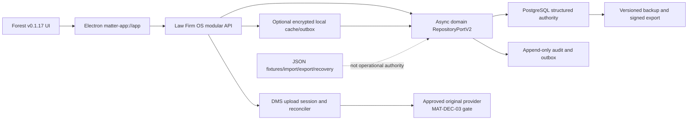
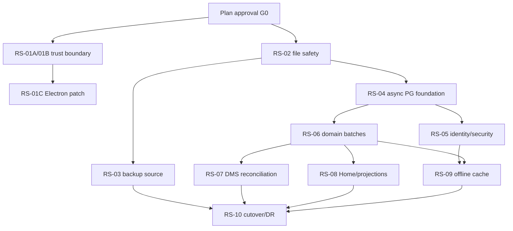

# Law Firm OS 런타임 안전성·중앙 원장 전환 구현계획

- 작성일: 2026-07-16 KST
- 상태: `PROPOSED_FOR_SOURCE_IMPLEMENTATION`
- 기준 소스: `origin/main` `b46a686f719875c6980ecba9bc213a605f58fa45`
- 기준 검토: `workbook/lawos-current-main-runtime-safety-analysis-review-2026-07-16.md`
- 적용 범위: 현재 `main`의 Law Firm OS modular monolith, Forest v0.1.17 UI·API 계약
- 비적용 범위: release, tag, AWS mutation/deployment, production migration, go-live

## 1. 결론과 실행 원칙

최신 `main`에서 확인된 위험은 세 층으로 나눠 구현한다.

1. **즉시 닫을 신뢰 경계**: app single-instance, operational step-up secret fail-closed, packaged custom protocol, CSP, `Origin: null` 제거, 새 창 기본 차단, Electron 지원 patch 적용.
2. **중앙 원장 전 과도기 무손실화**: 모든 파일 저장 경로를 공통 durable writer로 모으고, process-safe writer lock과 disk generation CAS, generation backup, 최소 권한, off-device backup queue를 적용한다.
3. **권위 원장 전환**: 기존 도메인 repository를 비동기 계약으로 진화시켜 PostgreSQL-compatible adapter, append-only audit/outbox, idempotency, optimistic concurrency를 도입한다. JSON은 fixture·import/export·복구 snapshot으로 강등한다.

이 순서는 JSON을 한 번에 제거하지 않는다. 현재 파일 저장의 데이터 유실 가능성을 먼저 막고, 도메인별 shadow comparison과 승인된 cutover를 거쳐 원장을 이동한다. 기존 Forest UI를 재설계하지 않으며 API 응답 계약도 migration 자체를 이유로 바꾸지 않는다.

## 2. 기준 사실과 채택 범위

### 2.1 현재 사실

- `STORE_PATH_MANIFEST`는 13개 도메인 JSON store와 security audit NDJSON, auth credential JSON, auth password-reset JSON 등 총 16개 operational file path를 요구한다. DMS object directory는 별도 derived path다.
- Matter·CRM·Intake·Master Data만 `writeJsonFileDurably()`를 사용한다. HRX는 temp+rename을 사용하지만 disk generation CAS가 없고, Finance·Analytics·AI governance·Portal·DMS·UI readiness·Enterprise readiness·auth는 직접 쓰기가 남아 있다.
- 두 독립 Matter repository와 두 독립 HRX store의 stale write에서 레코드 유실이 재현됐다.
- 현재 `apps/api/src/lambda.js`의 PostgreSQL 경로는 connection proof와 Matter **read overlay**다. 일반 write authority가 아니다.
- `packages/hrx/src/repository-sql.js`와 다수 HRX service는 동기식 `store.query()` port를 사용한다. 이름에 `sql`이 있어도 현재 운영 PostgreSQL adapter를 의미하지 않는다.
- Matter·HRX·DMS에는 SQL migration 자산이 있고 root dependency에 `pg`가 있다. 이를 재사용하되 새 ORM은 도입하지 않는다.
- S3 runtime-store backup/restore script와 queue helper는 있으나 모든 writer에 연결되지 않았고, 현 기기에서 활성 queue/launch agent 증거는 없다.
- S3 runtime-store **백업**과 DMS 문서 **원본 저장소**는 다른 결정이다. MAT-DEC-03은 현재도 SharePoint/OneDrive 대 object storage 선택이 보류 상태다.

### 2.2 이번 계획에서 구현 대상으로 채택하는 주장

| ID | 채택 대상 | 목표 상태 |
|---|---|---|
| V-01 | JSON operational authority와 stale-writer 유실 | JSON은 임시 안전 원장 후 보조 포맷으로 강등 |
| V-02 | 직접/비원자 파일 쓰기와 일부 store만의 backup | 모든 authoritative file writer가 공통 durability contract 사용 |
| V-03 | `file://`, CSP 부재, `Origin: null` | privileged custom scheme, restrictive CSP, exact origin |
| V-04 | app single-instance lock 부재 | main process가 local API·store 초기화 전에 lock 획득 |
| V-05 | operational step-up 기본 secret fallback | operational profile에서 명시 secret 없으면 시작 거부 |
| V-06 | auth 보안 상태와 Home operational state의 메모리 의존 | 중앙 원장과 append-only audit로 이동 |
| V-07 | DMS object/metadata 보상·reconciliation 부재 | upload session과 orphan reconciler 도입 |
| V-08 | 로컬 backup 권한과 off-device queue 공백 | `0700/0600`, durable queue, isolated restore rehearsal |
| V-09 | Electron 지원 patch 지연 | 실행 시점 지원 patch 재확인 후 최소 patch upgrade |

### 2.3 구현하지 않을 과장 또는 이미 해결된 항목

- 0.1.17에서 이미 존재하는 exact packaged renderer path 제한과 IPC sender 검증을 다시 설계하지 않는다. 새 custom protocol에서도 같은 제약을 보존·회귀 검증한다.
- formal package에서 local runtime/private roster를 제거하는 현 경계를 되돌리지 않는다.
- macOS formal 서명·공증이 전혀 없다는 전제로 작업하지 않는다. Windows Authenticode와 exact-main release package는 별도 release lane이다.
- `2명 4~6주`, `RPO 0`, `RTO 30분`을 검증된 사실로 사용하지 않는다.

## 3. 아키텍처 결정 기록(ADR)

### ADR-RS-001: modular monolith 안에서 단계적으로 중앙 원장으로 전환

- 상태: `PROPOSED`; 이 계획 승인 시 source implementation에 한해 채택
- production instance provisioning/cutover 상태: `OWNER_APPROVAL_REQUIRED`

#### Context

현재 API와 domain repository 경계는 재사용 가치가 있지만 대부분 동기식 파일 구현이다. PostgreSQL은 비동기 I/O이므로 현재 객체를 그대로 바꿔 끼울 수 없다. 동시에 현 파일 저장은 중앙 원장 구현 완료까지 방치할 수 없는 stale-write 위험을 갖는다.

#### Decision

1. 애플리케이션은 modular monolith로 유지한다. 도메인별 마이크로서비스 분리는 이 계획의 목표가 아니다.
2. 운영 구조 데이터의 source implementation target은 PostgreSQL-compatible repository로 한다. 실제 production DB vendor/instance/region/backup/cutover는 별도 승인한다.
3. 기존 동기식 repository 위에 임시 Promise wrapper만 얹어 영구화하지 않는다. 도메인별 `RepositoryPortV2`를 `async` 계약으로 정의하고 route/service를 순차 전환한다. 파일 adapter도 같은 async 계약을 구현해 cutover 전 비교 기준으로 유지한다.
4. Matter·HRX·DMS의 기존 SQL migration을 우선 재사용하고, 범용 `runtime_records` JSONB는 migration 보조나 확장 record에만 사용한다. 핵심 도메인의 최종 스키마를 하나의 JSONB 테이블로 축약하지 않는다.
5. 변경 transaction은 domain row, idempotency key, audit event, outbox event를 한 DB transaction에서 기록한다.
6. 일반 mutable record는 `expected_version` optimistic concurrency를 사용하고 충돌은 `409`로 노출한다. 법정 원장·HRX balance·audit는 append-only와 reversal로 처리한다.
7. 과거 계획의 `updated_at 최신 우선`은 operational conflict 자동해소 규칙으로 사용하지 않는다. 복구 import의 후보 정렬에만 사용할 수 있고, 충돌은 별도 ledger와 사람 판정 대상으로 남긴다.
8. JSON은 cutover 이후 fixture, import/export, signed snapshot, disaster-recovery input으로만 유지한다.

#### 검토한 대안

| 대안 | 판정 | 이유 |
|---|---|---|
| JSON hardening만 수행 | 기각(종착점으로) | 단일 장치·단일 writer를 넘어서는 권위 원장과 tenant transaction을 제공하지 못함 |
| 모든 도메인 Big Bang 전환 | 기각 | 동기식 호출면과 13개 domain store를 한 번에 바꾸면 rollback·비교·원인 격리가 어려움 |
| 도메인별 마이크로서비스 분리 선행 | 기각 | 현재 병목은 process boundary가 아니라 authority·transaction·durability이며 운영 복잡도만 증가 |
| 장기 dual-write | 기각 | 두 원장 간 drift와 실패 순서가 새 데이터 유실 경로를 만듦 |
| repository 뒤 domain별 strangler | 채택 | 기존 API를 보존하면서 contract test, shadow read, 개별 cutover가 가능 |

### ADR-RS-002: DMS metadata와 원본 provider 결정을 분리

1. DMS metadata, upload session, audit, outbox, reconciliation schema는 provider-neutral하게 구현한다.
2. S3 runtime-store backup bucket은 DMS document original store 선택을 의미하지 않는다.
3. SharePoint/OneDrive와 versioned object storage 중 실제 original provider adapter 활성화는 MAT-DEC-03 승인 후에만 한다.
4. provider가 정해지기 전 production upload는 fail closed를 유지한다. local/internal file adapter는 합성·QA 증거에만 사용한다.

## 4. 목표 구조



### 4.1 반드시 지킬 불변조건

- tenant context는 request body가 아니라 검증된 session에서 주입하고 DB transaction마다 `SET LOCAL app.current_tenant_id`를 적용한다.
- tenant-scoped table은 RLS와 negative test를 갖는다.
- 성공 응답 전에 authoritative transaction이 commit돼야 한다.
- 동일 idempotency key는 동일 결과를 재생하며 다른 request hash면 거부한다.
- audit/outbox 없는 privileged state change는 commit할 수 없다.
- append-only record는 update/delete하지 않고 reversal/correction을 추가한다.
- optimistic conflict는 최신 데이터를 덮지 않고 안전한 `409`와 current version ref를 반환한다.
- DB cutover 이후 새 write가 한 건이라도 수락되면 낡은 JSON으로 authority를 되돌리지 않는다. DB restore 또는 forward repair만 허용한다.
- provider 승인 전 실제 document original upload는 실행하지 않는다.
- UI는 migration 중에도 synthetic fallback이나 낡은 local store로 조용히 전환하지 않는다.

### 4.2 현재 store별 최종 처분

| 현재 경로 | 현재 역할 | 최종 처분 | 전환 batch/gate |
|---|---|---|---|
| `hrx-store.json` | HRX core·workflow·ledger | domain table, append-only ledger, outbox | Batch B |
| `master-data-store.json` | canonical Party/Entity/Relationship | canonical Master Data domain table | Batch A |
| `matter-store.json` | Matter·worktree·timeline·audit | Matter domain table와 transactional audit/outbox | Batch A |
| `dms-store.json` | DMS metadata | DMS metadata table; bytes는 provider adapter로 분리 | Batch C + MAT-DEC-03 |
| `crm-store.json` | CRM operational record | CRM domain table | Batch A |
| `intake-store.json` | Intake/conflict workflow | Intake domain table와 append-only decision audit | Batch A |
| `crm-master-data-store.json` | CRM용 별도 Master Data instance | canonical Master Data와 ID/중복 reconcile 후 두 번째 authority 제거 | Batch A |
| `finance-store.json` | billing/WIP/AR/finance record | Finance domain table; ledger 성격 row는 append-only | Batch B |
| `analytics-store.json` | analytics snapshot/result | source domain에서 rebuild 가능한 projection | Batch E |
| `ai-store.json` | AI policy/review/governance | policy·review·audit domain table | Batch D |
| `portal-store.json` | invite/secure-link/review state | Portal domain table와 revocation/audit | Batch D |
| `ui-readiness-store.json` | UI readiness state | mutable control plane이면 DB, generated evidence면 immutable artifact | Batch E classification gate |
| `enterprise-readiness-store.json` | enterprise readiness state | mutable control plane이면 DB, generated evidence면 immutable artifact | Batch E classification gate |
| `security-audit-events.ndjson` | security append log | append-only security audit table + export | WP-RS-05 |
| `auth/credential-store.json` | local operational credential state | security schema의 credential reference/account state | WP-RS-05 |
| `auth/password-reset-store.json` | password-reset lifecycle | security schema의 expiring/revocable token hash state | WP-RS-05 |
| `dms-store.json.objects/` | local/internal object bytes | 승인된 original provider; local adapter는 QA 전용 | WP-RS-07 + MAT-DEC-03 |

`crm-master-data-store.json`은 13개 store 중 빠뜨리기 쉬운 별도 authority다. 이를 새 DB에서도 독립 정본으로 그대로 복제하지 않고, canonical Master Data의 stable ID와 중복 판정 receipt를 만든 뒤 CRM이 canonical port를 참조하도록 전환한다.

## 5. 실행 work package

각 package는 별도 `codex/*` branch와 clean worktree에서 수행한다. 각 package의 `SOURCE_IMPLEMENTED`, `LOCAL_TEST_PASS`, `STAGING_PASS`, `PRODUCTION_CUTOVER`는 별도 상태다.

### WP-RS-01A — 즉시 보안 경계 1: single instance와 step-up fail-closed

- **의존성:** 없음
- **권장 첫 구현 package:** 예
- **예상 크기:** S

작업:

1. `apps/desktop/src/main/main.js`에서 userData path, local API, secure store를 만들기 전에 `app.requestSingleInstanceLock()`을 획득한다.
2. lock 실패 시 즉시 종료하고 store/API를 열지 않는다.
3. `second-instance`와 macOS `open-url`을 하나의 deep-link queue로 합치고 기존 창을 restore/focus한다. raw reset token은 로그에 남기지 않는다.
4. operational profile에서 `LAWOS_HRX_STEP_UP_SECRET`, `LAWOS_HRX_STEP_UP_TOTP_SECRET`이 없거나 known default와 같으면 preflight exit `78`로 시작을 거부한다. local-dev synthetic profile만 명시적 default를 허용한다.
5. 기존 exact renderer path와 IPC sender test를 유지한다.

완료 조건:

- 두 번째 instance가 local API나 file store를 초기화하지 않는다.
- 두 번째 instance의 password-reset deep link가 기존 창에 한 번만 전달된다.
- operational profile의 secret 미설정/기본값/빈 값 negative test가 모두 fail closed다.
- desktop smoke, session IPC, store-path preflight 회귀가 PASS다.

rollback:

- source commit revert 가능. 단 operational secret 검사를 우회하는 환경 변수나 fallback은 rollback 수단으로 허용하지 않는다.

### WP-RS-01B — 즉시 보안 경계 2: custom scheme, CSP, CORS

- **의존성:** WP-RS-01A
- **예상 크기:** M

작업:

1. 외부 deep link `matter://`와 별개로 privileged app scheme `matter-app://app`을 등록한다.
2. packaged renderer resource resolver는 빌드 root 내부의 canonical path만 반환하고 traversal, symlink escape, encoded traversal을 차단한다.
3. navigation/IPC trust 판정을 `matter-app://app` exact origin과 dev loopback origin으로 갱신한다.
4. packaged renderer에 restrictive CSP를 적용한다. `default-src 'self'`에서 시작하며 wildcard와 `unsafe-eval`은 허용하지 않는다. 필요한 `connect-src`, image/font/style 예외는 실제 packaged load 증거로만 추가한다.
5. `setWindowOpenHandler`는 기본 `deny`로 바꾼다. 외부 링크가 필요하면 별도 allowlist 검증 후 OS browser로 연다.
6. custom scheme의 실제 request origin을 Electron 통합 테스트로 먼저 확인한 뒤 API allowlist에 exact origin을 추가하고 `null`을 제거한다. dev origin은 `127.0.0.1`의 지정 port만 유지한다.
7. preflight와 credentialed request에서 미허용 origin, `null`, wildcard가 모두 거부되는지 검증한다.

완료 조건:

- packaged app에서 `file://` navigation이 0이고 `matter-app://app`만 renderer authority다.
- traversal·새 창·untrusted IPC·`Origin: null` negative test가 PASS다.
- CSP violation 0 또는 승인된 예외만 있고, 로그인·Home·People·Matter·Search 핵심 화면 packaged smoke가 PASS다.
- formal/internal packaging data boundary test가 계속 PASS다.

rollback:

- custom scheme commit 단위로 되돌릴 수 있으나, `Origin: null`을 장기 호환 fallback으로 다시 허용하지 않는다. 회귀 시 package promotion을 멈추고 source를 수정한다.

### WP-RS-01C — Electron 지원 patch

- **의존성:** WP-RS-01B의 trust-boundary test 고정
- **예상 크기:** S

작업:

1. 실행 당일 공식 stable/support 상태를 다시 확인한다.
2. 우선 현재 major 42의 최신 지원 patch로 올려 regression 원인을 제한한다. 계획일 기준 후보는 `42.7.0`이다.
3. major 43 전환은 Node/Chromium/native packaging 회귀를 분리한 후 별도 package로 판단한다.
4. lockfile, macOS/Windows build smoke, preload/IPC, custom scheme, notarization source gate를 검증한다.

완료 조건:

- source/lockfile 일치, desktop 전체 test PASS, internal package smoke PASS.
- release/tag/notarization upload/public asset 생성은 하지 않는다.

### WP-RS-02 — 과도기 파일 무손실화

- **의존성:** 없음; WP-RS-01과 병렬 source work 가능
- **예상 크기:** L

작업:

1. `packages/persistence`에 공통 `withStoreWriteLock()`을 추가한다. lock은 원자적 생성, owner PID/host/token/acquired-at, bounded wait, 검증된 stale-owner 회수, token 일치 release를 갖는다.
2. JSON root에 reserved `__lawos_store` metadata를 추가한다: `schema_version`, `generation`, `content_sha256`, `written_at`, `writer_id`. legacy file은 generation `0`으로 읽는다.
3. writer lock 안에서 disk generation을 다시 읽어 caller의 `expected_generation`과 비교한다. 불일치는 `LAWOS_STORE_CONFLICT`로 중단하고 backup도 새 authority도 만들지 않는다.
4. temp file `0600` 생성 → file fsync → atomic rename → directory fsync 순서를 유지한다. runtime/backup/queue directory는 `0700`, file은 `0600`으로 만든다.
5. Matter·CRM·Intake·Master Data를 새 generation contract로 올리고, HRX의 자체 temp+rename을 공통 writer로 교체한다.
6. Finance·Analytics·AI governance·Portal·DMS metadata·UI readiness·Enterprise readiness·auth credential/reset의 직접 쓰기를 공통 writer로 교체한다.
7. security audit NDJSON은 별도 append-only writer로 처리한다: exclusive append lock, `O_APPEND`, fsync, sequence/hash continuity 검증. JSON 전체 rewrite로 바꾸지 않는다.
8. DMS local bytes adapter는 temp+fsync+rename, digest readback, compensation API를 갖게 한다. 이는 MAT-DEC-03 provider 승인이 아니다.
9. backup generation 이름은 timestamp만이 아니라 generation과 random suffix를 포함해 collision을 제거한다.

필수 fault test:

- 두 독립 process가 같은 generation에서 write할 때 한 write만 성공하고 다른 쪽은 conflict를 받으며 기존 레코드가 유실되지 않는다.
- lock owner kill, stale lock, temp write 중 kill, rename 직후 kill, disk-full simulation에서 마지막 committed generation이 parse 가능하다.
- Matter와 HRX에서 기존 재현 case의 `lost: true`가 `conflict_detected: true`, `lost: false`로 바뀐다.
- 13개 domain store + 2개 auth JSON이 같은 contract test를 통과하고 audit NDJSON은 별도 append test를 통과한다.

완료 조건:

- direct authoritative `writeFileSync(filePath, JSON)` scan 결과 0. 허용 예외는 test fixture와 명시된 temp/append helper 내부뿐이다.
- 모든 operational store가 generation backup과 최소 권한을 사용한다.
- 기존 16-path preflight와 전체 domain test가 PASS다.

rollback:

- format metadata는 additive로 읽는다. rollback reader는 unknown root field를 무시해야 한다.
- generation을 제거하거나 stale write를 허용하는 downgrade는 금지한다. writer 회귀 시 write를 fail closed하고 마지막 valid generation에서 복구한다.

### WP-RS-03 — backup queue, 권한 보정, 복원 리허설

- **의존성:** WP-RS-02
- **예상 크기:** M source + external gate

작업:

1. 모든 authoritative commit이 unique UUID queue event를 남기도록 `s3-backup-queue`를 확장한다. queue 자체도 `0700/0600`, fsync, atomic create를 사용한다.
2. queue processor는 retry/backoff, per-device prefix, content hash, uploaded generation, last error, dead-letter를 기록한다.
3. 기존 `/Users/jws/lawos-backups/data` 권한 보정 도구를 `--dry-run` 기본으로 만든다. 실제 chmod와 이동은 별도 operator 실행으로 남긴다.
4. `backup-runtime-stores-to-s3.mjs`와 `restore-from-s3.mjs`를 16-path manifest와 generation metadata에 맞춘다.
5. restore는 항상 격리 directory에 수행하고 parse, hash, record-count, domain invariant를 검증한다. 현재 authority overwrite는 별도 승인 flag 없이는 불가능하게 한다.
6. backup 보존과 개인정보 삭제/법적 보존의 충돌을 legal/privacy decision으로 올린다. 기존 ‘무기한 보존’은 자동 시행하지 않는다.

완료 조건:

- local fake/object-store integration에서 enqueue → retry → upload receipt → isolated restore가 PASS다.
- production bucket/KMS/policy/launch agent 활성화는 별도 승인과 실제 receipt 전까지 `BLOCKED_EXTERNAL`이다.
- RPO/RTO는 리허설 측정값이 생기기 전까지 target으로만 표기한다.

### WP-RS-04 — async repository v2와 PostgreSQL foundation

- **의존성:** WP-RS-02 contract 고정
- **예상 크기:** L

작업:

1. domain별 최소 `RepositoryPortV2`를 정의한다. read/write/transaction/idempotency/audit method는 Promise를 반환하고 transaction callback도 async다.
2. 기존 file repository를 v2 adapter로 감싸 비교 기준을 만들되, 도메인 logic을 generic abstraction으로 재작성하지 않는다.
3. API dispatcher와 domain runtime context를 도메인별로 async 전환한다. 한 PR에서 전 domain을 바꾸지 않는다.
4. 기존 `pg`로 pool/transaction helper를 만든다: TLS verification policy, connection/statement timeout, `BEGIN`, `SET LOCAL app.current_tenant_id`, commit/rollback, sanitized error mapping.
5. migration runner는 실제 SQL checksum/history를 사용한다. 현재 synthetic runtime-spine descriptor를 production SQL migration으로 오인하지 않는다.
6. `idempotency_keys`, append-only `audit_events`, transactional `outbox_events`, schema version/migration history의 공통 contract를 만든다.
7. disposable PostgreSQL에서 RLS, tenant negative access, rollback, deadlock/retry, idempotency collision, optimistic conflict integration test를 실행한다.

완료 조건:

- file v2와 Postgres v2가 동일 repository contract suite를 통과한다.
- `lambda.js` Matter read overlay는 비교용으로만 남거나 v2 adapter로 흡수되며 write authority로 과장되지 않는다.
- DB 미설정 operational profile이 조용히 JSON fallback하지 않는다. 선택된 authority adapter 초기화 실패 시 시작을 거부한다.

rollback:

- production cutover 전에는 adapter selection을 file v2로 되돌릴 수 있다.
- DB가 write authority가 된 뒤에는 old file로 fallback하지 않는다.

### WP-RS-05 — Identity·session·security ledger 첫 전환

- **의존성:** WP-RS-04
- **예상 크기:** L

작업:

1. credential reference, account status, failed-login window/lock, break-glass request/approval/revoke, session JTI/revocation, password-reset state, security audit를 tenant-scoped schema로 만든다.
2. 로그인 성공/실패/잠금/해제/step-up 성공·실패/logout을 append-only audit로 남긴다. password나 TOTP 값, reset token, raw session token은 기록하지 않는다.
3. token verification이 active JTI와 account status를 확인하도록 한다.
4. idempotent server logout/revoke endpoint를 추가하고 desktop logout이 이를 호출한 뒤 local secure cache를 지운다.
5. IdP/MFA/passkey provider 선택은 별도 owner decision으로 남긴다. provider-neutral interface와 local/internal test adapter만 source 범위에서 구현한다.

완료 조건:

- API restart 뒤에도 lock/break-glass/revocation이 유지된다.
- revoke된 JTI는 다른 process에서도 즉시 거부된다.
- 동시 failed-login update가 threshold를 건너뛰지 않는다.
- audit 누락, secret leakage, tenant cross-read negative test가 PASS다.

### WP-RS-06 — 도메인별 중앙 원장 전환

- **의존성:** WP-RS-04; Identity가 필요한 production staging은 WP-RS-05
- **예상 크기:** XL, 여러 독립 package

권장 순서:

| Batch | 대상 | 이유 |
|---|---|---|
| A | Master Data → Matter → CRM → Intake | 상대적으로 좁은 repository로 v2·migration pattern을 먼저 증명 |
| B | HRX → Finance | 가장 많은 ledger·transaction·민감정보를 별도 집중 검증 |
| C | DMS metadata | object provider와 분리해 metadata transaction 먼저 고정 |
| D | Portal → AI governance | secure-link/policy lifecycle과 audit를 authority로 이동 |
| E | Analytics → Home → UI/Enterprise readiness | source domain 뒤에서 projection/control-plane 성격을 재분류해 이동 |

각 domain의 공통 절차:

1. **Inventory**: JSON model별 count, primary/unique key, tenant, append-only 여부, references, schema version, PII classification을 고정한다.
2. **Schema**: 기존 domain SQL migration을 재사용·보완한다. missing foreign key와 version column을 추가한다.
3. **Adapter**: Postgres v2 adapter와 file/Postgres contract test를 만든다.
4. **Importer**: JSON을 읽기 전용으로 import하고 source hash, row count, rejected row, invariant 결과를 receipt로 남긴다. 동일 input 재실행은 no-op다.
5. **Shadow read**: 사용자 응답은 file authority에서 반환하면서 DB read 결과를 PII-safe count/hash/invariant로 비교한다. row payload를 git evidence에 저장하지 않는다.
6. **Rehearsal**: disposable/staging DB에서 freeze → final delta import → adapter switch → smoke → rollback cutoff를 연습한다.
7. **Cutover**: 별도 승인 window에서만 수행한다. write freeze, final hash, DB switch, readback, unfreeze 순서를 따른다.
8. **Deprecation**: 안정화 기간 뒤 JSON write를 제거하고 signed export/snapshot만 남긴다.

domain 완료 조건:

- source/import/target count 차이가 모두 설명되고 orphan/duplicate/tenant mismatch가 0이다.
- API contract와 Forest UI smoke가 migration 전후 동일하다.
- concurrent write, optimistic conflict, idempotency replay, transaction rollback, RLS negative test가 PASS다.
- cutover receipt가 없으면 상태는 `SOURCE_READY` 또는 `STAGING_READY`이지 `PRODUCTION_MIGRATED`가 아니다.

### WP-RS-07 — DMS upload 보상과 original provider

- **의존성:** WP-RS-04, WP-RS-06 Batch C
- **예상 크기:** L source + MAT-DEC-03 gate

작업:

1. metadata DB에 `dms_upload_sessions`를 만들고 `pending → bytes_stored → committed | failed | expired` 상태와 idempotency key를 기록한다.
2. upload는 session 생성 transaction → staged object put+digest readback → document/version/file-object/audit/outbox finalize transaction 순서로 수행한다.
3. finalize 실패나 process kill을 위해 reconciler가 pending/bytes-stored session을 재시도하거나 안전하게 orphan cleanup한다.
4. adapter contract에 stage/finalize/delete-orphan/stat/digest/retention capability를 명시한다.
5. legal hold가 있는 committed object는 cleanup/delete 경로에서 fail closed한다.
6. MAT-DEC-03 승인 후 선택된 provider에만 실제 adapter와 staging round-trip/ACL/versioning 증거를 만든다.

완료 조건:

- object write 전/후와 metadata commit 전/후의 모든 kill point에서 orphan 또는 dangling metadata가 자동 탐지된다.
- same idempotency key가 중복 document/version을 만들지 않는다.
- provider 승인 전 production upload가 계속 차단된다.

### WP-RS-08 — Home·projection·readiness state 정리

- **의존성:** WP-RS-04, source domain adapters
- **예상 크기:** M

작업:

1. Home decision은 operational table, Home audit은 append-only audit, usage event는 비차단 telemetry/outbox로 분리한다.
2. news cache는 TTL cache로 유지하고 authority로 승격하지 않는다.
3. Analytics는 source transaction의 복제 원장이 아니라 rebuild 가능한 projection으로 만든다. freshness/watermark를 노출한다.
4. UI readiness와 Enterprise readiness store는 실제 mutable control-plane state인지 generated evidence인지 분류한다. generated evidence면 DB migration 대신 immutable artifact로 전환한다.

완료 조건:

- API restart 뒤 Home decision/audit가 유지되고 usage telemetry 실패가 operational transaction을 깨지 않는다.
- projection rebuild 결과가 source watermark와 일치한다.
- 13개 domain store 중 최종 authority/derived/artifact 분류가 미결 0이다.

### WP-RS-09 — encrypted offline cache/outbox

- **의존성:** WP-RS-05, 적어도 한 domain의 production-like central adapter 안정화
- **예상 크기:** L; 별도 ADR 후 착수

작업:

1. offline write 요구를 route/action 단위로 확정한다. 필요 없는 action은 offline read-only로 유지한다.
2. 필요 시 local SQLite cache/outbox를 사용하되 실행 Electron/Node의 native `node:sqlite` 적합성을 먼저 검증한다. 새 dependency는 native 기능이 부족할 때만 검토한다.
3. DB key는 OS `safeStorage`로 wrapping하고 plaintext JSON에 key/token/PII를 저장하지 않는다.
4. outbox row는 idempotency key, base version, encrypted payload, retry state를 갖는다.
5. server replay는 expected version을 검사한다. 충돌을 `latest wins`로 자동 덮지 않고 사용자에게 비교·재시도 경로를 제공한다.
6. device revoke, key loss, logout, account disable 시 cache wipe/lock 정책을 검증한다.

완료 조건:

- offline create/update → reconnect → exactly-once replay가 PASS다.
- competing device write가 silent overwrite 없이 conflict가 된다.
- DB 파일 복사만으로 평문 PII/token을 읽을 수 없다.

### WP-RS-10 — cutover·DR·JSON authority 종료

- **의존성:** 각 domain staging gate, 별도 owner 승인
- **예상 크기:** L + external window

작업:

1. domain별 cutover runbook, abort point, write freeze, final import, validation, unfreeze, forward repair를 고정한다.
2. DB backup/PITR와 DMS provider recovery를 별도 rehearsal한다.
3. RPO/RTO는 실제 timestamped receipt에서 계산한다.
4. 모든 production adapter가 안정화된 후 operational profile에서 JSON writer를 제거하고 import/export command만 남긴다.

완료 조건:

- 실제 승인 receipt, staging comparison, migration receipt, post-cutover read/write smoke, restore rehearsal가 모두 존재한다.
- JSON store path가 없을 때 operational runtime이 정상이며, JSON fallback이 0이다.
- 이 조건 전에는 `PRODUCTION_READY`, `GO_LIVE`, `RPO/RTO_MET`를 주장하지 않는다.

## 6. Gate와 claim boundary

| Gate | 통과 기준 | 통과해도 주장할 수 없는 것 |
|---|---|---|
| G0 Plan | 계획 승인, 범위·ADR·approval boundary 수락 | source implemented |
| G1 Trust | WP-RS-01 local tests와 packaged smoke PASS | release, production security complete |
| G2 File safety | multi-process/fault/permission tests PASS | central ledger complete |
| G3 Backup source | queue/processor/isolated restore local PASS | AWS backup active, RPO/RTO met |
| G4 DB foundation | async contract, disposable PG, RLS tests PASS | production DB selected/deployed |
| G5 Domain source | adapter/import/shadow tooling PASS | staging/production migrated |
| G6 Staging | approved staging shadow/rehearsal receipt | production cutover |
| G7 Cutover | per-domain owner approval와 execution receipt | release/go-live |
| G8 Release | exact SHA package, signing, platform gates | company-wide go-live without separate approval |

## 7. 검증 묶음

기존 검증을 유지하고 각 package에서 필요한 test를 추가한다.

```text
node --test apps/desktop/test/origin-policy.test.mjs \
  apps/desktop/test/session-ipc.test.mjs \
  apps/desktop/test/runtime-package.test.mjs

node --test apps/api/test/master-data-api.test.js

node --test packages/persistence/test/durable-file.test.js \
  packages/hrx/test/repository-sql.test.js

node scripts/validate-store-path-preflight.mjs
node scripts/validate-matter-desktop-security.mjs
```

신규 test family:

- `apps/desktop/test/single-instance.test.mjs`
- `apps/desktop/test/app-protocol.test.mjs`
- `apps/desktop/test/csp.test.mjs`
- `apps/api/test/cors-negative.test.js`
- `apps/api/test/operational-step-up-preflight.test.js`
- `packages/persistence/test/multi-process-generation.test.js`
- `packages/persistence/test/store-fault-injection.test.js`
- `packages/persistence/test/store-permissions.test.js`
- `packages/persistence/test/postgres-transaction.test.js`
- domain별 `repository-v2-contract.test.js`
- domain별 `json-import-shadow-compare.test.js`
- `packages/dms/test/upload-reconciliation.test.js`
- auth restart/revocation/concurrency integration test

검증 결과에는 command, exit code, source SHA, profile, started/finished time, redacted receipt path를 남긴다. test PASS와 production execution을 한 줄로 합치지 않는다.

## 8. 작업 순서와 병렬화



- RS-01과 RS-02는 파일 충돌을 피하는 별도 worktree에서 병렬 가능하다.
- RS-04 이후 domain batch는 repository core와 migration file 소유권을 분리한 경우에만 병렬화한다.
- 동일 domain의 importer, adapter, runtime call-site는 한 owner가 이어서 수행해 contract drift를 막는다.

## 9. 현실적 규모 판단

이 계획은 단일 보안 patch가 아니라 sync-to-async 전환, 16개 file path, 여러 domain schema, migration, DMS lifecycle, auth revocation, offline conflict를 포함한다.

- RS-01~03의 source/local evidence: 대략 3~5주 규모
- RS-04와 첫 domain cutover-ready implementation: 추가 4~7주 규모
- 나머지 domain·DMS·Home·offline·rehearsal: 추가 6~12주 규모

이는 2명의 전담 엔지니어와 QA/security 지원을 가정한 **계획 범위**이며 계약 일정이 아니다. provider/보안/법무 승인 lead time과 production window는 포함하지 않는다. G2와 첫 domain G5 통과 후 실제 변경량으로 재산정한다. 따라서 기존의 ‘2명 4~6주 전체 완료’는 채택하지 않는다.

## 10. 승인·외부 차단 사항

source work를 시작하는 데 별도 AWS 승인이 필요하지 않은 항목:

- RS-01, RS-02
- RS-03의 queue/processor/restore tooling과 local fake integration
- RS-04의 async contract와 disposable PostgreSQL test
- RS-05~09의 provider-neutral source와 synthetic/local tests

별도 승인이 필요한 항목:

1. AWS bucket/KMS/policy/role mutation과 backup scheduler 활성화
2. production DB instance/vendor/region/secret/IAM/provisioning
3. real-client-data inventory/import/shadow/cutover
4. MAT-DEC-03 문서 original provider와 실제 SharePoint/S3 계열 write
5. IdP/MFA/passkey provider와 production credential transition
6. release, tag, exact-main formal package, notarization/upload, AWS deploy
7. Windows Authenticode와 Windows distribution
8. production go-live와 company-wide rollout

## 11. 첫 실행 권고

첫 구현은 `WP-RS-01A`로 한정한다.

이 package는 데이터 format을 바꾸지 않고도 중복 local API/file writer와 operational default step-up secret을 즉시 차단한다. 완료 후 `WP-RS-01B`를 별도 commit/PR로 수행하고, 동시에 별도 branch에서 `WP-RS-02`의 lock/generation proof-of-correctness를 Matter와 HRX 두 저장소에 먼저 적용한다. 두 저장소에서 stale-writer 재현이 해소된 뒤 나머지 writer로 확장한다.

첫 세 package의 merge 순서:

1. `RS-01A`: single instance + step-up fail-closed
2. `RS-01B`: custom scheme + CSP + CORS/new-window hardening
3. `RS-02A`: common lock/generation + Matter/HRX two-process proof
4. `RS-02B`: remaining file writers + permissions/backups

각 merge는 source/local evidence까지만 의미한다. release/tag/AWS deploy는 실행하지 않는다.

## 12. 이 계획의 완료 정의

계획 자체는 다음을 만족하면 `PLAN_READY`다.

- 최신 `main`에서 확인된 타당한 위험만 추적한다.
- 이미 해결된 renderer path/IPC/formal-package 경계를 되돌리거나 중복 구현하지 않는다.
- sync repository와 실제 PostgreSQL adapter 사이의 async 전환 비용을 포함한다.
- S3 backup, DMS original provider, production DB, release/deploy 승인 경계를 분리한다.
- 각 work package에 dependency, 완료 조건, rollback, claim boundary가 있다.
- 첫 실행 package가 독립적으로 구현·검증 가능한 크기다.

제품 전체 완료는 RS-10의 cutover/DR 조건까지 충족된 상태이며, 이 계획 문서의 merge나 source implementation만으로 production-ready 또는 go-live를 주장하지 않는다.

## 13. 근거 문서·코드

- `workbook/lawos-current-main-runtime-safety-analysis-review-2026-07-16.md`
- `workbook/durable-data-persistence-execution-plan-2026-07-09.md`
- `apps/api/src/store-path-manifest.js`
- `packages/persistence/src/durable-file.js`
- `packages/persistence/src/s3-backup-queue.js`
- `apps/api/src/lambda.js`
- `packages/hrx/src/store/port.js`
- `packages/hrx/src/store/file-store.js`
- `packages/hrx/src/repository-sql.js`
- `packages/matter/src/repository.js`
- `packages/dms/src/document-service.js`
- `packages/dms/src/storage/storage-adapter.js`
- `apps/desktop/src/main/main.js`
- `apps/desktop/src/main/origin-policy.js`
- `apps/api/src/server.js`
- `apps/api/src/hrx-step-up-token.js`
- `apps/api/src/session-auth.js`
- `apps/api/src/home-dashboard-runtime-context.js`
- `docs/launch/mat-dec-03-storage-decision-brief.md`
- `docs/runbooks/backup-dr-runbook.md`
