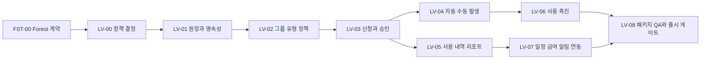

# 휴가관리 실행계획

작성일: 2026-07-13
대상: Law Firm OS `People > 휴가` 및 `요청/전자결재 > 휴가 요청`
상태: `INTERNAL_SYNTHETIC_IMPLEMENTATION_COMPLETE__RELEASE_GATES_BLOCKED`
승인 범위: 권고안에 따른 계획 수립과 합성 데이터 기반 소스 구현·내부 패키지 검증
비승인 범위: 실제 직원 데이터 마이그레이션, 외부 공급자 쓰기, 실제 취업규칙 변경, 서명·공증, 공개 릴리스, 프로덕션 전환

## 1. 목표와 완료 정의

현재의 단일 `휴가관리` 화면을 다음 기능을 갖춘 휴가관리 시스템으로 확장한다.

- 직원: 잔여 휴가 확인, 근무일정 기준 일·반일·시간 휴가 신청, 신청 변경·취소, 진행 상태 확인
- 관리자: 팀 휴가 현황 확인, 승인 또는 시기변경 협의, 대리 승인, 예외 처리
- HR 운영자: 휴가 그룹·유형·정책 버전 관리, 자동·수동 발생, 조정 원장, 사용 내역, 리포트, 입·퇴사 정산
- 준법 담당자: 연차휴가 사용 촉진 대상 산정, 서면 촉구·통보, 전달·열람·응답 증거, 감사 추적
- 시스템: 테넌트 격리, 최소 권한, 불변 원장, 멱등 자동발생, 정책 시행일 버전, 외부 연동 outbox

구현 완료는 단순 빌드 성공이 아니라 아래 조건을 모두 만족할 때로 정의한다.

1. FST-00 및 LV-00부터 LV-08까지의 수용 기준이 모두 통과한다.
2. 직원, 관리자, HR 운영자, 권한 없음의 4개 역할로 브라우저 시나리오를 직접 수행한다.
3. 1512, 1280, 1024, 820, 720px에서 기능 손실·가로 잘림·죽은 메뉴가 없다.
4. 발생, 예약, 승인, 반려·시기변경, 취소, 조정, 소멸, 촉진의 원장 합계가 재계산 결과와 일치한다.
5. 패키지된 `matter.app`에서 재시작 후 데이터가 유지되고 콘솔 오류가 없다.
6. 법무·노무 검토와 회사 취업규칙 정합성 확인 전에는 `production_ready_claim`, `public_release_claim`, `go_live_claim`을 모두 `false`로 유지한다.

## 2. 현재 상태와 재사용 경계

### 2.1 화면과 정보구조

현재 `apps/web/src/people/leave/LeaveRequestPage.tsx`는 다음 기능을 한 패널에 섞어 놓았다.

- 선택한 구성원의 잔액과 신청 목록 표시
- 자유 입력 방식의 시간, 휴가 유형, 정책 ID, 시작일, 종료일
- 같은 표 안에서 승인·반려 실행
- 직원용 자기서비스와 관리자용 결재 권한의 시각적 분리 없음

현재 사이드바 카탈로그인 `apps/web/src/people/peopleFeatureCatalog.js`에는 이미 다음 목적지가 있다.

- `people-leave`: 휴가관리
- `people-leave-types`: 휴가 그룹/유형
- `people-leave-accrual-auto`: 휴가 자동 발생
- `people-leave-accrual-manual`: 휴가 수동 발생
- `people-leave-usage`: 휴가 사용 내역
- `people-leave-requests`: 휴가 요청
- `people-annual-leave-notices`: 연차휴가 사용 촉진 문서

새 메뉴 체계를 발명하지 않고 이 ID를 정식 화면으로 채운다. 신청과 승인 기능은 분리하되, 휴가 요청은 기존 `요청/전자결재` 축을 재사용한다.

### 2.2 서비스와 데이터

재사용할 현재 구현:

| 영역 | 현재 구현 | 재사용 판단 |
|---|---|---|
| 신청 상태 전이 | `packages/hrx/src/leave/request-service.js` | 자기승인 차단과 상태 전이를 확장한다. |
| 잔액 원장 | `packages/hrx/src/leave/balance.js` | `earned`, `used`, `adjustment`, `carryover`, `reserved`, `released`를 유지하고 `expired` 및 유효기간별 entitlement 참조를 추가한다. |
| 정책 계산 | `packages/hrx/src/rules/leave-policy.js` | 한국 연차 기본 계산을 정책 버전 서비스로 승격한다. |
| 승인 모델 | `packages/hrx/src/approval.js` | 현재 메모리 기반 승인 요청을 영속 저장소로 연결하고 휴가 요청의 단일 결재 경로로 만든다. |
| 트랜잭션 | `packages/hrx/src/store/port.js`, `packages/hrx/src/store/file-store.js` | 신청+예약, 승인+사용, 취소+해제를 한 트랜잭션으로 묶는다. |
| SQL 스키마 | `packages/hrx/src/migrations/002_hrx_documents_leave_audit.sql` | 기존 요청·원장을 유지하고 `007` 마이그레이션에서 확장한다. |
| API 가드 | `apps/api/src/routes/hrx/route-policy-map.js`, `apps/api/src/hrx-runtime-context.js` | 현재 세션·테넌트·스코프 기반 fail-closed 경계를 유지한다. |
| 직원 조회 | `apps/web/src/people/hrxApiClient.ts` | 현재 세션 브리지와 API 호출 방식을 재사용한다. |

현재 해결해야 할 구조적 결함:

- 제출 시 잔액을 예약하지 않아 동시 신청이 잔액을 초과할 수 있다.
- 승인 처리와 `used` 원장 기록이 하나의 명시적 트랜잭션으로 묶여 있지 않다.
- `/api/hrx/leave/:id/approve`와 `/api/hrx/approvals/:id/approve`가 같은 휴가를 별도 경로로 처리한다.
- 승인 요청은 시드 배열이고 휴가 요청·원장과 같은 영속성 수준이 아니다.
- 자유 입력 `policy_id`, `leave_type`, `amount`는 잘못된 정책과 계산 단위를 만들 수 있다.
- 관리자 화면의 `반려`가 법정 연차의 사용 시기 변경 협의와 구분되지 않는다.
- 현재 스키마는 만료일이 다른 발생 건을 구분해 선차감할 수 없다.

## 3. Forest UI 고정 규칙

이 계획의 디자인 기준은 과거 문서가 아니라 2026-07-13 현재 소스와 실제 렌더링이다.

### 3.1 고정할 현재 기준

| 항목 | 기준 |
|---|---|
| 데스크톱 사이드바 | 214px |
| 821~1180px 사이드바 | 181px |
| 상단바 | 52px 기본값 |
| 페이지 여백 | 데스크톱 20px/16px, 반응형에서 16px·12px로 축소 |
| 히어로 | 현재 People 이미지 히어로와 `People` 제목 유지 |
| 본문 글자 | 14px |
| 라벨/메타 | 13px/12px |
| 패널 여백 | 16px, 축소형 12~14px |
| 표 행 | 44px |
| 컨트롤 | 현재 `--am-control-height`와 버튼 규칙 재사용 |
| 색·모서리 | 현재 Forest 토큰만 사용, 새 디자인 키트 도입 금지 |

### 3.2 고정하지 않을 현재 결함

- 720px에서 `휴가` 하위 메뉴가 한 줄 가로 배치되어 오른쪽이 잘리는 현상
- 직원 신청과 관리자 승인을 한 표에 배치한 구조
- `시간`, `휴가 유형`, `정책 ID` 자유 입력
- 선택된 구성원 데이터를 불러오지 못했는데 빈 신청 폼을 먼저 노출하는 상태
- 미구현 메뉴에 `설정` 배지를 붙이고 죽은 화면을 여는 동작

### 3.3 UI 구성 원칙

- People 히어로를 다시 설계하거나 삭제하지 않는다.
- 본문에는 현재 패널, 표, 탭, 입력, 배지 스타일을 재사용한다.
- 큰 통계 카드 3개, 벤토 그리드, 보라색 그라디언트, 알약 라벨, 장식용 글로우를 추가하지 않는다.
- 같은 `휴가관리` 제목을 히어로·패널·카드에서 반복하지 않는다.
- 관리자 기능은 역할에 따라 나타나되 직원 화면 안에 승인 버튼을 섞지 않는다.
- 820px 이하에서는 사이드바 하위 메뉴를 수평 스크롤시키지 말고 2행 래핑 또는 접기식 목록으로 전환한다.
- 720px에서는 신청 폼을 1열로, 820~1024px에서는 2열로, 넓은 화면에서는 정책에 맞춘 4~6열로 배치한다.
- 모든 버튼은 실제 동작이 연결된 뒤에만 활성 메뉴로 노출한다.

현재 화면 증거:

- `output/playwright/leave-planning-2026-07-13/current-people-leave-1512x864.png`
  SHA-256 `a2d82df66fc8e7d585413eeeeb444edf5f5adb1daf36589db0f34a23d1a10849`
- `output/playwright/leave-planning-2026-07-13/current-people-leave-1280x820.png`
  SHA-256 `15e03525e30a7314607a4560cae70193d8e04fbf913a01d1cb97e88dc522a84b`
- `output/playwright/leave-planning-2026-07-13/current-people-leave-1024x700.png`
  SHA-256 `875668a41ce3975b5dc8035081db4c8b7abfa36e376f717c7e60f63ea9d915b5`
- `output/playwright/leave-planning-2026-07-13/current-people-leave-720x800.png`
  SHA-256 `8a588c59c74648bde997d7d52bcd561fbc0703a839d9bde229018eb2bb16660e`
- `output/playwright/leave-planning-2026-07-13/current-people-leave-720x800-form.png`
  SHA-256 `9bcd85db86258a6e74deaf3d3f997761ee8dfd439485b5e86839bffec33c337f`

이 5장은 현재 날짜의 local web, `People > 휴가`, 오류/빈 데이터 표면 기준선이다. 성공 상태나 역할별 기능 완료 증거가 아니다. 820px **너비** 캡처는 현재 세트에 없으므로 FST-00에서 `current-people-leave-820x800.png`를 추가하고 route, skin, runtime/session source, source revision, viewport, 전체 SHA를 JSON manifest에 기록한다.

## 4. 구현 전제와 권고 정책 기준선

아래 값은 구현을 시작할 수 있게 하는 제품 기본값이다. 회사 취업규칙·근로계약·실제 운영 관행과 충돌하면 법무·노무 승인된 정책 버전이 우선한다.

| 결정 항목 | 권고 기본값 | 구현 규칙 |
|---|---|---|
| 법정 연차 원천 | 입사일 기준 | 법정 권리 계산의 source of truth로 사용한다. |
| 운영 표시 | 회계연도 환산 허용 | 별도 projection으로 제공하고 입사일 기준보다 불리해지지 않도록 차이를 계산한다. |
| 내부 계산 단위 | 정수 분 | 하루는 직원의 해당 일 소정근로시간으로 환산한다. 부동소수점 일수 저장을 금지한다. |
| 사용 단위 | 1일, 반일, 반반일, 시간 | 휴가 유형별 `duration_mode`, `deduction_minutes`, `paid_minutes`로 정의한다. |
| 초과 사용 | 기본 금지 | `negative_balance_allowed=false`, HR 예외 조정만 허용한다. |
| 차감 순서 | 가장 이른 만료 건 우선 | 동일 만료일이면 가장 먼저 발생한 entitlement부터 차감한다. |
| 제출 시점 | 즉시 예약 | `reserved`를 기록하여 동시 신청의 이중 사용을 막는다. |
| 승인 시점 | 예약 해제 + 사용 확정 | 같은 트랜잭션에서 `released`와 `used`를 기록한다. |
| 취소·반려 | 예약 해제 | 원장 삭제가 아니라 상쇄 항목을 추가한다. |
| 승인 단계 | 일반 1단계 관리자 | 예외·특별휴가·잔액 조정만 HR 2단계로 보낸다. |
| 법정 연차 결정 | 승인 또는 시기변경 협의 | 단순 `반려`를 기본 결정으로 사용하지 않는다. 사업 운영에 막대한 지장이 있는 경우에만 사유와 대체 시기를 기록한다. |
| 일반 연차 사유 | 선택 | 휴가 사유 없이도 신청 가능하게 하며 팀원에게는 기본 비공개다. |
| 증빙 첨부 | 유형별 필요 시에만 | 경조·특별휴가 등 정책에 필요한 최소 자료만 받는다. |
| 정책 변경 | 시행일 버전 | 과거 요청·원장은 당시 정책 버전을 계속 참조한다. |
| 조정 | 불변 원장 | 수정·삭제 대신 `adjustment`와 원거래 참조를 기록한다. |
| 촉진 | 별도 증거 워크플로 | 대상 산정, 1차 촉구, 응답, 2차 지정 통보, 전달 증거를 각각 저장한다. |
| 시간대 | 조직 IANA 시간대 + 현지 날짜 | 법적 날짜는 `Asia/Seoul` 현지 날짜로 계산하고 이벤트 시각은 UTC ISO 문자열로 저장한다. |

### 4.1 회사가 구현 전에 확인해야 하는 값

다음 값은 합리적 기본값을 넣을 수 있지만 운영 배포 전에 소유자 결정이 필요하다.

| ID | 확인 항목 | 권고 시작값 | 배포 차단 여부 |
|---|---|---|---|
| DEC-LV-01 | 법정 연차 운영 기준 | 입사일 원천 + 회계연도 projection | 예 |
| DEC-LV-02 | 표준 근로일과 근무일정 연동 | 직원별 일정 우선, 회사 기본 프로필이 명시 배정된 경우에만 480분 | 예 |
| DEC-LV-03 | 회사 휴가 그룹·유형 목록 | 연차, 경조, 병가, 가족돌봄, 무급 | 예 |
| DEC-LV-04 | 휴가 유형별 유급·차감·증빙 | 연차 사유 선택, 특별휴가 유형별 증빙 | 예 |
| DEC-LV-05 | 이월·소멸·보상 정책 | 법정 기준과 취업규칙을 버전으로 입력 | 예 |
| DEC-LV-06 | 승인자·대리자·SLA | 직속 관리자 1단계, 48시간 알림, HR 예외 | 예 |
| DEC-LV-07 | 동료 공개 범위 | 일정에는 `휴가`만 표시, 유형·사유 비공개 | 예 |
| DEC-LV-08 | 촉진 문서 전달 방식 | 전자문서 + 전달·열람 증거, 법률 검토 필수 | 예 |
| DEC-LV-09 | 첨부·신청·감사 보존기간 | 회사 보존정책과 법률 검토로 확정 | 예 |
| DEC-LV-10 | 퇴사 시 미사용·초과 사용 정산 | 급여 경계와 법률 검토 후 확정 | 예 |

정책 값이 미확정이어도 개발·테스트는 합성 테넌트와 위 권고값으로 진행한다. 실제 직원 데이터 마이그레이션과 go-live만 차단한다.

## 5. 법률·준법 경계

이 절은 제품 설계 체크리스트이며 법률 자문이 아니다. 실제 회사 취업규칙과 운영 적용은 공인노무사 또는 담당 법률가의 검토를 받아야 한다.

### 5.1 현재 반영할 법률 기준

- [근로기준법 제60조](https://www.law.go.kr/lsLawLinkInfo.do?chrClsCd=010202&lsJoLnkSeq=1000450050): 1년간 80% 이상 출근 시 15일, 1년 미만 또는 80% 미만 출근 시 1개월 개근당 1일, 3년 이상 근속 가산과 상한 규칙을 정책 계산의 기본 근거로 둔다.
- [근로기준법 제60조 제5항](https://www.law.go.kr/LSW/lsLinkCommonInfo.do?chrClsCd=010202&lsJoLnkSeq=1027161295): 근로자가 청구한 시기에 부여하는 것이 원칙이고 사업 운영에 막대한 지장이 있는 경우에 시기변경권을 행사할 수 있으므로 법정 연차 UI에서 `반려`와 `시기변경`을 분리한다.
- [근로기준법 제61조](https://www.law.go.kr/lsLinkProc.do?ancYd=20160302&joNo=006100000&lsClsCd=L&lsId=2031481&lsNm=%EA%B7%BC%EB%A1%9C%EA%B8%B0%EC%A4%80%EB%B2%95&mode=4): 사용 촉진의 대상, 시점, 서면 촉구·통보 요건을 캠페인 상태와 마감 계산에 반영한다.
- [근로기준법 제93조](https://www.law.go.kr/lsLinkCommonInfo.do?ancYnChk=&chrClsCd=&lsJoLnkSeq=1029728393): 상시 10명 이상 사업장의 취업규칙에 휴가 사항이 포함되므로 제품 정책과 취업규칙 정합성을 배포 게이트로 둔다.
- [근로기준법 제94조](https://law.go.kr/lsLawLinkInfo.do?chrClsCd=010201&lsJoLnkSeq=1000453056): 취업규칙 변경 의견 청취와 불이익 변경 동의 여부를 정책 변경 체크리스트에 포함한다.
- [개인정보 보호법 제16조](https://www.law.go.kr/LSW/lsLawLinkInfo.do?chrClsCd=010202&lsJoLnkSeq=900079387): 사유·첨부는 목적에 필요한 최소 정보만 수집하고 공개 범위를 역할별로 제한한다.

### 5.2 법령 버전 관리

2026-07-13 현재 시행 법령과 [2026-08-20 시행 예정 개정본](https://www.law.go.kr/LSW/lsInfoP.do?ancNo=21373&ancYd=20260219&efYd=20260820&lsiSeq=283457)이 공존한다. 따라서 다음을 필수로 한다.

- 정책 버전에 `legal_basis_code`, `legal_basis_version`, `effective_from`, `effective_to`, `reviewed_at`, `reviewed_by`를 저장한다.
- 계산 코드에 조문 항 번호나 촉진 마감일을 상수 하나로 하드코딩하지 않는다.
- 테스트 fixture를 `as_of_date`로 실행하여 시행 전·후 결과를 나눈다.
- 내부 패키지 후보 생성 전, 2026-08-20 시행본을 기준으로 법률 회귀 검토를 다시 수행한다.
- 시행일이 다른 정책이 중첩될 경우 신규 요청은 신청일과 사용일에 맞는 버전을 선택하고 과거 원장은 재작성하지 않는다.

## 6. 목표 정보구조와 화면 명세

### 6.1 사이드바

`People > 휴가`는 현재 그룹을 유지하고 다음 순서로 활성화한다.

| 순서 | 메뉴 | section ID | 역할 | 활성 시점 |
|---|---|---|---|---|
| 1 | 휴가관리 | `people-leave` | 전 직원, 관리자는 팀 범위 추가 | LV-03 |
| 2 | 휴가 그룹/유형 | `people-leave-types` | HR 관리자 | LV-02 |
| 3 | 휴가 자동 발생 | `people-leave-accrual-auto` | HR 관리자 | LV-04 |
| 4 | 휴가 수동 발생 | `people-leave-accrual-manual` | HR 관리자 | LV-04 |
| 5 | 휴가 사용 내역 | `people-leave-usage` | 본인·관리자·HR 범위 | LV-05 |

`People > 요청/전자결재`의 기존 `people-leave-requests`는 관리자 승인 큐로 사용한다. `people-annual-leave-notices`는 사용 촉진 캠페인 화면으로 사용한다. 같은 기능을 휴가 그룹 아래 중복 추가하지 않는다.

기존 경로 정리 계약:

- `people-company-leave`는 별도 설정 화면을 만들지 않고 `people-leave-types`로 영구 redirect한다. 기존 즐겨찾기와 deep link는 유지하되 canonical section은 하나만 둔다.
- `people-policy`는 회사 공통 인사정책·규정 게시 화면으로 남기고 휴가 유형·발생·승인 계산 설정은 소유하지 않는다.
- LV-02·04·05·06 각각에서 `PeopleHome.tsx`, feature catalog, Shell 역할 가시성, URL section 복원, generic 상태 패널 제거를 함께 완료한다. 메뉴가 먼저 클릭 가능해지고 화면은 placeholder인 중간 상태를 허용하지 않는다.
- `people-leave-requests`는 LV-03에서 실제 승인 큐를 mount하기 전까지 `active`로 출시하지 않는다.

### 6.2 휴가관리 대시보드

직원 기본 보기:

1. 본인의 사용 가능, 사용 완료, 승인 대기, 가장 빠른 만료일을 한 줄 요약으로 표시한다.
2. `휴가 신청` 버튼은 유형 선택 후 근무일정과 잔액을 계산하는 신청 패널을 연다.
3. 다가오는 휴가와 최근 신청을 44px 행 목록으로 표시한다.
4. 신청 행에서 상태, 사용일, 차감 시간, 승인 단계, 변경·취소 가능 여부를 확인한다.
5. 팀원의 휴가 사유·첨부·정확한 유형은 노출하지 않는다.

관리자 확장 보기:

1. 권한 범위 내 팀 부재 달력과 오늘·향후 7일 부재를 표시한다.
2. 승인 대기 건 수를 보여주되 결정은 `people-leave-requests`에서 수행한다.
3. 팀원별 잔액은 `hrx.leave.team.read` 권한이 있을 때만 표시한다.

### 6.3 휴가 신청 패널

입력 순서:

1. 휴가 그룹과 유형 선택
2. 시작·종료 현지 날짜 선택
3. 종일·반일·반반일·시간 옵션 선택
4. 해당 날짜의 소정근로일정 기반 시작·종료 시각 계산
5. 차감될 entitlement와 신청 후 잔액 미리보기
6. 대체 업무 또는 인계 메모 선택 입력
7. 유형 정책에 따라 사유·첨부 입력
8. 승인자와 예상 승인 단계 확인
9. 제출

검증 규칙:

- 종료일이 시작일보다 빠르면 제출 금지
- 비근무일·휴일 포함 여부는 정책에 따라 계산하고 포함된 날짜를 사용자에게 표시
- 중복 휴가와 출퇴근·근무일정 충돌을 제출 전에 표시
- 잔액 부족 시 기본 제출 금지, HR 예외 권한이 있어야 계속 가능
- 숨겨진 정책 ID와 계산 결과는 서버가 재검증하며 클라이언트 값을 신뢰하지 않음
- 일반 연차는 사유를 필수로 만들지 않음

근무일정 선행 계약:

- 현재 attendance 기록은 미래 소정근로일정의 source of truth가 아니므로 그대로 사용하지 않는다.
- LV-00에서 `WorkScheduleResolver` 계약과 authoritative source를 먼저 확정한다. LV-01은 재사용 가능한 `hrx_work_schedule_profiles`와 effective-dated assignment를 만들고, 휴가 전용 복제 캘린더는 만들지 않는다.
- 일정 프로필은 현지 timezone, 요일별 근무 구간, 휴게 구간, 휴일 calendar ref, 유효기간을 가진다. 요청 계산 시 날짜별 결과를 `hrx_leave_request_segments`에 snapshot하여 이후 일정 변경이 과거 차감량을 바꾸지 않게 한다.
- 개인 일정이 없을 때 480분을 조용히 가정하지 않는다. 회사 기본 480분 프로필이 명시적으로 배정된 경우에만 적용하고, 그 외에는 `HRX_LEAVE_WORK_SCHEDULE_REQUIRED`로 제출을 차단한다.
- LV-03은 일정 resolver, 공휴일 calendar, DST/timezone 경계 fixture가 통과하기 전 시작하지 않는다.

### 6.4 휴가 그룹/유형 설정

- 그룹 목록: 코드, 이름, 계산 단위, 총 잔액 관리 여부, 활성 상태
- 유형 목록: 그룹, 표시명, 내부 코드, 사용 단위, 차감 분, 유급 분, 승인 규칙, 사유·첨부 조건, 동료 공개명
- 새 버전은 미래 시행일로 발행하고 이미 사용된 버전은 직접 수정 금지
- 삭제 대신 비활성화하며 과거 요청 참조는 유지
- 중복 코드와 겹치는 유효기간 차단

### 6.5 자동·수동 발생

자동 발생:

- 입사일, 회계연도, 월 개근, 매년 고정일, 근속 가산 규칙 지원
- 미리보기에서 대상자, 발생량, 기존 entitlement, 차이를 확인
- 실행 키 `tenant + rule + employee + period`로 멱등성 보장
- dry-run과 execute를 분리하고 execute는 HR step-up 권한 요구

수동 발생:

- 1인 조정, 다수 선택, CSV 업로드 지원
- 조정 사유, 근거 문서 참조, 만료일, 승인자 필수
- 실행 전 합계와 대상자 검증 결과 표시
- 원장 행을 수정하지 않고 신규 `adjustment` 또는 `earned` 항목 추가

### 6.6 휴가 사용 내역과 리포트

- 직원·유형·기간·상태·원장 종류·만료일 필터
- 현재 잔액, 발생, 예약, 사용, 조정, 소멸을 재계산 가능한 형태로 표시
- CSV/XLSX 내보내기는 현재 필터와 권한이 적용된 행만 포함
- 잔액 스냅샷과 원장 합계 불일치를 별도 오류로 표시
- 보고용 집계는 원장 source of truth에서 재생성 가능해야 함

### 6.7 휴가 요청 승인 큐

- 직원명, 유형, 기간, 차감량, 팀 동시 부재, 잔액, 승인 단계 표시
- 법정 연차: `승인`, `시기변경 협의` 제공
- 비법정·특별휴가: 정책에 따라 `승인`, `반려`, `추가 자료 요청` 제공
- 시기변경은 사유, 제안 기간, 협의 상태를 기록하고 원 요청을 삭제하지 않음
- 승인자 부재 시 유효기간이 있는 위임만 허용
- 직원 본인, 대리 링크된 본인 계정, 권한 범위 밖 관리자의 처리를 서버에서 차단

### 6.8 연차휴가 사용 촉진

- 기준일별 대상자와 미사용 일수 계산
- 1차 촉구 대상 생성, 문서 버전, 발송, 전달, 열람, 직원 응답 기록
- 미응답자 2차 사용 시기 지정 통보 생성
- 각 단계의 법정 마감, 실제 처리 시각, 지연 여부 표시
- 전자계약/문서 모듈을 재사용하고 휴가 모듈에는 문서 참조와 증거 해시만 저장
- 단순 이메일 발송 성공을 법적 전달 완료로 자동 간주하지 않음

## 7. 데이터 모델과 마이그레이션

새 마이그레이션: `packages/hrx/src/migrations/007_hrx_leave_management.sql`

### 7.1 신규 테이블

| 테이블 | 핵심 목적 |
|---|---|
| `hrx_leave_groups` | 함께 차감되는 휴가 유형 그룹 |
| `hrx_leave_types` | 사용 단위, 차감·유급 시간, 표시·증빙 규칙 |
| `hrx_leave_policy_versions` | 시행일이 있는 계산·이월·소멸·승인 정책 |
| `hrx_leave_policy_assignments` | 직원·조직·고용형태별 정책 배정 |
| `hrx_work_schedule_profiles` | timezone·요일별 소정근로·휴게·휴일 calendar를 가진 effective-dated 일정 |
| `hrx_work_schedule_assignments` | 직원·조직별 일정 프로필 배정과 우선순위 |
| `hrx_leave_entitlements` | 발생 건별 부여량, 유효기간, 우선 차감 근거 |
| `hrx_leave_accrual_rules` | 자동 발생 규칙 |
| `hrx_leave_accrual_runs` | dry-run/execute 결과와 멱등 키 |
| `hrx_approval_requests` | 영속 승인 요청의 canonical store |
| `hrx_approval_steps` | 순차 승인 단계와 결정 이력 |
| `hrx_approval_assignments` | 승인 단계별 확정 approver actor·조직 범위·유효기간 |
| `hrx_approval_delegations` | 위임자·수임자·범위·시작·만료·철회 이력 |
| `hrx_approval_escalations` | 기한 초과·대체 승인자·처리 결과 |
| `hrx_leave_request_segments` | 날짜별 근무일정 snapshot과 차감 분 |
| `hrx_leave_request_allocations` | 한 요청이 차감하는 entitlement별 예약·사용 배분 |
| `hrx_leave_reschedule_proposals` | 시기변경 제안·법적 사유·직원 응답·만료 |
| `hrx_leave_command_receipts` | submit·modify·cancel·reschedule·decision 멱등 command 영수증 |
| `hrx_leave_request_attachments` | HR 문서 참조와 접근 수준 |
| `hrx_leave_termination_reconciliations` | 퇴사 기준 발생·사용·미사용·음수 잔액·급여 경계 대사 |
| `hrx_leave_promotion_campaigns` | 사용 촉진 캠페인과 법률 기준일 |
| `hrx_leave_promotion_recipients` | 직원별 촉구·응답·통보 증거 |
| `hrx_leave_sync_outbox` | 일정·급여·알림 연동의 재시도 가능한 이벤트 |

### 7.2 기존 테이블 유지와 저장소 계약

- `hrx_leave_requests`의 기본 키는 유지하되 `leave_type_id`, `policy_version_id`, `requested_minutes`, `timezone`, `schedule_snapshot_hash`, `state_version`을 additive column으로 확장한다. file-store가 schema-less row 저장소이므로 단순 필드 때문에 1:1 details 테이블을 만들지 않는다.
- 날짜별 일정과 entitlement 배분처럼 1:N 불변식이 있는 데이터만 `request_segments`와 `request_allocations`로 분리한다. 이 선택은 LV-01 ADR에 additive column 대 1:1 table 비교로 기록한다.
- 상태는 기존 값을 읽을 수 있게 유지하면서 `reschedule_pending`, `cancel_pending`, `cancelled_after_approval`을 확장한다. 시기변경의 제안·응답 상태는 별도 proposal에 보존한다.
- `hrx_leave_balance_entries`에 `group_id`, `entitlement_id`, `allocation_id`, `reverses_entry_id`, `policy_version_id`, `idempotency_key`, `adjustment_direction`, `amount_minutes`를 추가한다.
- 과거 `amount`는 호환 읽기용으로 유지하되 신규 계산은 정수 `amount_minutes`를 사용한다.
- migration SQL만 추가하지 않고 `packages/hrx/src/store/port.js`의 durable workflow 목록을 갱신한다. `file-store.js`의 `TABLES`는 port 목록에서 파생되므로 별도 하드코딩하지 않고, 신규 테이블별 `PRIMARY_KEYS`, tenant-scoped FK/UNIQUE mirror, immutable ledger update/delete 거부를 추가한다.
- 모든 신규 PK·FK·UNIQUE는 `tenant_id`를 포함한다. 같은 `request_id`, `employee_id`, `approval_id`가 다른 tenant에 존재하는 fixture로 read/write/export 격리를 검증한다.
- generic approval 테이블은 이 단계에서 Leave object만 backfill한다. 기존 `LegalRisk` 등 비휴가 in-memory approval의 의미·경로는 변경하지 않고, 별도 전환 승인 전까지 공존한다.

### 7.3 원장 불변식

1. 잔액 집계 키는 `tenant_id + employee_id + group_id`다. `policy_version_id`는 계산 근거와 추적 정보이며 같은 그룹의 잔액을 별도 silo로 나누지 않는다.
2. 모든 원장 항목은 테넌트, 직원, 그룹, 정책 버전, 발생 건, 원천 참조를 가진다. `amount_minutes`는 항상 양수이고 `adjustment`만 `credit|debit` 방향을 별도 필드로 가진다.
3. 한 요청은 earliest-expiry-first로 여러 entitlement에 배분할 수 있다. allocation별 분 합계와 request의 `requested_minutes`, reservation·used 합계가 모두 같아야 한다.
4. `(tenant_id, idempotency_key)`, `(tenant_id, request_id, entitlement_id, allocation_phase)`, `(tenant_id, reverses_entry_id)`는 UNIQUE다. 동일 원장 항목은 한 번만 역분개할 수 있다.
5. 제출·시기변경 대기 요청의 순 예약량은 요청 분과 같고, 승인·반려·취소 후 순 예약량은 0이다.
6. `expired`는 해당 entitlement의 당시 미사용·미예약 잔여량을 넘을 수 없다.
7. 사용 가능 잔액은 `earned + carryover + adjustment_credit + released - adjustment_debit - used - reserved - expired`로 재계산 가능하다.
8. 승인 후 취소는 기존 `used`를 수정하지 않고 같은 tenant·group·request·amount를 가진 반대 효과 역원장을 `reverses_entry_id`로 한 번 추가한다.
9. 표시용 `reserved_balance`는 누적 `reserved`가 아니라 `reserved - released` 순액이다.
10. 원장 행 update/delete API를 제공하지 않으며 repository와 file-store에서도 차단한다.

### 7.4 기존 데이터 백필

기존 `hrx_leave_requests`와 `hrx_leave_balance_entries`를 삭제하거나 덮어쓰지 않는다.

1. expand migration으로 신규 column·table·제약을 먼저 추가하고 legacy read/write를 그대로 유지한다.
2. 기존 `pto-us` 정책을 합성 기본 그룹, 유형, 정책 버전에 매핑하는 read-only preview를 만든다.
3. 기존 시간 단위 `amount`는 정확히 환산 가능한 경우에만 정수 분으로 백필한다. 일정 snapshot을 복원할 수 없으면 `legacy_assumed_minutes`로 표시하고 검토 대상에 둔다.
4. 기존 `submitted` 요청은 entitlement와 잔액을 재검증해 reservation과 approval request/step을 생성한다. 잔액·일정이 확정되지 않으면 요청을 변경하지 않고 `review_required`로 격리한다.
5. terminal 요청은 사용 원장·승인 결과와 대사하고, legacy `used` 행은 가능한 경우 request/allocation/approval에 연결한다. 불일치 상태를 자동 보정하지 않는다.
6. 현재 매 실행 시 생성되는 승인 seed는 Leave object만 durable approval로 이관하고, 동일 seed key의 재생성을 차단한다.
7. 백필 키를 `tenant + legacy table + primary key + target schema version`으로 만들어 재실행 가능하게 한다.
8. preview에는 원본 건수, submitted reservation 필요 건수, 승인 생성 건수, terminal 대사 건수, 보류 건수, 합계 차이를 표시한다.
9. execute 전 runtime store 백업과 복구 dry-run을 통과해야 한다.
10. 순서는 `expand → preview → backup/restore drill → backfill → invariant validate → dual-read compare → 신규 read cutover → legacy decision write disable → contract`로 고정한다.
11. execute 후 기존 잔액 합계와 신규 분 단위 환산 합계, submitted reservation, approval state의 대사 receipt를 저장한다.

## 8. API와 권한 설계

### 8.1 자기서비스 API

- `GET /api/hrx/leave/me/summary`
- `GET /api/hrx/leave/me/requests`
- `POST /api/hrx/leave/requests`
- `PATCH /api/hrx/leave/requests/:request_id` (제출 상태 수정; command idempotency 필수)
- `POST /api/hrx/leave/requests/:request_id/cancel`
- `POST /api/hrx/leave/requests/:request_id/reschedule-response`
- `POST /api/hrx/leave/requests/preview`

### 8.2 관리자·HR API

- `GET /api/hrx/leave/team/calendar`
- `GET /api/hrx/leave/requests/pending`
- `POST /api/hrx/approvals/:approval_id/approve`
- `POST /api/hrx/approvals/:approval_id/request-reschedule`
- `POST /api/hrx/approvals/:approval_id/reject`
- `GET|POST /api/hrx/leave/groups`
- `GET|POST /api/hrx/leave/types`
- `GET|POST /api/hrx/leave/policies`
- `GET|POST /api/hrx/leave/accrual-rules`
- `POST /api/hrx/leave/accrual-runs/preview`
- `POST /api/hrx/leave/accrual-runs/execute`
- `POST /api/hrx/leave/adjustments`
- `GET /api/hrx/leave/ledger`
- `GET /api/hrx/leave/reports/export`
- `GET|POST /api/hrx/leave/promotion-campaigns`
- `POST /api/hrx/leave/termination-reconciliations/preview`
- `POST /api/hrx/leave/termination-reconciliations/execute`

기존 `/api/hrx/leave`는 신규 API가 패키지에서 검증될 때까지 호환 경로로 유지하되, UI는 단계적으로 신규 서비스로 전환한다. 승인 결정은 최종적으로 `/api/hrx/approvals/:approval_id/*`만 쓰고 현재 중복 처리 경로는 제거한다.

cutover 계약:

- 신규 scope는 `lawos-role-registry.js`, signed-session principal의 `hrx_scopes`, `route-policy-map.js`, `hrx-sensitive-scopes.js`를 한 변경 단위로 갱신한다.
- 호환 기간에는 기존 `hrx.leave.read|write`, `hrx.approval.read|write`를 서버 내부에서만 granular scope로 매핑한다. 응답에 deprecation header와 audit metadata를 남기고 LV-08 뒤 legacy grant와 decision endpoint를 제거한다.
- legacy decision endpoint는 dual-write하지 않는다. read cutover 뒤 `409 HRX_LEAVE_LEGACY_DECISION_DISABLED`를 반환하고 canonical approval command로 안내한다.
- 같은 `Idempotency-Key`와 같은 canonical payload replay는 최초 status/body를 반환한다. 같은 key에 다른 payload는 `409 HRX_IDEMPOTENCY_KEY_REUSED`; 다른 command가 현재 state/version과 충돌하면 `409 HRX_LEAVE_STATE_CONFLICT`를 반환한다.

역할·호환 scope 매트릭스:

| 역할 프로필 | 신규 granular scope | legacy coarse scope 호환 상한 |
|---|---|---|
| `lawos_staff`, fallback staff | `hrx.leave.self.read`, `hrx.leave.self.write` | `hrx.leave.read|write`는 self 두 scope로만 변환 |
| `lawos_attorney`, partner/manager | staff scope + `hrx.leave.team.read`, `hrx.leave.approve` | `hrx.approval.read|write`는 지정 approval resource가 있을 때만 team/approve로 변환 |
| `lawos_hr` | attorney scope + `hrx.leave.policy.read|write`, `hrx.leave.accrual.execute`, `hrx.leave.ledger.adjust`, `hrx.leave.promotion.manage`, `hrx.leave.report.export`, `hrx.leave.termination.settle` | coarse leave/approval만으로 정책·발생·조정·리포트·촉진·퇴사 권한을 만들지 않고 HR role profile을 추가 확인 |
| `lawos_admin`, `security_admin` | HR scope 전체 | HR/admin role profile과 step-up이 모두 있을 때만 민감 write 허용 |
| desktop QA, tenant-B isolation fixture | fixture에 명시된 최소 scope만 | 암묵적 coarse 호환 없음 |

호환 변환은 role profile과 coarse scope의 교집합으로만 계산한다. `hrx.leave.write` 하나만 가진 사용자가 policy, accrual, adjustment, report, promotion, termination 권한을 얻는 경로를 금지하고 signed-session fixture로 고정한다.

위임 API와 UI 계약:

- `GET /api/hrx/approval-delegations?mine=true`
- `POST /api/hrx/approval-delegations` — delegator 본인 또는 HR이 대상 actor, leave-only scope, 조직 범위, `valid_from`, `valid_to`를 지정
- `POST /api/hrx/approval-delegations/:delegation_id/revoke`
- 만료는 서버 clock으로 판정하고 별도 delete 없이 `expired` projection과 audit event를 남긴다.
- 승인 큐의 `위임 관리` 패널은 현재 위임, 예정, 만료, 철회를 표시하며 자기 자신에게 위임, 순환 위임, 조직 범위 확대, 겹치는 활성 기간을 차단한다.
- 현재 RP30 descriptor의 `approval_delegation_runtime_deferred=true`는 과거 closeout truth이므로 수정하지 않는다. LV-03은 신규 leave 전용 `packages/hrx/src/leave/approval-delegation.js`와 runtime contract/validator를 격리 추가하고, generic approval runtime 전환을 주장하지 않는다.

### 8.3 권한

| 스코프 | 허용 범위 |
|---|---|
| `hrx.leave.self.read` | 본인의 요약·신청·원장 |
| `hrx.leave.self.write` | 본인의 신청·취소·협의 응답 |
| `hrx.leave.team.read` | 관리 범위 팀 일정과 승인 문맥 |
| `hrx.leave.approve` | 지정된 승인 단계 처리 |
| `hrx.leave.policy.read` | 정책·유형 조회 |
| `hrx.leave.policy.write` | 시행일 정책 버전 발행 |
| `hrx.leave.accrual.execute` | 자동·수동 발생 실행, step-up 필수 |
| `hrx.leave.ledger.adjust` | 원장 조정, step-up 및 이중 승인 필수 |
| `hrx.leave.promotion.manage` | 촉진 캠페인과 증거 관리 |
| `hrx.leave.report.export` | 권한 범위 내 내보내기 |
| `hrx.leave.termination.settle` | 퇴사 잔액 preview·execute, step-up 및 이중 승인 필수 |

모든 목록 API는 승인된 행만 집계한 후 개수를 반환한다. 권한 없음·검토 필요 응답에는 잔액, 사람 수, 첨부, 사유, facet count를 포함하지 않는다.

신원·자원 권한 계약:

- `/me`와 자기서비스 write의 `employee_id`는 body/query에서 받지 않고 signed actor를 기존 `EmployeeUserLink`로 해석해 서버가 주입한다. 명시적 대상 직원 입력은 별도 HR action과 resource scope가 있을 때만 허용한다.
- authoritative manager/team source는 현재 HRX 조직·보고선이고, 위임은 `hrx_approval_delegations`의 유효기간·범위가 겹치지 않을 때만 추가한다.
- approval 생성 시 approver actor, 조직 범위, source assignment version, valid_from/to를 snapshot한다. list·approve·reject·reschedule·delegation·export·attachment download 모두 route scope와 resource assignment를 함께 검사한다.
- 자기승인 차단은 approve뿐 아니라 reject, reschedule, delegation, cancellation approval에도 동일 적용한다.

step-up 계약:

- `hrx.leave.accrual.execute`, `hrx.leave.ledger.adjust`, `hrx.leave.termination.settle`, 민감 attachment download를 `hrx-step-up.js` action/purpose registry에 추가한다.
- absent, expired, wrong-tenant, wrong-actor, wrong-purpose, replayed token은 fail-closed하고 valid token만 1회 허용하는 signed-session 테스트를 둔다.

첨부·보존 계약:

- 첨부는 기존 HR document ref-only 모델을 재사용하며 본문·원본 바이트를 휴가 테이블에 넣지 않는다.
- 유형별 MIME·크기 allowlist, malware quarantine 완료, verified-source 상태가 없으면 연결·열람을 차단한다. 저장·전송 암호화, 짧은 만료의 download authorization, 다운로드 audit, 접근 철회, 문서 폐기 상태를 검증한다.
- 모든 leave object type을 versioned retention policy에 매핑한다. 정책 미설정은 fail-closed하고 legal hold를 우선하며, purge/anonymization 결과와 immutable evidence 예외를 receipt로 남긴다.
- DEC-LV-09 서명만으로는 충분하지 않다. 기존 retention job에 휴가 객체가 연결되고 retention·legal-hold·purge 테스트가 통과해야 내부 패키지 PASS가 가능하다.

## 9. 트랜잭션과 상태 전이

### 9.1 신청

선행조건: 현재 file-store `transaction()`은 Promise를 기다리지 않으므로 LV-01에서 callback을 Promise-aware로 바꾸고 resolve 뒤 commit, reject 뒤 전체 rollback하도록 계약 테스트를 먼저 만든다. 구현 전까지 async callback을 transaction에 전달하는 것은 금지한다.

1. signed actor를 employee로 해석하고 command receipt를 조회한다.
2. 트랜잭션 안에서 활성 직원, 적용 정책 버전, schedule assignment, 유형, entitlement, 기존 예약을 다시 조회한다.
3. SQL은 entitlement 행을 잠그고 file-store는 employee+group `state_version` CAS로 같은 직렬화 효과를 낸다.
4. 같은 트랜잭션 안에서 날짜·분·중복·잔액을 계산하고 earliest-expiry allocation을 확정한다.
5. 요청, segment snapshot, allocation, `reserved`, approval request/step/assignment, audit, outbox, command receipt를 생성한다.
6. 각 mutation 지점에 failure injection을 넣어 실패 시 어느 항목도 남지 않음을 증명한다.

### 9.2 승인

1. canonical 승인 요청과 현재 단계를 잠금·재조회한다.
2. 자기승인, 위임, 팀 범위, 정책 시행일, 잔액을 재검증한다.
3. request `state_version`과 allocation을 검증한 뒤 트랜잭션 안에서 승인 단계, 휴가 요청, `released`, `used`, 일정 outbox, audit, command receipt를 갱신한다.
4. 동일 replay는 최초 결과를 반환하고 key 재사용·state 충돌은 구분된 409로 처리한다. 원장 중복은 UNIQUE와 CAS 양쪽에서 차단한다.

### 9.3 반려·시기변경·취소

- 제출 상태 수정은 동일 요청의 새 segment·allocation을 원자적으로 계산하고 기존 reservation을 release한 뒤 새 reservation을 생성한다. 신청자·정책·원 요청 이력은 바꾸지 않는다.
- 반려와 제출 취소는 `released`를 추가하고 요청 이력을 보존한다.
- 법정 연차 시기변경은 request를 `reschedule_pending`으로 두고 proposal에 새 기간·법적 사유·만료를 기록한다. 직원 수락 시 한 트랜잭션에서 기존 reservation을 해제하고 새 일정·allocation을 예약한 뒤 `submitted`로 돌아가며, 거절 시 원 reservation을 유지한다.
- 승인 후 취소는 request를 `cancel_pending`으로 두고 별도 approval을 거친다. 승인되면 기존 `used`의 1회 역원장, 일정 역이벤트, `cancelled_after_approval`을 한 트랜잭션으로 기록한다.
- 허용 상태 전이는 `submitted → approved|rejected|cancelled|reschedule_pending`, `reschedule_pending → submitted|cancelled`, `approved → cancel_pending`, `cancel_pending → approved|cancelled_after_approval`로 고정한다. 그 밖의 전이는 409다.

### 9.4 자동발생과 퇴사 정산

- accrual preview는 대상 employee/version, source row versions, policy version, clock, timezone을 포함한 `snapshot_hash`를 발급한다. execute는 같은 hash만 허용하며 데이터가 바뀌면 새 preview를 요구한다.
- 모든 계산 테스트는 주입된 deterministic clock과 IANA timezone을 사용하고 자정·월말·연말·DST 경계를 포함한다.
- 퇴사 정산 preview는 퇴사 기준일까지의 최종 발생, 예약, 사용, 미사용, 소멸 예정, 음수 잔액, 보상/급여 경계를 계산한다.
- execute는 HR step-up과 이중 승인을 요구하며 원장을 수정하지 않고 adjustment/expiry/reversal과 payroll outbox를 추가한다.
- 기존 offboarding readiness에 `leave_reconciliation_status=approved_and_synced`를 추가하고, 미대사·연동 실패 상태에서는 종료 완료를 fail-closed한다.

## 10. 구현 작업 패키지



### FST-00: 현재 Forest 런타임 계약 고정

목적: 새 휴가 화면이 과거 UI로 회귀하지 않도록 현재 레이아웃·밀도·반응형을 테스트 계약으로 고정한다.

주요 변경 후보:

- `apps/web/src/styles.css`
- `apps/web/test/global-density-contract.test.mjs`
- `apps/web/test/forest-responsive-layout-browser.test.mjs`
- 신규 휴가 화면 전용 브라우저 계약 테스트

세부 작업:

1. 현재 토큰과 기준 뷰포트의 실제 geometry를 fixture로 고정한다.
2. 720px 하위 메뉴 잘림을 선행 수정한다.
3. People 히어로 높이·제목·이미지와 패널 밀도를 캡처한다.
4. viewport 기반 글자 확대가 아니라 공간·열 재배치로 반응형을 처리한다.

수용 기준:

- 1512/1280/1024/820/720px에서 `scrollWidth <= clientWidth`
- top axis 6개와 People 히어로가 유지됨
- 휴가 하위 메뉴와 사용자 카드가 잘리지 않음
- 현재 본문·표·컨트롤 토큰이 임의 변경되지 않음

### LV-00: 정책 결정 기록과 법률 버전

목적: DEC-LV-01~10을 회사 정책과 연결하고 계산 가능한 계약으로 만든다.

산출물:

- 정책 결정 기록
- 합성 기본 정책 fixture
- 법률 근거 버전과 시행일 매트릭스
- 법무·노무 승인 체크리스트
- authoritative work-schedule·holiday source ADR와 회사 기본 일정 assignment
- canonical 메뉴·redirect·역할 가시성 매트릭스

수용 기준:

- 모든 계산 필드에 단위와 시행일이 있음
- 미확정 결정이 실제 데이터 배포를 차단함
- 2026-08-20 시행 예정 법령 검토 항목이 릴리스 게이트에 있음
- schedule source가 없거나 겹치면 제출을 차단하고 480분 silent fallback이 없음
- `people-company-leave`, `people-policy`, 신규 휴가 메뉴의 소유권이 한 곳으로 확정됨

### LV-01: 영속 데이터와 불변 원장

목적: 발생 건·예약·사용·조정·승인의 원자성과 내구성을 보장한다.

주요 변경 후보:

- `packages/hrx/src/migrations/007_hrx_leave_management.sql`
- `packages/hrx/src/migrations/index.js`
- `packages/hrx/src/store/port.js`
- `packages/hrx/src/store/file-store.js`
- `packages/hrx/src/leave/balance.js`
- `packages/hrx/src/leave/request-service.js`
- 신규 work-schedule resolver와 request allocation/segment repository
- 관련 SQL·migration·durability 테스트

수용 기준:

- 신규 테이블이 file-store와 SQL migration 계약에 모두 존재
- file-store transaction이 Promise resolve를 기다리고 reject 시 rollback하며 async callback 조기 commit이 없음
- 잔액 재조회·allocation·reservation이 한 직렬화 구간에 있고 동시 신청 2건이 같은 entitlement를 이중 예약하지 않음
- 각 mutation 지점 실패 시 요청·segment·allocation·원장·승인·audit·outbox·receipt가 모두 롤백
- 중복 자동발생과 중복 승인이 원장 중복을 만들지 않음
- tenant-scoped PK/FK/UNIQUE, CAS/version, 1회 역분개 제약이 SQL과 file-store에서 동일하게 거부됨
- 기존 submitted seed는 reservation/approval이 생성되거나 `review_required`로 격리되어 신규 불변식을 위반하지 않음
- 앱 재시작 후 동일 잔액과 승인 상태 유지

### LV-02: 휴가 그룹·유형·정책 버전

목적: 자유 입력 필드를 제거하고 HR이 버전 있는 정책을 설정하게 한다.

주요 변경 후보:

- 신규 `packages/hrx/src/leave/policy-service.js`
- `packages/hrx/src/rules/leave-policy.js`
- `apps/api/src/routes/hrx/leave.js`
- `apps/api/src/routes/hrx/route-policy-map.js`
- 신규 `apps/web/src/people/leave/LeaveTypeSettingsPage.tsx`
- `apps/web/src/people/PeopleHome.tsx`
- `apps/web/src/people/peopleFeatureCatalog.js`
- `apps/web/src/components/Shell.jsx`

수용 기준:

- 그룹·유형·정책 CRUD가 테넌트 격리됨
- 사용 중인 정책은 직접 수정할 수 없고 새 버전만 발행 가능
- 유효기간 중첩과 중복 코드를 차단
- 비활성 유형은 신규 신청에 나오지 않지만 과거 기록에는 표시
- `people-leave-types` route가 실제 화면을 mount하고 HR 이외 역할에는 숨겨지며 generic placeholder가 없음
- `people-company-leave`는 canonical 설정 route로 redirect되고 `people-policy`와 기능이 중복되지 않음

### LV-03: 직원 신청과 관리자 승인 분리

목적: 자기서비스 신청과 관리자 결재를 각각 명확한 화면·권한·API로 만든다.

주요 변경 후보:

- `apps/web/src/people/leave/LeaveRequestPage.tsx` 분해
- 신규 대시보드·신청 패널·승인 큐 컴포넌트
- `apps/web/src/people/hrxApiClient.ts`
- `apps/web/src/people/PeopleHome.tsx`
- `packages/hrx/src/approval.js`
- 신규 `packages/hrx/src/leave/approval-delegation.js`와 leave 전용 runtime contract/validator
- `apps/api/src/hrx-runtime-context.js`
- `apps/api/src/lawos-role-registry.js`, `apps/api/src/session-auth.js`, `apps/api/src/routes/hrx/route-policy-map.js`
- `packages/authz/src/hrx-sensitive-scopes.js`, `apps/api/src/middleware/hrx-step-up.js`

수용 기준:

- 직원 화면에는 승인·반려 버튼이 없음
- 관리자 큐는 지정 범위 요청만 표시
- 일반 연차는 승인 또는 시기변경 협의로 처리
- 제출 즉시 예약되고 취소·처리 시 정확히 해제
- `/me` 신청은 body의 employee ID를 무시하고 signed actor의 `EmployeeUserLink`를 사용
- pending 수정·취소·시기변경·승인 command가 멱등하고 key 재사용과 state 충돌이 구분됨
- 위임·만료·에스컬레이션이 durable assignment에 남고 route scope와 resource assignment를 함께 검사
- 위임 create/list/revoke/expire API와 승인 큐 `위임 관리` 패널이 동작하고 자기·순환·범위확대·기간중첩 위임을 차단
- historical RP30 descriptor/validator는 deferred truth를 유지하고 신규 leave runtime receipt만 활성 상태를 주장
- 자기승인과 링크된 자기계정의 승인·반려·시기변경·위임·취소승인이 모두 차단
- granular scope가 역할 registry와 signed principal에 투영되며 legacy coarse scope 호환과 종료 시점이 테스트됨
- 720px 신청 폼과 승인 상세가 잘리지 않음

### LV-04: 자동·수동 발생

목적: 입사일·회계연도·월 개근·근속 규칙을 멱등 실행하고 HR 조정을 감사 가능하게 만든다.

주요 변경 후보:

- 신규 accrual rule/run service
- 배치 실행 API와 preview API
- 자동 발생, 수동 발생 화면
- CSV import validator
- `apps/web/src/people/PeopleHome.tsx`, feature catalog, Shell 역할 가시성

수용 기준:

- 동일 기간 재실행 결과가 `0 new entries`
- preview snapshot hash가 같을 때만 execute되고 source version이 바뀌면 새 preview를 요구
- 일부 직원 오류가 전체 실행을 조용히 누락시키지 않고 행별 결과로 남음
- 1년 미만, 80% 미만, 근속 가산, 상한, 휴직·단축근로, deterministic clock·timezone 경계 fixture를 검증
- 자동·수동 발생 route가 HR에게만 mount되고 placeholder가 없음

### LV-05: 사용 내역·리포트·입출력

목적: 원장과 요청을 운영자가 설명하고 재계산할 수 있게 한다.

주요 변경 후보:

- ledger query service
- 사용 내역 화면과 필터
- CSV/XLSX 내보내기
- 잔액 재계산 validator
- 퇴사 정산 preview/execute service와 offboarding readiness 연결
- `apps/web/src/people/PeopleHome.tsx`, feature catalog, Shell 역할 가시성

수용 기준:

- 화면 합계, 내보내기 합계, 원장 재계산 합계가 일치
- 직원은 본인, 관리자는 팀, HR은 승인된 조직 범위만 조회
- 사유·첨부는 기본 내보내기에 포함하지 않음
- 권한 없는 행과 건수 유출이 없음
- 퇴사 기준 최종 발생·예약·사용·미사용·음수 잔액·급여 경계 대사가 receipt로 남고 미완료 시 offboarding close가 차단됨
- 정산 execute는 step-up과 이중 승인을 요구하고 원장 행을 수정하지 않음
- 사용 내역 route가 권한별 실제 화면을 mount하고 placeholder가 없음

### LV-06: 연차휴가 사용 촉진

목적: 단순 알림이 아닌 법정 단계와 증거를 가진 캠페인을 제공한다.

주요 변경 후보:

- promotion campaign service
- `people-annual-leave-notices` 화면
- HR 문서·전자계약 참조 어댑터
- `packages/hrx/src/risk-event.js`와 `apps/web/src/people/security/HrxRiskDashboard.tsx`
- `apps/web/src/people/PeopleHome.tsx`, feature catalog, Shell 역할 가시성
- 마감 계산·증거 검증 테스트

수용 기준:

- 대상자와 기준 미사용 일수를 재현 가능
- 1차·2차 단계의 법정 마감과 실제 처리 시각이 분리됨
- 전달 실패·미열람·미응답이 성공으로 표시되지 않음
- 문서 본문과 첨부 접근은 최소 권한으로 제한
- 기존 `annual_leave_promotion_target`가 minute ledger의 released·expired·순예약을 사용해 같은 대상·잔액을 산출
- 촉진 route가 권한별 실제 화면을 mount하고 placeholder가 없음

### LV-07: 일정·급여·알림 연동

목적: 승인된 휴가를 외부 경계에 안전하게 전달하고 실패를 추적한다.

연동:

- 근무일정: 승인 후 휴가 일정 생성, 취소 시 역이벤트
- 출퇴근: 휴가 시간과 결근 판정 정합성
- 급여: 유급·무급 분과 퇴사 정산 경계 전달
- 오프보딩: 승인된 퇴사 정산과 payroll sync가 완료될 때만 종료 readiness 허용
- 알림: 신청, 승인, 시기변경, 마감, 촉진 이벤트

수용 기준:

- outbox 재시도는 중복 일정을 만들지 않음
- 외부 연동 실패가 휴가 원장 트랜잭션을 되돌리지 않고 `pending_sync`로 보임
- PII와 사유가 알림 제목·로그에 노출되지 않음
- 미구현 공급자를 성공으로 표시하지 않음
- 퇴사 정산 outbox와 offboarding gate가 중복 실행·부분 실패 후에도 일치

### LV-08: 통합 QA, 패키지 검증, 출시 게이트

목적: 실제 앱 표면과 데이터 재시작 경로에서 전체 흐름을 증명한다.

자동 검증:

- `node --test packages/hrx/test/*.test.js`
- `npm --workspace apps/api test`
- `npm --workspace apps/web run typecheck`
- `npm --workspace apps/web run test:ui`
- `npm --workspace apps/web run build`
- `npm run hrx:persistence:validate`
- `npm run hrx:authz:validate`
- `npm run hrx:security:validate`
- `npm run hrx:ui:validate`
- `npm run hrx:no-premature-claim:validate`
- `npm run hrx:workflows:validate`
- `npm run hrx:context:validate`
- `npm run lcx:hrx-sft:catalog:validate`
- `npm run web:e2e -- hrx`
- `python3 /Users/jws/Applications/ai-slop-taxonomy/scripts/sloplint.py --repo "$PWD" --changed`

내부 macOS 패키지 재현 명령:

```bash
npm --workspace apps/web run build
npm --workspace apps/desktop run prepare:web-renderer
MATTER_DESKTOP_RELEASE_CHANNEL=internal MATTER_DESKTOP_SIGN=internal MATTER_DESKTOP_NOTARIZE=0 npm --workspace apps/desktop run build:mac
MATTER_LEAVE_PACKAGE_QA_ARTIFACT_DIR="$PWD/output/playwright/leave-management-package" node scripts/run-leave-management-packaged-qa.mjs
```

마지막 명령의 `scripts/run-leave-management-packaged-qa.mjs`는 LV-08에서 신규 작성한다. 이 스크립트는 다음을 고정한다.

- 실행 파일: `apps/desktop/dist/mac/matter.app/Contents/MacOS/matter`
- userData: `${TMPDIR}/matter-leave-package-qa-<run-id>` 격리 경로
- runtime: 스크립트가 띄운 loopback ephemeral endpoint와 `/api/health`; 실제 주소는 receipt에 기록하고 외부 환경을 사용하지 않음
- signed-session 역할 fixture: employee, assigned manager, HR admin, out-of-tenant actor
- 출력: `docs/lazycodex/evidence/matter-desktop/artifacts/leave-management-package-qa.json`, 역할별 screenshot·console log·restart receipt는 `output/playwright/leave-management-package/`
- receipt 필수값: source/build SHA, app bundle SHA, runtime profile·endpoint, userData path, tenant/role fixture IDs, migration version, screenshot SHA, console error count, 재시작 전후 잔액·상태

브라우저 시나리오:

1. 직원이 반일 연차 신청, 예약 잔액 확인, 취소, 잔액 복구
2. 직원이 종일 연차 신청, 관리자가 승인, 일정과 사용 원장 확인
3. 관리자가 법정 연차 시기변경 제안, 직원 응답, 재승인
4. 잔액 부족·중복 일정·비근무일·권한 없음 실패 경로
5. HR이 자동 발생 preview/execute/re-run 수행
6. HR이 수동 조정 후 원장·리포트·내보내기 대조
7. 촉진 캠페인 1차·응답·2차 단계와 증거 확인
8. HR이 퇴사 정산 preview·이중승인·execute를 수행하고 offboarding gate와 payroll outbox 확인
9. 직원·관리자·HR·타 테넌트 역할별 route·count·attachment 접근 검증
10. 앱 종료·재실행 후 동일 데이터 확인

출시 게이트:

- 내부 패키지 검증 PASS
- 법무·노무 검토 완료
- DEC-LV-01~10 서명 완료
- 실제 취업규칙과 정책 fixture 대조 PASS
- 백업·복구 drill PASS
- 보안·개인정보 검토 PASS
- attachment MIME/size·malware quarantine·short-lived download·download audit·revocation PASS
- 모든 leave object의 versioned retention·legal hold·purge/anonymization receipt PASS
- legacy decision endpoint와 coarse scope 호환 제거 후 signed-session 회귀 PASS
- 소유자 공개 배포 승인 전까지 public release와 go-live는 별도 차단

수용 기준:

- 위 자동 검증과 실제 Playwright HRX 시나리오가 모두 0 exit이며 source-regex 검사만으로 UI PASS를 주장하지 않음
- 내부 build 명령으로 생성한 정확한 `matter.app`에서 네 역할 fixture와 10개 브라우저 시나리오가 통과
- 격리 userData에서 신청·승인·시기변경·퇴사 정산 데이터가 앱 재시작 뒤 동일하고 receipt hash와 화면이 대조됨
- 1512/1280/1024/820/720px 실제 캡처 manifest, 전체 SHA, route/session/runtime/source revision, console error 0을 기록
- 내부 패키지 검증과 법무·노무·보안 게이트는 PASS하되 서명·공증·public release·go-live는 별도 승인 없이는 false로 유지

## 11. 테스트 매트릭스

| 층 | 필수 검증 |
|---|---|
| 정책 단위 | 입사 1~11개월, 12개월, 80% 경계, 3년 이상 가산, 25일 상한, 정책 시행일 전후 |
| 원장 단위 | 발생, 예약, 해제, 사용, 조정, 이월, 소멸, 역원장, earliest-expiry-first |
| 동시성 | 같은 잔액에 대한 2개 신청, 중복 승인, 중복 배치, 재시도 outbox |
| API | 테넌트 격리, 자기서비스, 관리자 범위, step-up, count leak 방지, 안전 오류 |
| UI | 역할별 메뉴, 입력 검증, 키보드, 포커스, 빈 상태, 오류, 5개 뷰포트 |
| 개인정보 | 사유·첨부 최소수집, 동료 비공개, 내보내기 제외, 로그 비노출 |
| 내구성 | 앱·API 재시작, 부분 실패 롤백, 백업·복구 후 잔액 일치 |
| 연동 | 일정·출퇴근·급여·알림 성공, 재시도, 중복 방지, 공급자 실패 |
| 촉진 | 대상 산정, 마감, 문서 버전, 전달 증거, 미응답, 법령 버전 |

## 12. 위험과 완화

| 위험 | 심각도 | 완화 |
|---|---|---|
| 회계연도 운영이 입사일 기준 권리를 줄임 | 높음 | 두 기준을 함께 계산하고 차액 보정, 법무 검토 게이트 |
| 승인과 원장 기록 사이 부분 실패 | 높음 | 단일 store transaction과 멱등 키 |
| 중복 승인 API로 상태가 갈림 | 높음 | canonical approval endpoint 하나로 통합 |
| 사유·첨부의 과도한 공개 | 높음 | 최소수집, 필드별 가시성, 기본 비공개, 내보내기 제외 |
| 사용 촉진 이메일을 법적 완료로 오인 | 높음 | 전달·열람·응답 증거 상태 분리, 법률 승인 없이는 보상면제 주장 금지 |
| 2026년 법령 변경 누락 | 높음 | effective-dated legal basis와 출시 전 재검토 |
| 부동소수점 일수 오차 | 중간 | 정수 분 원장과 일정 기반 환산 |
| 메뉴만 먼저 노출되어 죽은 화면 발생 | 중간 | 각 LV 패키지 수용 기준 통과 후 활성화 |
| 720px 내비게이션 재발 | 중간 | FST-00 선행 수정과 geometry 테스트 |
| 외부 일정·급여 동기화 중복 | 중간 | outbox idempotency와 provider receipt |

## 13. 외부 제품·업계 패턴 반영 범위

이 계획은 특정 제품을 복제하지 않고 다음 운영 패턴만 채택한다.

- [시프티 휴가 시작 가이드](https://shiftee.io/ko/help/article/leaveGettingStartedGuide): 그룹과 유형 분리, 자동·수동 발생, 발생 건과 사용 내역, 직원 신청과 관리자 등록의 구분
- [시프티 휴가 생성 요청](https://shiftee.io/ko/help/article/createLeavesRequest): 유형별 유급시간·차감량 표시, 근무일정 기반 부분일 휴가, 승인자, 첨부, 초과 사용 제한, 먼저 발생한 건부터 차감
- [시프티 회사 설정 - 휴가](https://shiftee.io/ko/help/article/companySettingsLeave): 동료에게 보이는 유형명과 사유 공개 범위를 역할별로 분리
- [시프티 승인 규칙](https://shiftee.io/ko/help/article/requestApprovalRuleUseCases): 상황별 승인 경로의 제품 패턴
- [SAP SuccessFactors Accrual Rule](https://help.sap.com/docs/successfactors-employee-central/implementing-time-management-in-sap-successfactors/accrual-rule): 규칙 기반 발생과 시행일 정책의 엔터프라이즈 패턴
- [SAP SuccessFactors Absence Workflow](https://help.sap.com/docs/successfactors-employee-central/implementing-time-management-in-sap-successfactors/configuring-workflows-for-absence-recording): 휴가 기록과 승인 워크플로 분리 패턴

채택하지 않는 항목:

- 외부 제품의 메뉴·카피·시각 디자인 복제
- 승인 사유를 모든 연차에 일괄 필수화하는 규칙
- 회사 취업규칙 확인 없이 공급자 기본값을 법적 기준으로 사용하는 방식
- 공급자 화면에 있다는 이유만으로 미구현 연동을 활성 메뉴로 노출하는 방식

## 14. Lazyweb 증거 상태

대상은 기존 People 휴가 화면의 개선이므로 정상 경로는 다음이다.

- Skill: `lazyweb-design`
- Objective: `improve`
- Platform: `web`
- Screen type: `out_of_vocab` 또는 HR leave management
- Intent: 현재 Forest 밀도와 People 히어로를 유지하면서 직원 신청, 관리자 승인, HR 설정과 법정 촉진을 역할별로 분리하고 720px 잘림을 제거

현재 상태:

- Lazyweb skill pack `0.14.6`과 integrity 파일은 로컬에 존재한다.
- 현재 Codex 도구 manifest에는 `lazyweb_health`, 이미지 업로드 도구, `lazyweb_generate_report`, `lazyweb_get_report`가 없다.
- 따라서 이 문서는 hosted Lazyweb report URL, 실험 근거, 생성 mockup을 주장하지 않는다.
- 현재 소스와 2026-07-13 브라우저 캡처를 디자인 근거로 사용했다.

보고서 재개 절차:

1. Lazyweb connector를 재연결하고 `lazyweb-update`를 실행한다.
2. 위 현재 화면 캡처를 request/PUT/resolve 방식으로 업로드한다.
3. 위 intent와 제품 brief로 `lazyweb_generate_report`를 한 번 호출한다.
4. 완료 URL과 degraded slot을 이 문서에 추가한다.
5. 보고서가 이 계획의 법률·보안·데이터 무결성 기준을 약화시키는 제안을 하면 채택하지 않는다.

AI slop review: 계획 문서와 구현된 휴가 표면은 PASS다. FST-00 및 각 LV의 실제 브라우저·패키지 화면을 수동 확인했으며, 기존 Forest 패널·표·입력 계층을 유지하고 장식형 그라디언트·글로우·통계 카드 패턴을 추가하지 않았다.

## 15. 실행 순서와 중단 조건

권장 구현 순서:

1. FST-00
2. LV-00
3. LV-01
4. LV-02
5. LV-03
6. LV-04와 LV-05
7. LV-06
8. LV-07
9. LV-08

각 패키지는 별도 커밋과 다음 증거를 가진다.

- 변경 파일 pathspec
- 대상 테스트와 전체 영향 테스트
- 브라우저 캡처 또는 API receipt
- 데이터·권한·법률 claim boundary
- 다음 패키지 진입 조건

즉시 중단하고 소유자 결정을 요청할 조건:

- 회사 취업규칙과 권고 기준선이 실제 권리를 줄이는 방향으로 충돌
- 기존 실제 휴가 데이터의 단위·유효기간·직원 연결을 신뢰성 있게 해석할 수 없음
- 파괴적 마이그레이션이나 원장 행 수정이 필요함
- 법무 검토 없이 촉진 완료 또는 미사용 연차 보상 면제를 주장해야 함
- 외부 급여·전자문서 시스템에 실제 쓰기 권한이 새로 필요함

## 16. 계획 승인 후 첫 구현 단위

첫 구현은 FST-00과 LV-01을 한 번에 섞지 않는다.

1. `FST-00`에서 720px 사이드바 잘림을 수정하고 현재 Forest 계약 테스트를 먼저 고정한다.
2. `LV-00`에서 합성 정책 fixture와 미확정 DEC-LV 항목을 코드 밖 결정 기록으로 만든다.
3. `LV-01`에서 데이터·트랜잭션·멱등성만 구현한다. UI는 아직 기존 화면을 유지한다.
4. 원장 재시작 증거가 통과한 뒤 `LV-02`와 `LV-03` UI를 연결한다.

이 순서가 지켜져야 UI가 먼저 완성된 것처럼 보이면서 잔액·승인·법률 근거가 뒤에서 어긋나는 상황을 막을 수 있다.

## 17. 계획 근거 런타임 감사

2026-07-13 현재 구현에 대해 계획의 필요성을 반증하려는 세 가설을 실행했다.

| 가설 | 실행 증거 | 판정 | 계획 반영 |
|---|---|---|---|
| H1. 현재 제출 서비스가 이미 잔액을 예약한다 | 8시간 발생 후 8시간 신청을 제출했지만 결과는 `state=submitted`, `available_balance=8`, `reserved_balance=0`, `entry_ids=["e"]` | 반증됨 | LV-01과 LV-03에서 제출+예약을 한 트랜잭션으로 추가 |
| H2. 현재 승인과 사용 원장 기록이 이미 원자적이다 | 합성 ledger append 실패를 주입하자 `error=synthetic-ledger-failure`인데 요청은 `persisted_state=approved`로 남음 | 반증됨 | 승인 상태와 원장 append를 store transaction 안으로 이동 |
| H3. 현재 `reserved_balance`는 release를 반영한 순액이다 | `earned=8`, `reserved=8`, `released=8` 뒤 `available_balance=8`이지만 `reserved_balance=8`로 표시됨 | 반증됨 | 순 예약량을 `reserved - released`로 계산하도록 원장 read model 수정 |

H1~H3 재현 명령:

```bash
node --input-type=module <<'NODE'
import { createInMemoryLeaveBalanceLedger } from './packages/hrx/src/leave/balance.js';
import { createInMemoryLeaveRequestStore, createLeaveRequestService } from './packages/hrx/src/leave/request-service.js';

const input = { request_id: 'r', employee_id: 'emp', policy_id: 'p', leave_type: 'pto', amount: 8, start_date: '2026-07-13', end_date: '2026-07-13' };
const earned = (ledger, entry_id = 'e') => ledger.append({ tenant_id: 't', entry_id, employee_id: 'emp', policy_id: 'p', entry_type: 'earned', amount: 8, occurred_on: '2026-07-13', source_ref: 'probe' });

const ledger1 = createInMemoryLeaveBalanceLedger();
earned(ledger1);
const service1 = createLeaveRequestService({ store: createInMemoryLeaveRequestStore(), balanceLedger: ledger1 });
const request1 = await service1.submit({ tenant_id: 't', actor_id: 'emp' }, input);
console.log(JSON.stringify({ h1: { state: request1.state, ...ledger1.balance({ tenant_id: 't', employee_id: 'emp', policy_id: 'p' }) } }));

const store2 = createInMemoryLeaveRequestStore();
const service2 = createLeaveRequestService({ store: store2, balanceLedger: { balance: () => ({ available_balance: 8 }), append: () => { throw new Error('synthetic-ledger-failure'); } } });
await service2.submit({ tenant_id: 't', actor_id: 'emp' }, { ...input, request_id: 'r2' });
try { await service2.approve({ tenant_id: 't', actor_id: 'mgr' }, { request_id: 'r2' }); } catch (error) { console.log(JSON.stringify({ h2: { error: error.message, persisted_state: store2.get({ tenant_id: 't', request_id: 'r2' }).state } })); }

const ledger3 = createInMemoryLeaveBalanceLedger();
earned(ledger3, 'e3');
for (const [entry_id, entry_type] of [['r3', 'reserved'], ['x3', 'released']]) ledger3.append({ tenant_id: 't', entry_id, employee_id: 'emp', policy_id: 'p', entry_type, amount: 8, occurred_on: '2026-07-13', source_ref: 'probe' });
console.log(JSON.stringify({ h3: ledger3.balance({ tenant_id: 't', employee_id: 'emp', policy_id: 'p' }) }));
NODE
```

기대 판정값은 H1 `state=submitted, available_balance=8, reserved_balance=0`, H2 `error=synthetic-ledger-failure, persisted_state=approved`, H3 `available_balance=8, reserved_balance=8`이다.

기존 회귀 테스트도 함께 실행했다.

- `node --test packages/hrx/test/leave-sql.test.js packages/hrx/test/leave-policy.test.js apps/api/test/hrx/leave.test.js`: 10 passed, 0 failed
- `node --test apps/web/test/global-density-contract.test.mjs apps/web/test/forest-responsive-layout-browser.test.mjs`: 12 passed, 0 failed

이는 현재 기능이 전부 잘못되었다는 뜻이 아니다. 기존 자기승인 차단, 잔액 초과 차단, 정책 계산, 기본 반응형 계약은 통과하며 재사용할 가치가 있다. 위 세 결함은 현재 테스트가 다루지 않는 트랜잭션·예약 read model 경계이므로 각 LV 패키지에서 실패 우선 테스트로 고정한다.

## 18. 내부 구현 완료 대조표

완료일: 2026-07-13
완료 범위: 합성 테넌트, 로컬 API, 내부 unsigned macOS 패키지
출시 판정: `BLOCKED_EXTERNAL_APPROVALS`

| 작업 패키지 | 내부 구현 판정 | 핵심 증거 |
|---|---|---|
| FST-00 | PASS | `output/playwright/leave-management-implementation-2026-07-13/fst-00-capture-manifest.json`, 1512/1280/1024/820/720px 가로 overflow 없음 |
| LV-00 | PASS (합성 기준선) | `docs/decisions/leave-work-schedule-and-policy-baseline-2026-07-13.md`, `packages/hrx/fixtures/leave-management-defaults.synthetic.json`; DEC-LV-01~10 실제 운영 서명은 차단 상태 |
| LV-01 | PASS | `docs/decisions/leave-management-storage-adr-2026-07-13.md`, `007_hrx_leave_management.sql`, 영속·rollback·동시 예약·재시작 테스트 |
| LV-02 | PASS | 버전형 그룹·유형·정책 API와 `LeaveTypeSettingsPage`, 역할/redirect/placeholder 제거 브라우저 영수증 |
| LV-03 | PASS | signed `/me` 신청, 관리자 승인 큐, 시기변경, 위임, 자기승인 차단과 LV-03 역할별 브라우저 영수증 |
| LV-04 | PASS | 자동 preview/execute/re-run, 수동 조정·CSV 검증과 LV-04 브라우저 영수증 |
| LV-05 | PASS | 원장·재계산·CSV/XLSX, 퇴사 정산·step-up·offboarding gate와 LV-05 브라우저 영수증 |
| LV-06 | PASS (법률 주장 제외) | 촉진 대상·1차·응답·2차·전달 증거와 LV-06 브라우저 영수증; 법률상 보상면제 주장은 false |
| LV-07 | PASS (합성 경계 어댑터) | `lv-07-browser-qa-receipt.json`; 일정·출퇴근·급여·알림 outbox, 실패·재시도·멱등·PII 비노출 |
| LV-08 | PASS (내부 패키지) | `docs/lazycodex/evidence/matter-desktop/artifacts/leave-management-package-qa.json`; 10/10 시나리오, 11개 캡처, console/page error 0, 재시작 domain hash 동일 |

최종 자동 검증 결과:

- HRX: 425 passed, 0 failed
- API: 355 passed, 0 failed, 파일 기반 durable runtime 간 격리를 위해 공식 runner를 직렬화
- Web UI: 137 total, 136 passed, 1 intentional skip, 0 failed
- Desktop: 95 passed, 0 failed
- HRX E2E: 16 passed, 0 failed
- 타입 검사·웹 빌드·HRX persistence/authz/security/UI/workflow/context/no-premature-claim·LCX feature catalog: 모두 PASS
- 내부 `matter.app`: renderer를 현재 `apps/web`에서 재빌드, install smoke PASS, package QA PASS

내부 구현 완료와 출시 승인을 분리한다. 다음 항목은 구현 누락이 아니라 승인·외부 환경 게이트이며 계속 false 또는 blocked 상태다.

- DEC-LV-01~10 회사 서명과 실제 취업규칙 대조
- 법무·노무 검토 및 2026-08-20 시행본 재검토
- 실제 직원 데이터 backfill/migration execute
- 실제 급여·일정·알림·전자문서 공급자 쓰기
- Developer ID 서명, 공증, 공개 배포, production go-live
