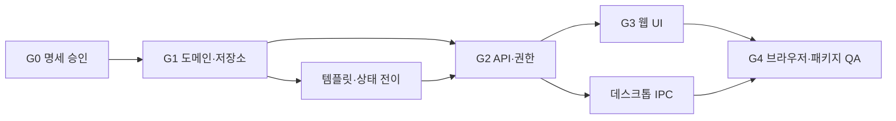

# Matter 워크트리 v1 전체 구현 실행 계획

- 작성일: 2026-07-11
- 저장소: `/Users/jws/Documents/Codex/Law Firm OS`
- 상태: 기술 구현·브라우저·내부 패키지 QA 완료 / G0 지정 책임자 승인 대기
- 적용 범위: Matter 워크트리 v1
- 원본: Codex 첨부 명세 `98804161-c357-4f5a-a6fc-2f7573932999/pasted-text.txt`

## 0. 수량 정합성

첨부 첫 문장은 `5개 게이트, 32개 TUW`라고 되어 있으나, 실제 표에 나열된 식별자는 다음과 같이 총 43개다.

| 게이트 | 범위 | TUW 수 |
|---|---:|---:|
| G0 계약과 검증 자료 | `WT-00-01`~`WT-00-04` | 4 |
| G1 도메인과 저장소 | `WT-01-01`~`WT-01-10` | 10 |
| G2 API·권한·데스크톱 경계 | `WT-02-01`~`WT-02-09` | 9 |
| G3 웹 UI | `WT-03-01`~`WT-03-12` | 12 |
| G4 통합 QA와 패키지 | `WT-04-01`~`WT-04-08` | 8 |
| 합계 |  | **43** |

누락을 방지하기 위해 이 문서는 표에 실제로 나열된 43개 TUW를 정본으로 삼는다. 이후 `32개`라는 표현은 사용하지 않는다.

## 1. Goal

Matter의 `업무 관리` 아래에 내부 전용 워크트리 v1을 구현한다. 송무, 기업 자문, 분쟁, 트랜잭션 분야에서 Matter Code를 선택하면 해당 Matter의 기존 `MatterTask`를 단일 업무 원본으로 사용하여 체크 가능한 트리를 표시하고, 구조 편집·완료·재개·진행률·미분류 업무·템플릿·권한·감사·데스크톱 IPC·재시작 복원까지 제공한다.

Goal은 아래 조건을 모두 만족할 때만 완료다.

1. 이 문서의 43개 TUW가 모두 완료되고 각 TUW에 독립 테스트와 단일 커밋이 존재한다.
2. G0~G4의 종료 조건이 모두 증거로 입증된다.
3. `MatterTask.status` 외에 업무 완료 상태를 저장하지 않고, 진행률과 `depth`를 별도 저장하지 않는다.
4. tenant·Matter·role 격리, 감사, 멱등성, 낙관적 잠금 검증이 모두 통과한다.
5. 8개 대표 Matter fixture에서 기존 Task 누락과 분야 오분류가 각각 0건이다.
6. 375/768/1024/1280px 브라우저 QA에서 페이지 가로 overflow가 0이고 키보드만으로 핵심 동작이 가능하다.
7. 300개 노드 최초 안정 렌더가 1.5초 이내이며 장시간 main-thread block이 없다.
8. 정확한 워크스페이스의 최신 `matter.app`에서 작성→종료→재실행 후 동일 상태가 복원된다.
9. 구현, 패키지 QA, 공개 릴리스, AWS 운영 배포 상태를 각각 분리해 기록한다.

## 2. 범위와 비범위

### 포함

- Matter당 활성 워크트리 1개
- 내부 사용자 전용 조회와 편집
- 4개 분야 분류와 Matter Code 선택
- branch/task 노드와 기존 `MatterTask` 연결
- 체크 완료, 재개 사유, blocked 해제 규칙
- 진행률·blocked·overdue·미분류 업무 투영
- draft/approved/archived 템플릿
- tenant·Matter·role 권한과 감사·멱등성·version 충돌
- 웹 UI, Electron IPC, 로컬 runtime store 재시작 복원

### 제외

- 외부 포털 사용자 공개
- Matter당 복수 활성 워크트리
- 진행률, `depth`, 완료 상태의 중복 저장
- 노드 삭제 시 연결된 `MatterTask` 삭제
- 책임자 승인 전 실제 법률업무 템플릿 활성화
- 브라우저 QA 이전의 패키지·배포 진행
- 별도 승인 없는 공개 릴리스 또는 AWS 운영 배포

## 3. 선행 설계 결정

- 워크트리 루트는 별도 노드로 저장하지 않고 `MatterWorktree + Matter`에서 투영한다.
- `depth`와 진행률은 저장하지 않고 부모 관계와 `MatterTask.status`에서 계산한다.
- 노드 삭제는 배치 관계만 보관 처리하며 연결된 `MatterTask`는 삭제하지 않는다.
- `미분류 업무`는 저장 노드가 아닌 조회 시 계산되는 가상 가지다.
- 템플릿은 `draft → approved → archived` 상태를 사용한다.
- 실제 법률업무 템플릿은 책임자 승인 전까지 `draft`다.
- v1은 Matter당 활성 워크트리 1개, 내부 전용이다.

## 4. G0 계약과 검증 자료

| TUW | 결과물 | 독립 수용 기준 | 검증 |
|---|---|---|---|
| WT-00-01 | 워크트리 도메인 계약 | 모델, 상태, 루트 투영, 삭제 의미, 최대 깊이, 활성 워크트리 규칙 확정 | 계약 테스트용 JSON fixture가 스키마 검증 통과 |
| WT-00-02 | 분야 분류 계약 | `LIT/Litigation`, `ADV/Advisory`, `Dispute`, `DEAL/Transaction` 매핑 확정 | 모든 별칭과 미분류 입력의 기대 결과 테스트 |
| WT-00-03 | 권한·상태 전이표 | 열람·완료·재개·구조 편집·템플릿 관리 권한 확정 | 역할별 허용/거부 매트릭스 리뷰 |
| WT-00-04 | QA fixture 명세 | 분야별 대표 Matter 2개, 총 8개와 업무·차단·기한 초과 fixture 선정 | 8개 Matter가 분류·업무 상태 검증을 모두 충족 |

G0 종료 조건: 분야 책임자, 권한 규칙, 템플릿 승인자가 정해져야 한다.

## 5. G1 도메인과 저장소

| TUW | 구현 범위 | 독립 수용 기준 | 주요 테스트 |
|---|---|---|---|
| WT-01-01 | 공용 분야 분류 함수 | 업무 보드와 워크트리가 동일 함수를 사용 | 기존 업무 보드 분류 결과가 변경되지 않음 |
| WT-01-02 | 워크트리 모델 | `MatterWorktree`, `MatterWorktreeNode` factory·registry 추가 | 필수 필드, 불변 레코드, 잘못된 `node_type` 거부 |
| WT-01-03 | 템플릿 모델 | `MatterWorktreeTemplate`, `MatterWorktreeTemplateNode` 추가 | draft/approved/archived 상태와 버전 검증 |
| WT-01-04 | 저장소·마이그레이션 | 신규 모델 기본 ID, 저장·조회·재시작 복원 지원 | 파일 저장 후 repository 재생성 시 동일 데이터 |
| WT-01-05 | 트리 구조 검증 | 순환, 고아 부모, 최대 깊이 4, 잘못된 정렬 차단 | 자기 참조·조상 이동·깊이 초과가 모두 실패 |
| WT-01-06 | 활성 워크트리·낙관적 잠금 | Matter당 활성 1개, `version` 불일치 차단 | 두 번째 활성 생성과 stale update가 conflict |
| WT-01-07 | 템플릿 스냅샷 | approved 템플릿만 Matter에 복제, 버전 고정 | 원본 템플릿 수정 후 기존 워크트리 불변 |
| WT-01-08 | 진행률·미분류 투영 | 진행률 계산, cancelled 제외, 미연결 Task 표시 | done/전체 수, blocked 수, 미분류 업무 누락 0건 |
| WT-01-09 | Task 완료·재개 규칙 | 완료, 재개, blocked 해제 규칙 확장 | done→in_progress는 사유 없으면 실패; blocked→done 실패 |
| WT-01-10 | 감사·멱등성 | 모든 구조·상태 변경 감사 이벤트와 idempotency 적용 | 같은 키 재전송 시 한 번만 변경·감사 기록 |

`WT-01-07`, `WT-01-09`는 `WT-01-04` 이후 병렬 진행할 수 있다.

G1 종료 조건:

- 도메인 테스트 전체 통과
- 재시작 후 데이터 동일
- 진행률을 별도로 저장하는 코드 없음
- `MatterTask` 외에 업무 완료 상태를 저장하는 모델 없음

## 6. G2 API, 권한, 데스크톱 경계

| TUW | 구현 범위 | 독립 수용 기준 | 주요 테스트 |
|---|---|---|---|
| WT-02-01 | 워크트리 조회 API | 트리, 가상 루트, 미분류 가지, 진행률 반환 | `GET` 결과에서 권한 밖 노드·건수 0건 |
| WT-02-02 | 생성·템플릿 적용 API | 빈 워크트리 생성과 approved 템플릿 적용 | 동일 Matter에 활성 워크트리 중복 생성 실패 |
| WT-02-03 | 노드 생성·수정 API | branch/task 추가, 이름·순서·Task 연결 변경 | 타 Matter의 Task 연결 거부 |
| WT-02-04 | 이동·삭제 API | 순환 검증 이동, 하위 노드 보호, 배치 보관 | 자손 밑 이동 실패; Task 원본은 유지 |
| WT-02-05 | Task 완료·재개 API | complete/reopen 전용 엔드포인트 | 담당자·팀원만 완료, 재개 사유 필수 |
| WT-02-06 | 권한·테넌트 격리 | 모든 경로에 tenant/Matter/role 검사 | 다른 tenant 요청 404 또는 비노출 응답 |
| WT-02-07 | ETag/version 충돌 응답 | stale write를 `409`로 표준화 | 현재 version과 다른 PATCH/move 실패 |
| WT-02-08 | API 감사·멱등성 | 요청 ID, actor, reason, source ref 기록 | 재전송에도 상태 변경과 감사 이벤트 각각 1건 |
| WT-02-09 | 데스크톱 쓰기 허용 목록 | 신규 POST/PATCH/DELETE 경로만 최소 추가 | 미허용 경로·메서드 차단, 승인 경로만 통과 |

권장 API 구현 순서는 조회 → 생성 → 노드 편집 → Task 상태 변경이다. UI 쓰기 기능은 `WT-02-05`와 `WT-02-06` 전에는 연결하지 않는다.

G2 종료 조건:

- API 계약 테스트 전체 통과
- 권한 없는 사용자는 가지 존재와 업무 건수도 알 수 없음
- generic activity API에 워크트리 JSON을 저장하지 않음
- 데스크톱 허용 목록이 wildcard를 사용하지 않음

## 7. G3 웹 UI

| TUW | 구현 범위 | 독립 수용 기준 | 주요 테스트 |
|---|---|---|---|
| WT-03-01 | 사이드바·라우트 | `업무 보드 → 워크트리 → 할 일 → 일정` 순서와 `matter-worktree` 등록 | 메뉴 1개, route 1개, 활성 상태 1개 |
| WT-03-02 | API client·상태 모델 | 조회·생성·편집·완료·재개 client 추가 | loading/data/empty/denied/error/conflict 상태 테스트 |
| WT-03-03 | 분야 선택 컴포넌트 | 4개 분야 동일 너비, 글자 길이 무관 | 네 버튼 computed width 동일 |
| WT-03-04 | Matter Code 선택·URL 상태 | 분야별 필터, 검색, Matter 선택을 URL에 유지 | 새로고침·뒤로가기 후 동일 선택 복원 |
| WT-03-05 | 트리 캔버스 | 좌→우 가지, 동일 깊이 동일 노드 폭, 연결선 | branch/task/root 렌더링과 접기·펼치기 |
| WT-03-06 | Task 체크·재개 | 체크 완료, 완료 해제 시 재개 확인과 사유 입력 | 취소 시 상태 불변, 확인 시 API 1회 호출 |
| WT-03-07 | 진행률·상태 표시 | 완료/전체, blocked, overdue를 색상+아이콘+텍스트로 표시 | cancelled 제외 및 스크린리더 진행률 검증 |
| WT-03-08 | 우측 상세 패널 | 담당자, 기한, 상태, 연결 문서, 감사 요약 | 노드 선택 변경 시 정확한 Task 상세 표시 |
| WT-03-09 | 캔버스 도구 | 전체 펼치기·접기, 검색, 화면 맞춤 | 검색 결과 포커스 이동, fit 후 페이지 overflow 없음 |
| WT-03-10 | 반응형 아웃라인 | 1024px 이하에서 세로 트리로 전환 | 375/768/1024px에서 페이지 가로 overflow 0 |
| WT-03-11 | 키보드·접근성 | tree/treeitem, 방향키, Space, 포커스 표시 | 마우스 없이 선택·펼치기·완료 가능 |
| WT-03-12 | 오류·충돌 복구 UI | 403/404/409/네트워크 오류를 구분 | 409에서 최신 버전 재조회 후 사용자 변경 보존 |

워크트리 캔버스는 새 화면이므로 `WT-03-05` 착수 전에 Lazyweb 디자인 게이트를 수행한다.

G3 종료 조건:

- 페이지 전체 가로 스크롤 0
- 트리 내부 이동만 허용
- 상태를 색상만으로 표현하지 않음
- 짧은 `송무`와 긴 분야명이 동일 폭
- 체크 UI와 `MatterTask.status`가 항상 일치

## 8. G4 통합 QA와 패키지

| TUW | 검증 범위 | 수용 기준 |
|---|---|---|
| WT-04-01 | 8개 Matter 통합 fixture | 네 분야 분류 오류 0건, 기존 Task 누락 0건 |
| WT-04-02 | API 보안·충돌 E2E | tenant 격리, 역할 거부, 멱등 재전송, stale version 충돌 전부 통과 |
| WT-04-03 | 브라우저 UI E2E | 분야 전환, Matter 선택, 체크, 재개, 차단, 검색, 접기·펼치기 통과 |
| WT-04-04 | 반응형·접근성 QA | 375/768/1024/1280px, 키보드, CJK, 포커스, overflow 검증 |
| WT-04-05 | 성능 | 300개 노드 최초 안정 렌더 1.5초 이내, 조작 시 장시간 main-thread block 없음 |
| WT-04-06 | Electron IPC·재시작 | 임시 runtime store에서 작성→앱 종료→재실행 후 동일 상태 |
| WT-04-07 | 최신 패키지 검증 | 정확한 워크스페이스 `matter.app`에서 웹과 동일 동작 |
| WT-04-08 | closeout 문서 | 구현·패키지 QA·공개 릴리스·AWS 배포 상태를 각각 분리 기록 |

## 9. TUW 공통 완료 조건

각 TUW는 아래를 모두 만족해야 닫는다.

- 실패하는 테스트를 먼저 추가하고 구현 후 통과
- 해당 TUW의 수용 기준이 테스트 이름에 드러남
- 관련 패키지 테스트 전체 통과
- `git diff --check` 통과
- UI TUW는 실제 렌더링 검증 포함
- 보안 TUW는 tenant·권한·감사 검증 포함
- 관련 없는 dirty worktree 변경을 포함하지 않음
- TUW 하나당 독립 커밋 1개
- 패키지 빌드 성공을 공개 릴리스나 운영 배포로 표현하지 않음

## 10. 증거와 커밋 계약

각 TUW의 증거는 `workbook/matter-worktree-evidence/<TUW-ID>/` 아래에 다음 형식으로 남긴다.

- `acceptance.md`: 수용 기준과 실제 결과
- `commands.txt`: 실행한 검증 명령과 종료 코드
- `tests.txt`: red→green 및 관련 패키지 테스트 결과
- `files.txt`: 변경 파일 목록
- UI TUW: `render.png` 또는 동등한 실제 화면 증거
- 보안 TUW: 역할·tenant·감사 허용/거부 매트릭스
- 성능 TUW: 측정 조건, 원시 결과, p50/p95 또는 안정 렌더 시간

커밋 제목은 `feat(worktree): <TUW-ID> <결과>` 또는 성격에 맞는 `test`, `docs`, `fix` 접두사를 사용한다. 커밋에는 해당 TUW의 구현·테스트·증거만 포함한다.

## 11. 권장 실행 묶음

- 배치 A: `WT-00-*`, `WT-01-01`
- 배치 B: `WT-01-02`~`WT-01-10`
- 배치 C: `WT-02-01`~`WT-02-09`
- 배치 D: `WT-03-01`~`WT-03-04`
- 배치 E: `WT-03-05`~`WT-03-12`
- 배치 F: `WT-04-01`~`WT-04-08`

배치는 병렬 실행 편의를 위한 묶음일 뿐이며, 게이트 종료 조건과 TUW별 단일 커밋 규칙을 약화하지 않는다.

## 12. 중단 게이트

다음 조건에서는 추정으로 진행하지 않고 중단해 사용자 또는 지정 책임자의 결정을 받는다.

1. 분야 책임자, 권한 규칙, 템플릿 승인자가 정해지지 않으면 G0를 닫지 않는다.
2. 템플릿 책임자 승인이 없으면 실제 법률업무 템플릿을 `approved`로 전환하거나 Matter에 적용하지 않는다.
3. 권한·tenant 격리 테스트가 통과하기 전에는 UI 쓰기 기능을 연결하지 않는다.
4. 브라우저 QA가 통과하기 전에는 데스크톱 패키지·공개 릴리스·배포 단계로 넘어가지 않는다.
5. 저장 구조 변경이 기존 Matter 데이터 손실 가능성을 만들면 마이그레이션을 중단하고 복구 계획 승인을 받는다.
6. 공개 릴리스 또는 AWS 운영 배포는 별도 명시적 요청과 현재 환경 검증 없이는 실행하지 않는다.

## 13. Gate closeout 체크리스트

### G0

- [x] WT-00-01
- [x] WT-00-02
- [x] WT-00-03
- [x] WT-00-04
- [ ] 분야 책임자·권한 규칙·템플릿 승인자 기록

### G1

- [x] WT-01-01
- [x] WT-01-02
- [x] WT-01-03
- [x] WT-01-04
- [x] WT-01-05
- [x] WT-01-06
- [x] WT-01-07
- [x] WT-01-08
- [x] WT-01-09
- [x] WT-01-10
- [x] 도메인·재시작·단일 완료 원본 종료 조건 검증

### G2

- [x] WT-02-01
- [x] WT-02-02
- [x] WT-02-03
- [x] WT-02-04
- [x] WT-02-05
- [x] WT-02-06
- [x] WT-02-07
- [x] WT-02-08
- [x] WT-02-09
- [x] API 계약·비노출·allowlist 종료 조건 검증

### G3

- [x] WT-03-01
- [x] WT-03-02
- [x] WT-03-03
- [x] WT-03-04
- [x] WT-03-05
- [x] WT-03-06
- [x] WT-03-07
- [x] WT-03-08
- [x] WT-03-09
- [x] WT-03-10
- [x] WT-03-11
- [x] WT-03-12
- [x] Lazyweb 디자인 게이트와 실제 렌더링 증거
- [x] overflow·키보드·상태 동기화 종료 조건 검증

### G4

- [x] WT-04-01
- [x] WT-04-02
- [x] WT-04-03
- [x] WT-04-04
- [x] WT-04-05
- [x] WT-04-06
- [x] WT-04-07
- [x] WT-04-08
- [x] 구현·패키지·공개 릴리스·AWS 상태 분리 closeout

## 14. 최종 완료 판정

다음 수치가 모두 충족되어야 Goal을 `complete`로 표시한다.

- 완료 TUW: **43/43**
- TUW 독립 커밋: **43개**
- Gate closeout: **5/5**
- 대표 Matter fixture: **8/8**
- 기존 Task 누락: **0건**
- 분야 오분류: **0건**
- tenant·권한 정보 노출: **0건**
- 브라우저 목표 viewport 통과: **4/4**
- 페이지 가로 overflow: **0px**
- 키보드 핵심 시나리오 통과율: **100%**
- 300노드 최초 안정 렌더: **1.5초 이하**
- Electron 재시작 복원: **100% 동일**
- 최신 패키지 수동 QA: **통과**
- 공개 릴리스·AWS 배포 상태: **별도 사실로 명시**

하나라도 충족하지 않으면 구현은 부분 완료이며 Goal을 완료 처리하지 않는다.
